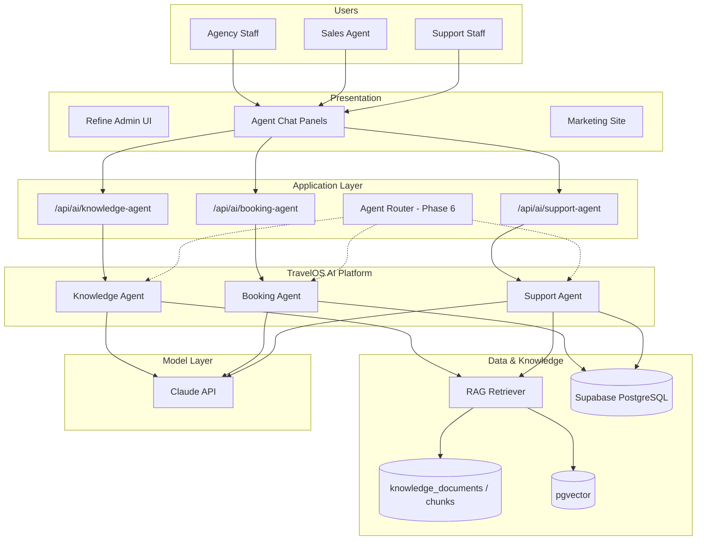
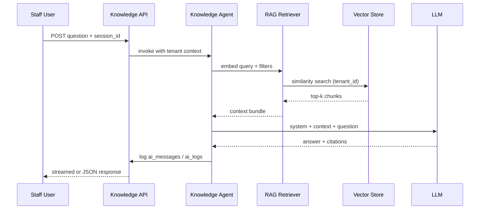
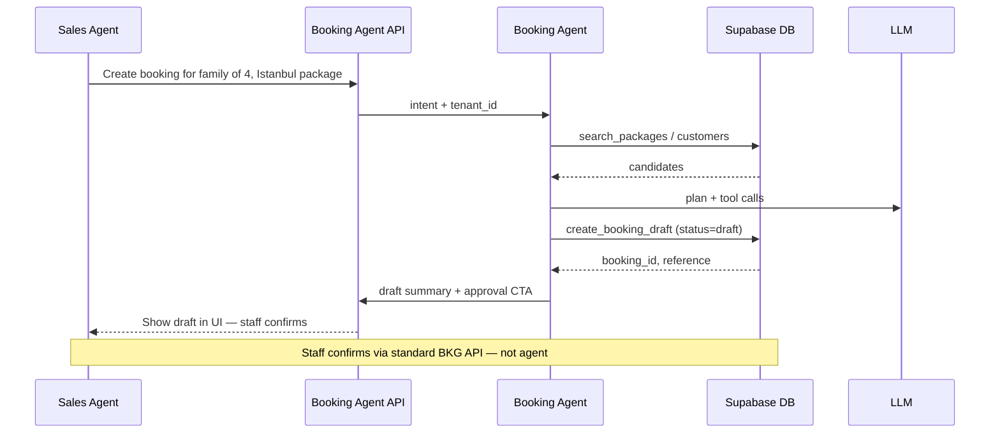
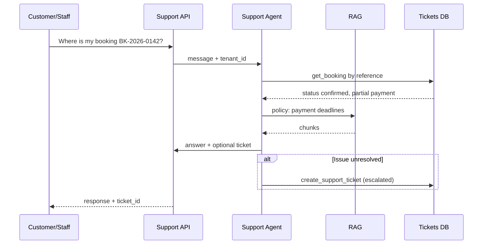

# TravelOS AI Architecture

**Version:** 2.0 — Approved Agent Platform  
**Last Updated:** 2026-06-02  
**Status:** Architecture approved — implementation Phase 5 (no new DB migrations until approved)

---

## 1. TravelOS AI Platform Overview

TravelOS embeds a **multi-agent AI platform** alongside the operational SaaS (customers, packages, bookings, payments). All agents share:

- **Tenant isolation** — JWT `tenant_id` on every retrieval and tool call
- **Human-in-the-loop** — no autonomous financial commits or booking confirmations in Phase 5 MVP
- **Auditability** — prompts, tool calls, and outputs logged (see [Database impact](#9-database-impact-recommendations) in docs)
- **RAG foundation** — pgvector / Supabase Vectors for Knowledge and Support corpora

### Agent roadmap alignment

| Agent | Phase 5 (Foundation) | Phase 6 (Expansion) |
|-------|----------------------|---------------------|
| Knowledge Agent | MVP — internal Q&A, RAG | Advanced corpus, auto-FAQ |
| Booking Agent | MVP — drafts, lookup, suggest | Orchestrated handoffs, analytics |
| Support Agent | MVP — FAQ, tickets, escalate | Voice readiness, multi-channel |

---

## 2. Knowledge Agent

### Business purpose

Provide **internal staff** with accurate answers from the agency’s operational knowledge: policies, SOPs, package rules, pricing notes, supplier contracts, and FAQs — without searching shared drives or email.

### User personas

| Persona | Use case |
|---------|----------|
| Sales Agent | Package policy, cancellation rules, upsell guidance |
| Tenant Admin | HR/ops procedures, commission policy |
| Finance Officer | Payment terms, invoice policy |
| Operations Manager | Supplier SLAs, escalation paths |

### Inputs

- Natural language question (chat message)
- Optional filters: document category, package ID, destination
- Session context (prior turns in `ai_conversations`)
- User JWT (`tenant_id`, `role`)

### Outputs

- Grounded answer with **citation snippets** (chunk IDs / document titles)
- Suggested follow-up questions
- Confidence indicator (low → recommend human review)
- Optional: draft FAQ entry for admin approval (POST-MVP)

### Prompt strategy

- System prompt: internal assistant; cite sources; refuse cross-tenant data; no legal/financial advice beyond documented policy
- Retrieval-augmented generation: top-k chunks (k=5–8), MMR for diversity
- Fallback: “I don’t have documented guidance” + link to upload knowledge (admin)

### Tools

| Tool | Description |
|------|-------------|
| `search_knowledge` | Semantic + keyword hybrid search over tenant chunks |
| `get_document_metadata` | Title, type, updated_at for citations |
| `list_packages` | Read-only package summary for cross-reference |

### MCP integrations (recommended)

| Server | Tools | Purpose |
|--------|-------|---------|
| Supabase | `query` | Tenant-scoped reads |
| PostgreSQL | `execute_sql` | Admin reporting (read-only role) |
| Filesystem / Storage | `read` | Ingest PDFs from Supabase Storage |

### RAG requirements

- Ingestion pipeline: PDF, DOCX, Markdown → chunk (512–1024 tokens, overlap 128)
- Embeddings: consistent model per tenant corpus
- Metadata: `tenant_id`, `document_type`, `source_uri`, `effective_date`
- Re-index on document publish/update
- See [ai/rag/knowledge-base.md](./rag/knowledge-base.md)

### Database requirements (recommended)

- `knowledge_documents`, `knowledge_chunks` (+ vector column)
- `ai_conversations`, `ai_messages`, `ai_sessions`, `ai_logs`, `ai_feedback`
- Details: [DatabaseDesign.md](../docs/03-Architecture/DatabaseDesign.md) §8

### Future enhancements

- Auto-sync from package catalog into knowledge index
- Multilingual retrieval (AR/EN)
- Role-based document visibility (finance-only docs)
- Automated FAQ publishing to Support Agent corpus

### Workflow

---

## 3. Booking Agent

### Business purpose

Accelerate **sales operations**: package recommendations, booking draft creation, modifications, cancellations (proposed), status lookup, and traveler data collection — while staff retain confirm/cancel authority.

### User personas

| Persona | Use case |
|---------|----------|
| Sales Agent | Inquiry → draft booking in minutes |
| Tenant Admin | Oversight of agent-created drafts |
| Finance Officer | Read-only status and payment context (no agent payments) |

### Inputs

- Chat message or structured intent (create/update/cancel/lookup)
- Entity hints: `customer_id`, `package_id`, `booking_id`, travel dates, pax count
- Conversation session bound to tenant + user

### Outputs

- **Draft** booking payload (JSON) for staff review
- Package recommendations (ranked list with rationale)
- Booking status summary (reference, status, payment_status)
- Clarifying questions when required fields missing
- Never: confirmed booking without explicit staff action

### Prompt strategy

- System prompt from [ai/prompts/system_prompt.md](./prompts/system_prompt.md)
- Tool-first: prefer DB tools over hallucination
- State machine awareness: draft → confirmed → completed; cancel rules per BR-008
- Arabic/English input accepted; structured output in English JSON for API

### Tools

| Tool | Description |
|------|-------------|
| `search_customers` | Name/email/phone lookup |
| `search_packages` | Published packages by destination/dates |
| `get_booking` | Status, travelers, totals |
| `create_booking_draft` | Insert draft booking + items (pending approval) |
| `update_booking_draft` | Modify draft only |
| `propose_cancellation` | Validate transition; return proposal (staff confirms) |
| `add_traveler_draft` | Attach traveler rows to draft |

### MCP integrations (recommended)

| Server | Tools | Purpose |
|--------|-------|---------|
| Supabase | `query`, `insert`, `update` | Tenant-scoped CRUD (draft only) |
| PostgreSQL | `execute_sql` | Complex searches |

Configuration examples in `mcp/` directory (when present).

### RAG requirements

- Light RAG: package descriptions, destination blurbs, agency booking policies
- Shared chunk store with Knowledge Agent or dedicated `booking_policy` document type
- Not required for MVP lookup-only flows

### Database requirements

- Uses existing `bookings`, `booking_items`, `booking_travelers`, `customers`, `packages`
- Agent audit via `ai_*` tables (recommended)
- `ai_agents` registry row: `agent_key = 'booking'`

### Future enhancements

- Multi-turn traveler passport OCR ingest
- GDS/availability integration (Enterprise)
- Proactive “stale draft” reminders
- Handoff to Support Agent on customer complaint

### Workflow

See [ai/workflows/booking-agent-workflow.md](./workflows/booking-agent-workflow.md).

---

## 4. Support Agent

### Business purpose

Automate **customer support** for agency staff: answer FAQs, explain booking status, open and route support tickets, and escalate when sentiment or SLA thresholds require human intervention.

### User personas

| Persona | Use case |
|---------|----------|
| Support Staff | Triage inquiries, ticket notes |
| Sales Agent | Quick customer answers while on call |
| Customer (future) | B2C chat widget (POST-MVP channel) |

### Inputs

- Support question (customer or staff-authored)
- Optional `customer_id`, `booking_id`, `ticket_id`
- Channel metadata (in-app, email ingest POST-MVP)

### Outputs

- FAQ answer with citations
- Created or updated `support_tickets` record
- Suggested escalation (team, priority)
- Internal summary for handoff

### Prompt strategy

- Empathetic tone; tenant brand voice configurable
- Never share other customers’ data
- Escalate on: refund disputes, legal threats, ambiguous policy
- Ticket creation tool returns ticket number for CRM

### Tools

| Tool | Description |
|------|-------------|
| `search_knowledge` | FAQ / policy corpus (shared with Knowledge Agent) |
| `get_customer` | Profile + booking list (read-only) |
| `get_booking` | Status, payment_status, travelers |
| `create_support_ticket` | New ticket with category |
| `update_ticket_status` | open → pending → escalated → resolved |
| `add_ticket_message` | Thread message |

### MCP integrations

| Server | Tools | Purpose |
|--------|-------|---------|
| Supabase | `query`, `insert`, `update` | Tickets + messages |
| Email (future) | send | Customer notifications |

### RAG requirements

- FAQ documents, cancellation policy, contact hours
- Optional: sync resolved tickets as anonymized knowledge (Phase 6)

### Database requirements (recommended)

- `support_tickets`, `support_ticket_messages`
- Link `customer_id`, `booking_id`, `assigned_user_id`
- Full `ai_*` conversation linkage

### Future enhancements

- Voice (IVR / Whisper) — Phase 6 readiness
- WhatsApp / email channel adapters
- CSAT collection via `ai_feedback`
- Auto-assign by language (AR/EN)

### Workflow

---

## 5. Cross-Agent Platform Services

| Service | Phase 5 | Phase 6 |
|---------|---------|---------|
| Agent registry (`ai_agents`) | Config per tenant | Feature flags |
| Conversation store | Yes | Yes |
| Unified logging | `ai_logs` | OpenTelemetry export |
| Rate limiting | 20 req/min/user | Tiered by plan |
| Model routing | Haiku (FAQ), Sonnet (drafts) | Multi-model orchestration |
| Orchestrator | — | Route intent → agent |

---

## 6. Safety Guardrails (all agents)

1. **Human-in-the-loop** for booking confirm/cancel and payment mutations
2. **Tenant-scoped** data access only (RLS + JWT validation on API)
3. **No payment operations** via agents in Phase 5
4. **No status transition** beyond `draft` without staff RBAC action
5. **Structured output validation** (Zod) before any DB write
6. **PII minimization** in logs; retention policy per tenant

---

## 7. Cost Management

- Claude Haiku: simple FAQ / lookup
- Claude Sonnet: booking draft generation, complex support threads
- Cache embedding queries (short TTL)
- Batch embedding on document ingest (off-peak)

---

## 8. Implementation Map (existing codebase)

| Component | Path | Status |
|-----------|------|--------|
| Booking Agent API | `src/app/api/ai/booking-agent/route.ts` | Stub / MVP |
| System Prompt | `ai/prompts/system_prompt.md` | Exists |
| Booking Workflow | `ai/workflows/booking-agent-workflow.md` | Exists |
| Knowledge corpus guide | `ai/rag/knowledge-base.md` | Exists |
| Knowledge API | `src/app/api/ai/knowledge-agent/route.ts` | POST-MVP |
| Support API | `src/app/api/ai/support-agent/route.ts` | POST-MVP |

---

## 9. Database Impact Recommendations

See [DatabaseDesign.md](../docs/03-Architecture/DatabaseDesign.md) §8 and [DomainModel.md](../docs/03-Architecture/DomainModel.md) §10.

**Do not apply migrations until implementation approval.**

---

## 10. Related Documents

- [AI-Agents.md](../docs/04-Modules/AI-Agents.md) — module specification
- [DECISIONS.md](../docs/01-Product/DECISIONS.md) — D-006–D-008
- [Roadmap.md](../docs/01-Product/Roadmap.md) — Phase 5 & 6
- [PRD.md](../docs/01-Product/PRD.md) — product scope
