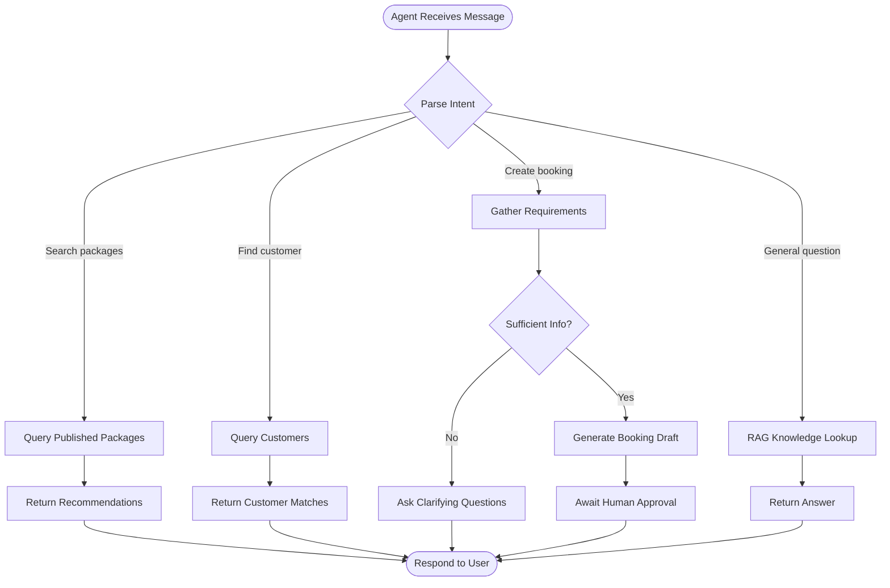

# Booking Agent Workflow

**Version:** 1.1 — Phase 5 approved  
**Agent:** Booking Agent  
**Model:** Claude (primary), OpenAI (fallback)  
**Last Updated:** 2026-06-02

---

## Purpose

Assist sales agents with **package recommendations**, **draft booking create/update**, **status lookup**, **traveler collection**, and **cancellation proposals** — all with human approval before confirm/cancel (D-007).

## Inputs

| Input | Source | Required |
|-------|--------|----------|
| User message | Chat interface | Yes |
| Tenant context | JWT tenant_id | Yes |
| Customer search results | Supabase customers table | Optional |
| Package catalog | Supabase packages table (published) | Optional |
| Conversation history | Session state | Optional |

## Outputs

| Output | Format | Action |
|--------|--------|--------|
| Text response | Markdown | Display in chat |
| Booking draft | Structured JSON | Create draft booking (requires approval) |
| Package recommendations | List with IDs | Display as selectable cards |
| Clarifying questions | Text | Display in chat |

## Workflow



## Tools (MCP)

| Tool | Description |
|------|-------------|
| search_packages | Query published packages by destination, duration, price |
| search_customers | Query customers by name, email, phone |
| get_package_detail | Get full package with itinerary and pricing |
| create_booking_draft | Insert draft booking (status: draft) |
| get_booking_status | Look up existing booking by reference |

## RAG Strategy

Knowledge base indexed from:
- Published package descriptions and itineraries
- Business rules (booking workflow, payment policy)
- FAQ documents

Retrieval: Top-5 chunks by semantic similarity, filtered by tenant_id.

See [knowledge-base.md](../rag/knowledge-base.md).

## Human-in-the-Loop

1. Agent creates booking with status `draft`
2. Agent presents draft summary to sales agent
3. Sales agent reviews in Bookings UI
4. Sales agent confirms or edits before status → `confirmed`

Agent NEVER transitions booking beyond `draft`.

## Error Handling

| Scenario | Response |
|----------|----------|
| No matching packages | Suggest broadening search criteria |
| Customer not found | Offer to create new customer |
| Package not published | Explain only published packages are bookable |
| Missing traveler info | Ask for required fields |
| API error | Apologize and suggest manual booking creation |

## API Integration

```
POST /api/ai/booking-agent
Authorization: Bearer {jwt}

Request:
{
  "message": "I need a 7-day Paris trip for John Doe and his wife, departing August 15",
  "session_id": "uuid"
}

Response:
{
  "reply": "I found 2 matching packages...",
  "draft": { ... } | null,
  "recommendations": [{ "id": "uuid", "title": "...", "price": 1500 }],
  "session_id": "uuid"
}
```

Implementation: `src/app/api/ai/booking-agent/route.ts`
