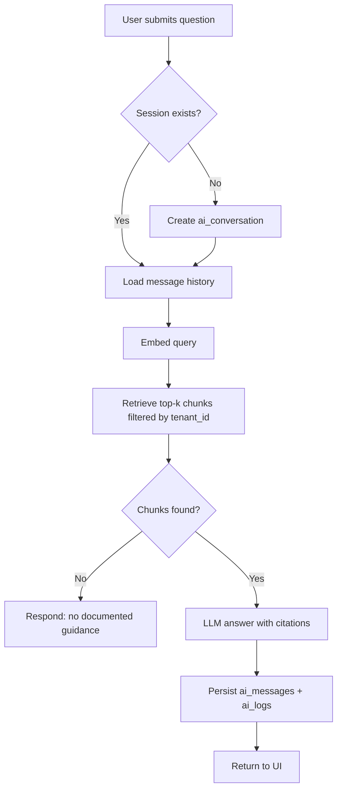

# Knowledge Agent Workflow

**Version:** 1.0  
**Status:** Approved (Phase 5) — documentation only  
**Last Updated:** 2026-06-02

---

## Overview

Internal staff ask questions; the agent retrieves tenant-scoped chunks and responds with citations. No writes to bookings, customers, or payments.

## Process

## Roles

| Role | Can use |
|------|---------|
| Sales Agent | Yes |
| Finance Officer | Yes |
| Tenant Admin | Yes + manage documents |

## Related

- [AIArchitecture.md](../AIArchitecture.md) §2
- [knowledge-base.md](../rag/knowledge-base.md)
