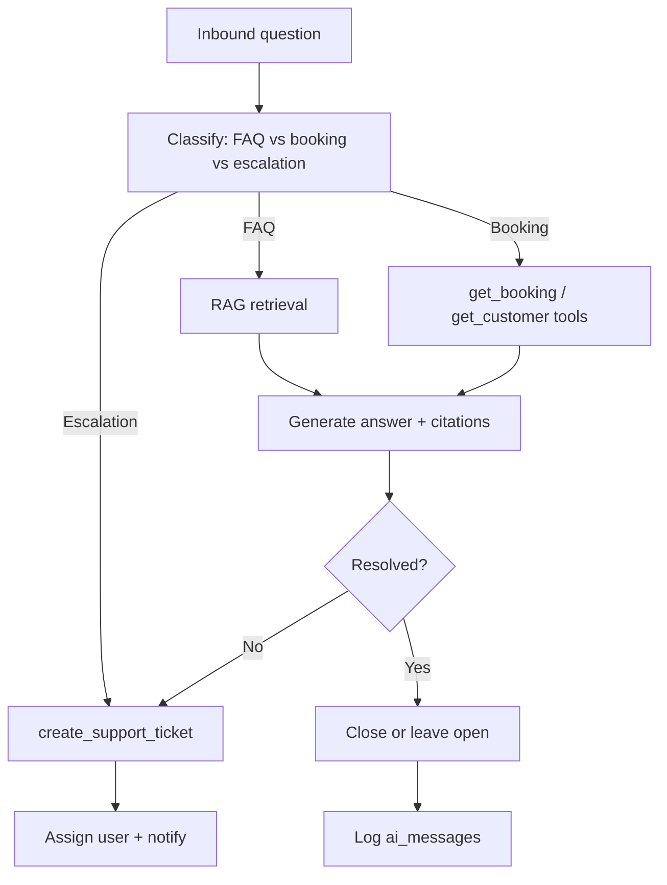

# Support Agent Workflow

**Version:** 1.0  
**Status:** Approved (Phase 5) — documentation only  
**Last Updated:** 2026-06-02

---

## Overview

Support staff (or future customer channels) describe issues; the agent answers from FAQ/policy RAG, looks up bookings, and creates or escalates tickets.

## Process

## Ticket states

`open` → `pending` → `escalated` → `resolved` → `closed`

## Related

- [AIArchitecture.md](../AIArchitecture.md) §4
- [Customers.md](../../docs/04-Modules/Customers.md) — CRM integration
