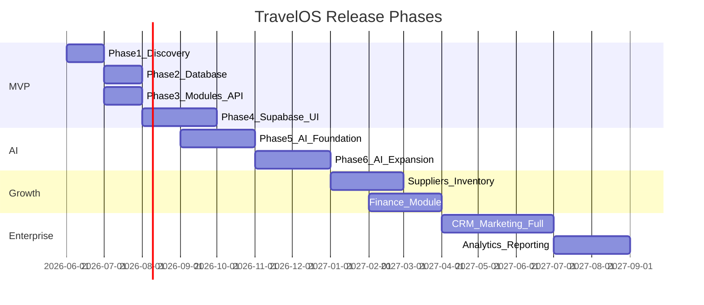

# TravelOS Product Roadmap

**Last Updated:** 2026-06-03

## Release Strategy Overview

TravelOS follows a phased release model: **MVP (Phases 1–4) → AI Foundation (Phase 5) → AI Expansion (Phase 6) → Growth → Enterprise**. Each phase delivers a shippable product increment with clear exit criteria.

**Current implementation status (2026-06-02):**

| Track | Status |
|-------|--------|
| PRD, Requirements, User Stories, Domain Model, ERD, Database Design | Complete |
| Supabase migrations | **001–021** applied in repo (latest: audit user triggers) |
| Admin UI (Refine) + core modules | **Implemented** (MVP modules + RecordMetadata on Show pages) |
| Marketing landing page | **Implemented** (`/`, `/home`) — Trust & Scale Metrics (D-009) |
| AI agents (Knowledge, Booking, Support) | **Implemented** — DB 012–017, chat UI, knowledge admin, feedback; Phase 5 manual sign-off pending |
| Audit logs UI | **Implemented** (`/audit-logs`, `tenant_admin`) |
| AI conversation history | **Implemented** (`/ai/history`, `ai.read`) |

---

## Phase 1 — MVP Foundation

**Target:** Q3 2026  
**Goal:** Core travel operations for a single agency tenant

### Features

| Module | Capability |
|--------|------------|
| Authentication | Email/password login, JWT sessions, password reset |
| User Management | Invite users, assign roles, deactivate accounts |
| Customers | CRUD, contacts, addresses, search |
| Packages | CRUD, itineraries, pricing tiers, media |
| Bookings | Create, status workflow, travelers, line items |
| Payments | Record payments, link to bookings, transaction log |

### Cross-Cutting

- Multi-tenant isolation (RLS)
- RBAC (4 tenant roles + Super Admin)
- Audit logging on all mutations
- Soft delete on all business entities

### Deliverables

- Full documentation (Phases 1–4)
- Supabase migrations with RLS
- Next.js + Refine admin dashboard
- Booking Agent API stub — draft-only workflow (expanded in Phase 5)
- Marketing landing page (see [LandingPage.md](./LandingPage.md))
- CI/CD pipeline

### Exit Criteria

- Agency can onboard, create packages, book customers, record payments
- Tenant data isolation verified
- All MVP user stories pass acceptance criteria

### Risks

| Risk | Impact | Mitigation |
|------|--------|------------|
| Refine + Supabase integration gaps | High | Early spike in Phase 5 |
| RLS policy complexity | High | Security test suite in Phase 4 |
| Scope creep to full 26-module spec | Medium | Strict MVP boundary in PRD |

### Dependencies

- Supabase project provisioned
- Vercel account for deployment
- Domain and SSL for production

---

## Phase 5 — AI Foundation

**Target:** Q4 2026  
**Goal:** Ship three approved AI agents with RAG infrastructure and support ticketing foundation

### Deliverables

| Deliverable | Description |
|-------------|-------------|
| **Knowledge Agent MVP** | Internal Q&A over tenant documents; citations; admin upload |
| **Booking Agent MVP** | Package suggestions, draft create/update, status lookup, traveler collection |
| **Support Agent MVP** | FAQ answers, booking context, ticket create/route/escalate |
| **RAG Infrastructure** | `knowledge_documents`, `knowledge_chunks`, embeddings pipeline |
| **Knowledge Base Management** | Admin UI to upload, tag, and reindex documents |
| **AI persistence layer** | `ai_conversations`, `ai_messages`, `ai_logs`, `ai_feedback` (see Database Design §8) |

### Dependencies

- MVP modules stable (customers, packages, bookings)
- pgvector / Supabase Vectors enabled
- Claude API keys and rate limits configured
- RBAC permissions for `ai.*` actions

### Exit Criteria

- Sales agent creates draft booking via Booking Agent; human confirms in UI
- Staff receives cited answer from Knowledge Agent for a published policy doc
- Support Agent opens ticket and escalates with audit trail
- Zero cross-tenant retrieval in security tests

### References

- [AIArchitecture.md](../../ai/AIArchitecture.md)
- [AI-Agents.md](../04-Modules/AI-Agents.md)
- [DECISIONS.md](./DECISIONS.md) D-006–D-008

---

## Phase 6 — AI Expansion

**Target:** Q1 2027  
**Goal:** Operational maturity for multi-agent platform and customer-facing readiness

### Deliverables

| Deliverable | Description |
|-------------|-------------|
| **Multi-agent orchestration** | Intent router → Knowledge / Booking / Support |
| **Agent analytics** | Usage, latency, resolution rate per tenant |
| **Agent monitoring** | Error budgets, hallucination flags, cost dashboards |
| **AI feedback loops** | Corrections feed retraining / prompt tuning |
| **Voice support readiness** | STT/TTS adapter design, IVR hooks (implementation optional) |

### Exit Criteria

- Orchestrator correctly routes 90%+ labeled test intents
- Tenant Admin views agent analytics dashboard
- Feedback export available for prompt review

---

## Phase 2 — Growth

**Target:** Q4 2026 – Q1 2027  
**Goal:** Expand operational capabilities for mid-size agencies

### Features

1. **Suppliers + Inventory** — hotels, flights, transfers, excursions, guides
2. **Finance** — invoices, refunds, payment gateway integration (Stripe)
3. **Documents** — upload/store booking documents via Supabase Storage
4. **Notifications** — email alerts for booking status changes
5. **Public B2C Portal** — package browse, online booking, traveler self-service
6. **Reports** — booking revenue, agent performance, outstanding payments

### Deliverables

- 30+ additional database tables
- Supplier management UI
- Invoice PDF generation
- Stripe payment integration
- Email notification service

### Exit Criteria

- End-to-end booking with supplier inventory
- Automated invoice generation
- Online payment collection

---

## Phase 3 — Enterprise

**Target:** Q2–Q3 2027  
**Goal:** Platform-scale features for large agencies and DMCs

### Features

1. **CRM** — leads, opportunities, pipeline management
2. **Marketing** — campaigns, email templates, audience segmentation
3. **Analytics** — dashboards, KPI tracking, custom reports
4. **Multi-Currency** — exchange rates, currency conversion on bookings
5. **Multi-Language** — i18n for UI and customer communications
6. **Extended AI Platform** — Recommendation, CRM, Marketing, Operations agents (beyond Phase 5–6 core three)
7. **API Marketplace** — public API for third-party integrations
8. **SSO/SAML** — enterprise identity provider integration

### Deliverables

- 50–100 total database tables
- 300+ user stories implemented
- Full AI agent suite with RAG
- Enterprise SLA monitoring

### Exit Criteria

- Multi-region deployment
- 99.9% uptime SLA
- SOC 2 readiness assessment complete

---

## MVP Module Boundary

### In Scope

- Authentication, User Management
- Customers, Packages, Bookings, Payments
- Multi-tenancy, RBAC, Audit

### Deferred (POST-MVP)

| Module | Target Phase |
|--------|-------------|
| Travelers (standalone) | Growth |
| Destinations, Countries, Cities | Growth |
| Hotels, Flights, Transfers, Excursions | Growth |
| Guides, Suppliers (full) | Growth |
| Invoices, Refunds | Growth |
| CRM, Marketing | Enterprise |
| Notifications (full) | Growth |
| Documents (full) | Growth |
| Reports, Analytics | Enterprise |
| Settings (advanced) | Growth |
| Knowledge / Booking / Support Agents (full platform) | Phase 5–6 (approved) |
| AI Agents (Recommendation, CRM, Marketing, Operations) | Enterprise |
| Landing Trust & Scale Metrics band | Phase 5 (marketing — D-009) |

---

## KPIs by Phase

| KPI | MVP Target | Growth Target | Enterprise Target |
|-----|-----------|---------------|-------------------|
| Active tenants | 10 | 100 | 500 |
| Bookings/month | 500 | 10,000 | 100,000 |
| Avg booking creation time | < 5 min | < 3 min | < 2 min |
| Payment collection rate | 80% | 90% | 95% |
| Platform uptime | 99% | 99.5% | 99.9% |
| AI-assisted bookings | 5% | 15% | 30% |

---

## Internationalization — Future Work (D-010)

**Decision:** Expand beyond **English + Arabic** in phases; staff admin UI stays EN/AR for MVP/pilot unless a tenant explicitly requires another language.

### Locale rollout priority

| Surface | Locales (planned) | Target phase | Notes |
|---------|-------------------|--------------|-------|
| Marketing landing (`/home`) | `es`, then `fr` | Growth | Hero, pricing, FAQ, footer — high ROI for international agencies |
| AI agents (chat replies) | Auto-detect + `ar`/`en`/`es` | Phase 5 completion → Phase 6 | `resolveAiLocale` + prompts; no full admin UI translation required |
| Auth & transactional email | Match user/tenant locale | Growth | Supabase templates per language |
| Customer portal / B2C (POST-MVP) | `ar`, `en`, `es`, … | Growth | Bookings, payments, self-service |
| Mobile app (POST-MVP) | Same as customer portal | Growth | Device locale + tenant default |
| Staff admin UI (Refine) | `en`, `ar` (MVP); `es` optional per tenant | Enterprise | Full `messages/{locale}.json` — high maintenance cost |

### Implementation checklist (when approved)

1. Add locale to `LOCALES` in `src/i18n/config.ts` and `messages/{locale}.json`
2. Landing: translate marketing keys only (subset of `messages/`, not full admin catalog)
3. AI: extend `AiLocale` and agent prompts; keep FTS/RAG bilingual (see migration 017)
4. Do **not** block Phase 5 AI exit on Spanish staff UI

**References:** `src/i18n/config.ts` (`FUTURE_LOCALES`), [DECISIONS.md](./DECISIONS.md) D-010.

---

## Phase 5 AI — Completion Checklist (remaining)

The three agents are **started in code** (routes, lib, UI, migrations). To declare Phase 5 **done**, complete:

| Area | Knowledge | Booking | Support |
|------|:---------:|:-------:|:-------:|
| API route + RBAC | Done | Done | Done |
| Chat UI | Done | Done | Done |
| RAG / tools | FTS + optional vectors | Tools + draft HITL | RAG + tickets |
| Admin (KB upload) | `/settings/knowledge` | — | Ticket list UI |
| **Env:** `ANTHROPIC_API_KEY` | Recommended | Recommended | Recommended |
| **Env:** `OPENAI_API_KEY` (embeddings) | Optional (FTS fallback) | — | Optional |
| Acceptance scenarios (AcceptanceCriteria §AI) | Validate manually | Validate manually | Validate manually |
| `ai_feedback` thumbs UI | Done | Done | Done |
| Ticket assign / escalate UI | — | — | Done (`/api/support-tickets/[id]`) |

**Exit criteria (from Phase 5):** cited Knowledge answer; draft booking via Booking Agent + human confirm; Support ticket with audit trail; zero cross-tenant leakage in tests.

**Manual validation:** [Phase5-AI-Validation.md](../05-Development/Phase5-AI-Validation.md)

**Out of scope for Phase 5:** public customer chatbot, voice, multi-agent orchestrator (Phase 6).
