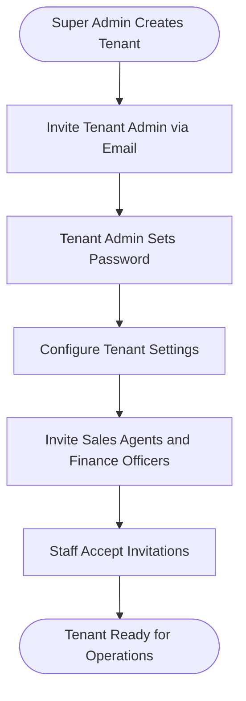
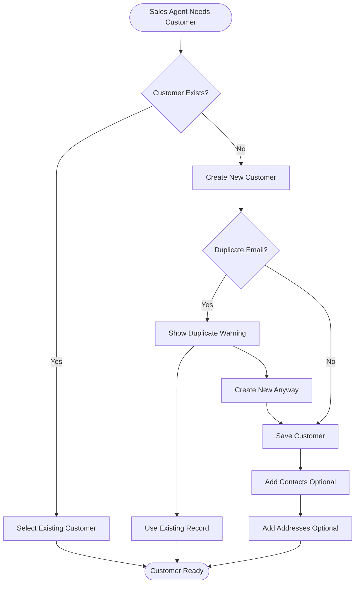
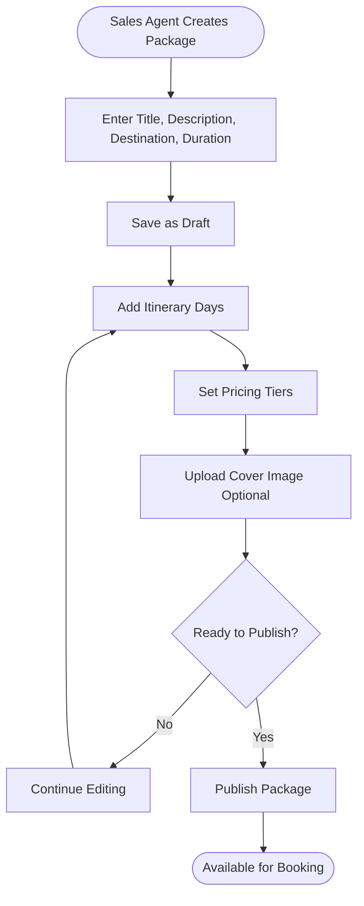
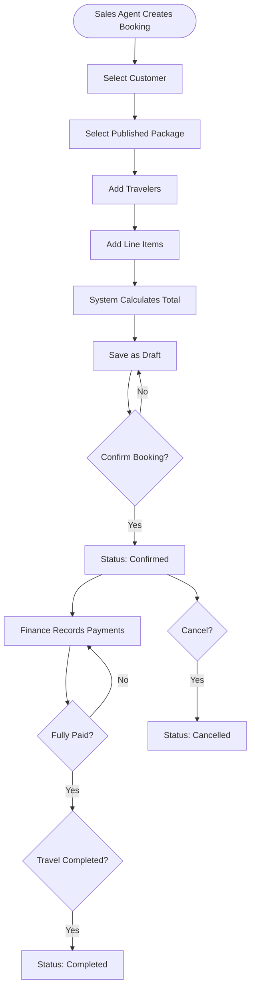
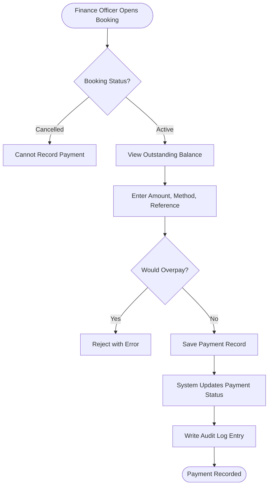
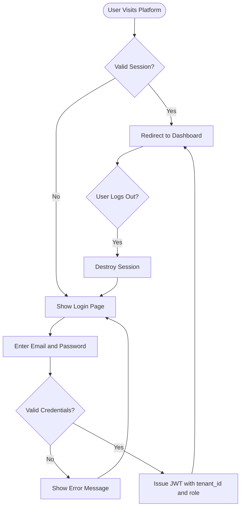
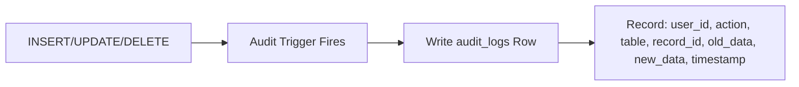

# TravelOS Business Flows

**Version:** 1.0 — MVP  
**Last Updated:** 2026-06-01

---

## 1. Tenant Onboarding Flow

**Steps:**

1. Super Admin creates tenant record with agency name and admin email
2. System sends invitation email to Tenant Admin
3. Tenant Admin sets password and completes profile
4. Tenant Admin configures tenant settings (name, timezone, currency)
5. Tenant Admin invites staff members with assigned roles
6. Staff accept invitations and set passwords
7. Tenant is operational

**Business Rules:** BR-009, BR-010

---

## 2. Customer Onboarding Flow

**Steps:**

1. Sales Agent searches for existing customer by name, email, or phone
2. If found, select existing record; if not, create new
3. System checks for duplicate email within tenant (BR-001)
4. Add optional contacts and addresses
5. Customer is ready for booking

---

## 3. Package Creation Flow

**Steps:**

1. Sales Agent enters basic package information
2. Package saved as draft (BR-002: not bookable yet)
3. Add daily itinerary items
4. Set pricing tiers (adult, child, infant)
5. Optionally upload cover image
6. Publish when complete — package becomes selectable in bookings

**Status Transitions:** draft → published → archived

---

## 4. Booking Lifecycle Flow

**Steps:**

1. Select customer and published package
2. Add travelers with passport details
3. Add line items (auto-populated from package pricing or manual)
4. System calculates total (BR-003)
5. Save as draft, then confirm when ready
6. Finance Officer records payments (BR-004, BR-005)
7. Mark completed after travel, or cancel at any point (BR-008)

**Status Transitions:** draft → confirmed → completed; any → cancelled

---

## 5. Payment Collection Flow

**Steps:**

1. Finance Officer opens a confirmed booking
2. System shows outstanding balance (total - paid)
3. Enter payment amount, method, date, reference number
4. System validates no overpayment (BR-006)
5. Payment saved, booking payment status auto-updated (BR-004)
6. Audit log entry created

**Payment Status Logic:**
- unpaid: total_paid = 0
- partial: 0 < total_paid < booking_total
- paid: total_paid >= booking_total

---

## 6. User Authentication Flow

---

## 7. Audit Trail Flow

Every mutation on business entities triggers:

Applies to: customers, packages, bookings, payments, users (within tenant scope).

---

## Process-to-Story Mapping

| Flow | User Stories |
|------|-------------|
| Tenant Onboarding | US-USER-001, US-USER-006, US-AUTH-001 |
| Customer Onboarding | US-CUST-001 to US-CUST-008 |
| Package Creation | US-PKG-001 to US-PKG-008 |
| Booking Lifecycle | US-BKG-001 to US-BKG-010 |
| Payment Collection | US-PAY-001 to US-PAY-007 |
| Authentication | US-AUTH-001 to US-AUTH-006 |
| Audit Trail | US-XCT-002 |
