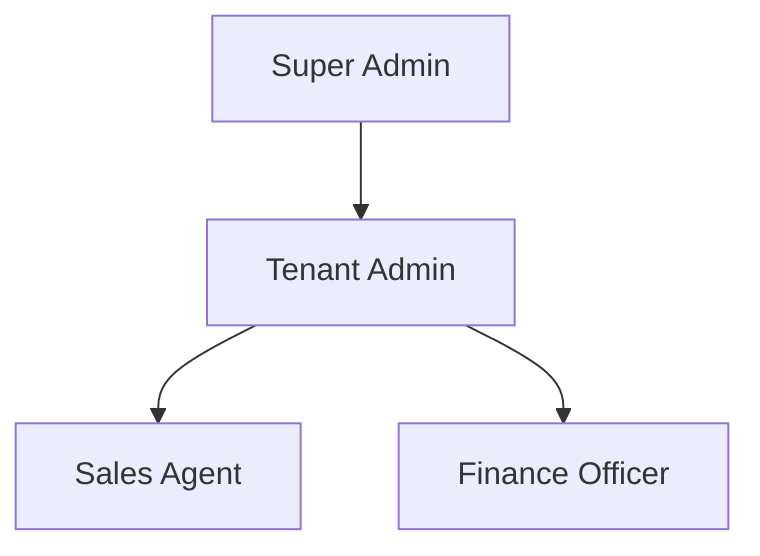

# TravelOS Roles

**Version:** 1.0 — MVP  
**Last Updated:** 2026-06-01

---

## Role Hierarchy

Super Admin operates at the platform level. All other roles are scoped to a single tenant.

---

## Role Definitions

### Super Admin

| Attribute | Value |
|-----------|-------|
| **Scope** | Platform-wide (all tenants) |
| **Description** | Platform operator who manages tenants, monitors system health, and handles platform-level configuration |
| **Typical User** | TravelOS internal staff |
| **Tenant Binding** | None (platform-level) |

**Responsibilities:**
- Create and manage tenant organizations
- View cross-tenant audit logs
- Monitor platform health and usage
- Manage platform-level settings

### Tenant Admin

| Attribute | Value |
|-----------|-------|
| **Scope** | Single tenant (their agency) |
| **Description** | Agency owner or manager with full control over their tenant's data and users |
| **Typical User** | Agency owner, office manager |
| **Tenant Binding** | Exactly one tenant |

**Responsibilities:**
- Manage tenant settings (name, timezone, currency)
- Invite, assign roles, and deactivate users
- Full CRUD on all MVP modules (customers, packages, bookings, payments)
- View dashboard and audit logs for their tenant
- Soft-delete customers and archive packages

### Sales Agent

| Attribute | Value |
|-----------|-------|
| **Scope** | Single tenant |
| **Description** | Front-line staff who interact with customers and create bookings |
| **Typical User** | Travel consultant, booking agent |
| **Tenant Binding** | Exactly one tenant |

**Responsibilities:**
- Create and manage customers (CRUD except delete)
- Create and manage packages (CRUD except delete)
- Create and manage bookings (full lifecycle)
- View payments (read-only)
- View dashboard (own bookings)

### Finance Officer

| Attribute | Value |
|-----------|-------|
| **Scope** | Single tenant |
| **Description** | Staff responsible for payment collection and financial reconciliation |
| **Typical User** | Accountant, finance manager |
| **Tenant Binding** | Exactly one tenant |

**Responsibilities:**
- Record and manage payments (full CRUD)
- View all bookings (read-only, especially payment status)
- View customers (read-only)
- View dashboard (financial metrics)
- Export payment data

---

## Role Assignment Rules

| Rule | Description |
|------|-------------|
| BR-009 | Each user (except Super Admin) belongs to exactly one tenant |
| BR-010 | Each user has exactly one role within their tenant |
| RA-001 | Only Tenant Admin can assign or change roles |
| RA-002 | A tenant must have at least one Tenant Admin at all times |
| RA-003 | Super Admin role is assigned manually at platform level |
| RA-004 | Deactivated users retain their role assignment but cannot authenticate |

---

## MVP Roles vs Full Platform Roles

| Role | MVP | Growth | Enterprise |
|------|-----|--------|------------|
| Super Admin | Yes | Yes | Yes |
| Tenant Admin | Yes | Yes | Yes |
| Sales Agent | Yes | Yes | Yes |
| Finance Officer | Yes | Yes | Yes |
| Operations Officer | No | Yes | Yes |
| Customer Support | No | Yes | Yes |
| Traveler | No | Yes | Yes |
| Supplier | No | Yes | Yes |
| Guide | No | No | Yes |

---

## Role-to-Module Access Summary

| Module | Super Admin | Tenant Admin | Sales Agent | Finance Officer |
|--------|:-----------:|:------------:|:-----------:|:---------------:|
| Tenants | CRUD | — | — | — |
| Users | CRUD | CRUD | — | — |
| Customers | CRUD | CRUD | CRUD | Read |
| Packages | CRUD | CRUD | CRUD | Read |
| Bookings | CRUD | CRUD | CRUD | Read |
| Payments | CRUD | CRUD | Read | CRUD |
| Dashboard | Read | Read | Read | Read |
| Audit Logs | Read | Read | — | — |
| Settings | CRUD | CRUD | — | — |

See [Permissions.md](./Permissions.md) for the detailed permissions matrix.
