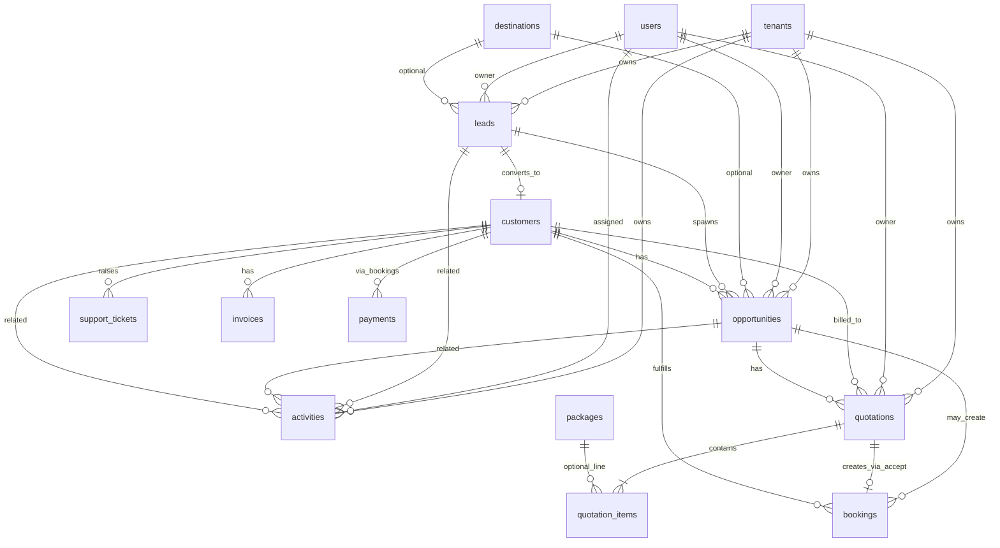

# TravelOS CRM Phase 7 — Implementation Specification

**Status:** APPROVED FOR IMPLEMENTATION (design artifacts)  
**Version:** 1.0 Final  
**Last Updated:** 2026-06-03  
**Effort:** ~320 hours | **Delivery:** 10–12 weeks (7A + 7B)

This document is the single source of truth for Phase 7 implementation.  
**No Phase 8 entities are implemented in Phase 7** (design reference only at §12).

---

## Table of Contents

1. [Final ERD](#1-final-erd)
2. [Database Schema](#2-database-schema)
3. [Migration Plan](#3-migration-plan)
4. [RLS Design](#4-rls-design)
5. [Permission Matrix](#5-permission-matrix)
6. [API Contracts](#6-api-contracts)
7. [Refine Resource Map](#7-refine-resource-map)
8. [Navigation Structure](#8-navigation-structure)
9. [CRM Dashboard Specification](#9-crm-dashboard-specification)
10. [Customer 360 Specification](#10-customer-360-specification)
11. [Quotation Workflow Specification](#11-quotation-workflow-specification)
12. [Phase 8 Reference (Design Only)](#12-phase-8-reference-design-only)
13. [Test Strategy](#13-test-strategy)
14. [Sprint Breakdown](#14-sprint-breakdown)

---

## 1. Final ERD

### 1.1 Phase 7A–7B Entity Relationship



### 1.2 Cardinality Rules

| Relationship | Cardinality | Notes |
|--------------|-------------|-------|
| Lead → Opportunity | 1:N | Multiple opps per lead allowed (re-open deals) |
| Lead → Customer | N:1 | Set on convert; won path |
| Opportunity → Quotation | 1:N | Revisions; one `accepted` active |
| Quotation → Booking | 1:1 typical | `bookings.quotation_id` nullable FK (7B) |
| Activity → Lead/Opp/Customer | N:1 each | ≥1 FK required |

### 1.3 Explicit Exclusions (ERD)

- No `package_id` on `opportunities`
- No separate CRM customer table
- No `accounts`, `suppliers`, `travel_requests` in Phase 7

---

## 2. Database Schema

### 2.1 Enum Types

```sql
-- 025_crm_enums.sql
CREATE TYPE lead_status AS ENUM (
  'new', 'contacted', 'qualified', 'proposal_sent', 'negotiation', 'won', 'lost'
);
CREATE TYPE lead_source AS ENUM (
  'whatsapp', 'website', 'facebook', 'instagram', 'tiktok',
  'referral', 'walk_in', 'phone_call', 'other'
);
CREATE TYPE preferred_contact_channel AS ENUM (
  'whatsapp', 'phone', 'email', 'in_person'
);
CREATE TYPE opportunity_stage AS ENUM (
  'discovery', 'proposal', 'negotiation', 'verbal_approval', 'closed_won', 'closed_lost'
);
CREATE TYPE activity_type AS ENUM (
  'call', 'whatsapp', 'email', 'meeting', 'task'
);
CREATE TYPE activity_status AS ENUM (
  'open', 'in_progress', 'completed', 'cancelled'
);
-- 028_quotations.sql (7B)
CREATE TYPE quotation_status AS ENUM (
  'draft', 'pending_approval', 'approved', 'sent', 'accepted', 'rejected', 'expired'
);
CREATE TYPE quotation_item_type AS ENUM (
  'package', 'hotel', 'flight', 'visa', 'transport', 'insurance', 'other'
);
CREATE TYPE quotation_approval_mode AS ENUM ('simple', 'standard');
```

### 2.2 Table: `leads`

| Column | Type | Constraints |
|--------|------|-------------|
| id | UUID | PK, DEFAULT gen_random_uuid() |
| tenant_id | UUID | NOT NULL, FK → tenants(id) ON DELETE CASCADE |
| lead_number | TEXT | NOT NULL |
| full_name | VARCHAR(200) | NOT NULL |
| mobile | VARCHAR(50) | |
| whatsapp | VARCHAR(50) | |
| email | VARCHAR(255) | |
| preferred_contact_channel | preferred_contact_channel | NOT NULL DEFAULT 'whatsapp' |
| source | lead_source | NOT NULL |
| destination_id | UUID | FK → destinations(id) ON DELETE SET NULL |
| destination_text | VARCHAR(255) | |
| expected_budget | DECIMAL(12,2) | |
| currency | CHAR(3) | NOT NULL DEFAULT 'USD' |
| travel_date | DATE | |
| pax_count | INTEGER | NOT NULL DEFAULT 1, CHECK (pax_count > 0) |
| notes | TEXT | |
| owner_id | UUID | NOT NULL, FK → users(id) ON DELETE SET NULL |
| status | lead_status | NOT NULL DEFAULT 'new' |
| customer_id | UUID | FK → customers(id) ON DELETE SET NULL |
| last_contacted_at | TIMESTAMPTZ | |
| last_whatsapp_at | TIMESTAMPTZ | |
| lost_reason | TEXT | |
| deleted_at | TIMESTAMPTZ | |
| created_by | UUID | FK → users(id) ON DELETE SET NULL |
| updated_by | UUID | FK → users(id) ON DELETE SET NULL |
| created_at | TIMESTAMPTZ | NOT NULL DEFAULT now() |
| updated_at | TIMESTAMPTZ | NOT NULL DEFAULT now() |

**Constraints:**

- `UNIQUE (tenant_id, lead_number)`
- `UNIQUE (tenant_id, email) WHERE deleted_at IS NULL AND email IS NOT NULL`

**Indexes:**

- `idx_leads_tenant_status` ON (tenant_id, status) WHERE deleted_at IS NULL
- `idx_leads_tenant_owner` ON (tenant_id, owner_id) WHERE deleted_at IS NULL
- `idx_leads_tenant_source` ON (tenant_id, source)
- `idx_leads_tenant_created` ON (tenant_id, created_at DESC)
- `idx_leads_tenant_last_contacted` ON (tenant_id, last_contacted_at DESC NULLS LAST)

### 2.3 Table: `opportunities`

| Column | Type | Constraints |
|--------|------|-------------|
| id | UUID | PK |
| tenant_id | UUID | NOT NULL, FK → tenants |
| opportunity_number | TEXT | NOT NULL |
| lead_id | UUID | FK → leads(id) ON DELETE SET NULL |
| customer_id | UUID | FK → customers(id) ON DELETE SET NULL |
| destination_id | UUID | FK → destinations(id) ON DELETE SET NULL |
| destination_text | VARCHAR(255) | |
| expected_budget | DECIMAL(12,2) | |
| estimated_revenue | DECIMAL(12,2) | |
| currency | CHAR(3) | NOT NULL DEFAULT 'USD' |
| expected_travel_date | DATE | |
| pax_count | INTEGER | NOT NULL DEFAULT 1, CHECK (pax_count > 0) |
| probability | SMALLINT | CHECK (probability >= 0 AND probability <= 100) |
| expected_close_date | DATE | |
| stage | opportunity_stage | NOT NULL DEFAULT 'discovery' |
| owner_id | UUID | NOT NULL, FK → users |
| notes | TEXT | |
| deleted_at, audit columns | | Standard |

**Constraints:**

- `UNIQUE (tenant_id, opportunity_number)`
- **NO package_id column**

### 2.4 Table: `activities`

| Column | Type | Constraints |
|--------|------|-------------|
| id | UUID | PK |
| tenant_id | UUID | NOT NULL, FK → tenants |
| activity_type | activity_type | NOT NULL |
| subject | VARCHAR(255) | NOT NULL |
| description | TEXT | |
| due_date | TIMESTAMPTZ | |
| assigned_to | UUID | NOT NULL, FK → users |
| related_lead_id | UUID | FK → leads ON DELETE CASCADE |
| related_opportunity_id | UUID | FK → opportunities ON DELETE CASCADE |
| related_customer_id | UUID | FK → customers ON DELETE CASCADE |
| status | activity_status | NOT NULL DEFAULT 'open' |
| completed_at | TIMESTAMPTZ | |
| channel_meta | JSONB | NOT NULL DEFAULT '{}' |
| deleted_at, audit columns | | |

**Constraints:**

- `CHECK (num_nonnulls(related_lead_id, related_opportunity_id, related_customer_id) >= 1)`

### 2.5 Table: `quotations` (Phase 7B)

| Column | Type | Constraints |
|--------|------|-------------|
| id | UUID | PK |
| tenant_id | UUID | NOT NULL |
| quotation_number | TEXT | NOT NULL |
| opportunity_id | UUID | NOT NULL, FK → opportunities |
| customer_id | UUID | FK → customers ON DELETE SET NULL |
| status | quotation_status | NOT NULL DEFAULT 'draft' |
| valid_until | DATE | |
| currency | CHAR(3) | NOT NULL |
| subtotal | DECIMAL(12,2) | NOT NULL DEFAULT 0 |
| discount_amount | DECIMAL(12,2) | NOT NULL DEFAULT 0 |
| tax_amount | DECIMAL(12,2) | NOT NULL DEFAULT 0 |
| total_amount | DECIMAL(12,2) | NOT NULL DEFAULT 0 |
| notes | TEXT | |
| terms_and_conditions | TEXT | |
| sent_at | TIMESTAMPTZ | |
| accepted_at | TIMESTAMPTZ | |
| rejected_at | TIMESTAMPTZ | |
| approved_by | UUID | FK → users |
| approved_at | TIMESTAMPTZ | |
| owner_id | UUID | NOT NULL, FK → users |
| deleted_at, audit columns | | |

**Constraints:**

- `UNIQUE (tenant_id, quotation_number)`

### 2.6 Table: `quotation_items` (Phase 7B)

| Column | Type | Constraints |
|--------|------|-------------|
| id | UUID | PK |
| tenant_id | UUID | NOT NULL |
| quotation_id | UUID | NOT NULL, FK → quotations ON DELETE CASCADE |
| sort_order | INTEGER | NOT NULL DEFAULT 0 |
| item_type | quotation_item_type | NOT NULL |
| description | TEXT | NOT NULL |
| package_id | UUID | FK → packages ON DELETE SET NULL |
| quantity | DECIMAL(10,2) | NOT NULL DEFAULT 1 |
| unit_price | DECIMAL(12,2) | NOT NULL |
| line_total | DECIMAL(12,2) | NOT NULL |
| created_at | TIMESTAMPTZ | NOT NULL DEFAULT now() |
| updated_at | TIMESTAMPTZ | NOT NULL DEFAULT now() |

### 2.7 Extension: `bookings` (Phase 7B)

| Column | Type | Notes |
|--------|------|-------|
| quotation_id | UUID | FK → quotations(id) ON DELETE SET NULL, nullable |

### 2.8 Extension: `tenant_settings` (Phase 7B)

| Column | Type | Default |
|--------|------|---------|
| quotation_approval_mode | quotation_approval_mode | 'simple' |
| quotation_default_valid_days | INTEGER | 14 |
| quotation_terms_default | TEXT | NULL |
| company_logo_storage_path | TEXT | NULL (Supabase Storage path) |

### 2.9 Functions & Triggers

| Object | Purpose |
|--------|---------|
| `generate_lead_number()` | `LD-YYYY-######` per tenant/year |
| `generate_opportunity_number()` | `OP-YYYY-######` |
| `generate_quotation_number()` | `QT-YYYY-######` |
| `sync_activity_contact_timestamps()` | Update lead `last_contacted_at` / `last_whatsapp_at` |
| `recalculate_quotation_totals()` | On item change |
| `set_updated_at`, `set_audit_user`, `log_audit` | Register CRM tables |

---

## 3. Migration Plan

**Baseline:** Latest repo migration = `024_email_logs.sql`  
**CRM migrations:** `025`–`030` (7A), `031`–`033` (7B)

### 3.1 Phase 7A Migrations

| File | Description | Deploy order |
|------|-------------|--------------|
| `025_crm_enums.sql` | All 7A enums | 1 |
| `026_crm_tables.sql` | leads, opportunities, activities | 2 |
| `027_crm_functions.sql` | Number generators, contact timestamp trigger | 3 |
| `028_crm_rls.sql` | RLS enable + CRM policies + `has_crm_permission()` | 4 |
| `029_crm_permissions_seed.sql` | permissions + role_permissions grants | 5 |
| `030_crm_audit_triggers.sql` | updated_at, audit_user, log_audit on CRM tables | 6 |

### 3.2 Phase 7B Migrations

| File | Description |
|------|-------------|
| `031_quotations.sql` | quotation enums, quotations, quotation_items, bookings.quotation_id |
| `032_quotation_functions.sql` | totals recalc, expiry check helper |
| `033_quotation_rls_permissions.sql` | RLS, quotation permissions seed, tenant_settings columns |

### 3.3 Rollback Strategy

- Rollback in reverse order per phase.
- 7B rollback: drop quotation tables before removing `bookings.quotation_id`.
- No data migration from existing customers (greenfield CRM data).

### 3.4 Apply Checklist

1. Apply to staging Supabase
2. Run RLS test suite (§13)
3. Seed test tenant leads/opportunities
4. Apply to production during maintenance window
5. Enable CRM nav via permissions (no feature flag)

---

## 4. RLS Design

### 4.1 Helper Functions

```sql
-- Resolve permission from JWT role via user_roles (auth.uid())
CREATE FUNCTION public.has_crm_permission(p_action TEXT)
RETURNS BOOLEAN
-- p_action examples: 'leads.read', 'leads.read_all', 'leads.write', 'leads.write_all'
-- Implementation: JOIN user_roles ur → role_permissions → permissions
-- WHERE ur.user_id = auth.uid() AND ur.tenant_id = current_tenant_id()
--   AND p.module = 'crm' AND p.action = p_action
-- OR is_super_admin()

CREATE FUNCTION public.crm_can_read_row(p_owner_id UUID, p_read_all_action TEXT)
RETURNS BOOLEAN
-- is_super_admin() OR has_crm_permission(p_read_all_action) OR owner_id = auth.uid()

CREATE FUNCTION public.crm_can_write_row(p_owner_id UUID, p_write_all_action TEXT)
RETURNS BOOLEAN
-- is_super_admin() OR has_crm_permission(p_write_all_action)
--   OR (has_crm_permission('*.write') AND owner_id = auth.uid())
```

### 4.2 Policy Pattern: `leads`

| Operation | USING / WITH CHECK |
|-----------|-------------------|
| SELECT | `tenant_id = current_tenant_id()` AND `crm_can_read_row(owner_id, 'leads.read_all')` OR super_admin |
| INSERT | `tenant_id = current_tenant_id()` AND (`has_crm_permission('leads.write')` OR `leads.write_all`) |
| UPDATE | tenant match AND `crm_can_write_row(owner_id, 'leads.write_all')` |
| DELETE | soft delete via UPDATE; same as UPDATE |

### 4.3 Policy Pattern: `opportunities`

Same as leads with `opportunities.read_all`, `opportunities.write`, `opportunities.write_all`.

### 4.4 Policy Pattern: `activities`

| Operation | Rule |
|-----------|------|
| SELECT | tenant AND (`activities.read_all` OR `assigned_to = auth.uid()`) |
| INSERT/UPDATE | tenant AND (`activities.write_all` OR (`activities.write` AND assigned_to = auth.uid())) |

### 4.5 Policy Pattern: `quotations` (7B)

Owner-based same as leads; `approve` transitions validated in API (RLS allows update if `write_all` or owner with write).

### 4.6 `quotation_items`

Tenant isolation via `quotation_id` join to quotations (subquery policy) OR duplicate `tenant_id` on items (recommended for simpler RLS).

### 4.7 Defense in Depth

- API enforces permissions before mutation (authoritative for workflows).
- RLS prevents cross-tenant and unauthorized cross-owner access if client bypasses API.

---

## 5. Permission Matrix

**Storage format:** `permissions.module = 'crm'`, `permissions.action = '{entity}.{verb}'`

### 5.1 Permission Catalog

| action | Description |
|--------|-------------|
| leads.read | Read own leads |
| leads.read_all | Read all tenant leads |
| leads.write | Create/update/assign own |
| leads.write_all | Full lead admin |
| opportunities.read | Read own |
| opportunities.read_all | Read all |
| opportunities.write | Own write |
| opportunities.write_all | All write |
| activities.read | Read assigned/related own |
| activities.read_all | Read all |
| activities.write | Own write |
| activities.write_all | All write |
| dashboard.read | CRM dashboard |
| quotations.read | Own (7B) |
| quotations.read_all | All read (7B) |
| quotations.write | Own draft/edit (7B) |
| quotations.write_all | All (7B) |
| quotations.approve | pending → approved (7B) |
| quotations.send | approved/sent transitions (7B) |
| quotations.accept | sent → accepted (7B) |

### 5.2 Role Grants

| action | super_admin | tenant_admin | sales_agent | finance_officer |
|--------|:-----------:|:------------:|:-----------:|:---------------:|
| leads.read | ✓ | ✓ | ✓ | — |
| leads.read_all | ✓ | ✓ | — | ✓ |
| leads.write | ✓ | ✓ | ✓ | — |
| leads.write_all | ✓ | ✓ | — | — |
| opportunities.read | ✓ | ✓ | ✓ | — |
| opportunities.read_all | ✓ | ✓ | — | ✓ |
| opportunities.write | ✓ | ✓ | ✓ | — |
| opportunities.write_all | ✓ | ✓ | — | — |
| activities.read | ✓ | ✓ | ✓ | — |
| activities.read_all | ✓ | ✓ | — | ✓ |
| activities.write | ✓ | ✓ | ✓ | — |
| activities.write_all | ✓ | ✓ | — | — |
| dashboard.read | ✓ | ✓ | ✓ | ✓ |
| quotations.* write/approve/send/accept | ✓ | ✓ | write/send/accept own | read_all only |

**Note:** `super_admin` bypasses via RLS `is_super_admin()`; grants still seeded for consistency.

### 5.3 Application Mapping

| Layer | File | Mapping |
|-------|------|---------|
| API | `src/lib/auth/rbac.ts` | Extend `hasCrmPermission(role, action)` |
| Refine | `src/providers/access-control-provider.ts` | Map resources → crm permissions |
| JWT | No change | Role in app_metadata |

---

## 6. API Contracts

**Base:** `/api` | **Auth:** Bearer JWT | **Envelope:** existing API.md conventions

**Rule:** Mutations and workflows **MUST** use API routes. List reads **MAY** use Supabase Data Provider.

### 6.1 Leads

#### `GET /api/leads`

Query: `search`, `status`, `source`, `owner_id`, `page`, `limit`, `cursor`  
Permission: `crm.leads.read` (own filtered server-side) or `crm.leads.read_all`

Response 200:

```json
{
  "data": [{
    "id": "uuid",
    "lead_number": "LD-2026-000001",
    "full_name": "Ahmed Hassan",
    "mobile": "+2010...",
    "whatsapp": "+2010...",
    "status": "new",
    "source": "whatsapp",
    "owner_id": "uuid",
    "last_contacted_at": null,
    "last_whatsapp_at": null,
    "created_at": "ISO8601"
  }],
  "meta": { "page": 1, "limit": 20, "total": 42, "totalPages": 3 }
}
```

#### `POST /api/leads`

Permission: `crm.leads.write`  
Body: lead create fields (Zod validated). Sets `owner_id` default = auth user.

#### `GET /api/leads/:id`

Permission: read + RLS  
Response includes full detail + optional `timeline_preview` (last 5 activities).

#### `PATCH /api/leads/:id`

Permission: write or write_all on row.

#### `DELETE /api/leads/:id`

Soft delete (`deleted_at`). Permission: write_all or owner with write.

#### `POST /api/leads/:id/assign`

Body: `{ "owner_id": "uuid" }`  
Permission: `crm.leads.write` on row or write_all.

#### `POST /api/leads/:id/convert-opportunity`

Creates opportunity from lead fields. Permission: `crm.opportunities.write`.  
Response: `{ "data": { "opportunity_id": "uuid", ... } }`

#### `POST /api/leads/:id/convert-customer`

Body optional: `{ "link_existing_customer_id": "uuid" }`  
Creates or links customer; sets lead `customer_id`, status `won`.  
Permission: `crm.leads.write` + `customers.create` (or tenant_admin).

### 6.2 Opportunities

#### `GET /api/opportunities`

Query: `stage`, `owner_id`, `lead_id`, `search`, pagination.

#### `POST /api/opportunities`

Permission: `crm.opportunities.write`

#### `PATCH /api/opportunities/:id`

Partial update including `stage`, `probability`, revenue fields.

#### `POST /api/opportunities/:id/create-booking`

**Mandatory API workflow.**  
Pre-fills draft booking from opportunity (customer, dates, pax, notes).  
Does NOT confirm booking.  
Permission: `crm.opportunities.write` + `bookings.create`  
Response: `{ "data": { "booking_id": "uuid", "redirect_url": "/bookings/edit/:id" } }`

#### `GET /api/opportunities/forecast`

Query: `period=month|quarter`  
Permission: `crm.dashboard.read`  
Response: weighted forecast series.

### 6.3 Activities

#### `GET /api/activities`

Query: `view=timeline|upcoming|overdue`, `lead_id`, `opportunity_id`, `customer_id`, `assigned_to`

#### `POST /api/activities`

Quick-log endpoint for WhatsApp: `{ "activity_type": "whatsapp", "related_lead_id": "...", "subject": "WhatsApp follow-up", ... }`

#### `PATCH /api/activities/:id`

Status transitions; sets `completed_at` when completed.

### 6.4 Customer 360

#### `GET /api/customers/:id/360`

Permission: `customers.read` + CRM read permissions for CRM sections.  
See §10 for payload schema.

### 6.5 CRM Dashboard

#### `GET /api/crm/dashboard`

Query: `period=month` (default), optional `from`, `to`  
Permission: `crm.dashboard.read`  
See §9 for payload schema.

### 6.6 Quotations (7B)

| Method | Path | Permission |
|--------|------|------------|
| GET | `/api/quotations` | quotations.read / read_all |
| POST | `/api/quotations` | quotations.write |
| GET | `/api/quotations/:id` | read |
| PATCH | `/api/quotations/:id` | write (draft only) |
| POST | `/api/quotations/:id/items` | write |
| PATCH | `/api/quotations/:id/items/:itemId` | write |
| DELETE | `/api/quotations/:id/items/:itemId` | write |
| POST | `/api/quotations/:id/submit-approval` | write (standard mode) |
| POST | `/api/quotations/:id/approve` | quotations.approve |
| POST | `/api/quotations/:id/send` | quotations.send |
| POST | `/api/quotations/:id/accept` | quotations.accept |
| POST | `/api/quotations/:id/reject` | quotations.write |
| GET | `/api/quotations/:id/pdf` | quotations.read |
| POST | `/api/quotations/:id/create-booking` | accept + bookings.create |

---

## 7. Refine Resource Map

| Resource name | Routes | Data provider | Mutations |
|---------------|--------|---------------|-----------|
| `crm-dashboard` | list: `/crm/dashboard` | API only | — |
| `leads` | list/create/edit/show: `/crm/leads/...` | Supabase read list; API for create/update/delete/workflows | API |
| `opportunities` | `/crm/opportunities/...` | Same pattern | API |
| `activities` | `/crm/activities/...` | Same pattern | API |
| `quotations` | `/crm/quotations/...` (7B) | Same pattern | API |
| `customers` | existing `/customers/...` | Existing | Existing + 360 via API |

**Meta:**

```typescript
{ parent: "crm", labelKey: "nav.leads", icon: UserPlus }
```

**Custom pages (no standard CRUD):**

- `/crm/dashboard` → CRM Dashboard (uses `useCustom` → GET /api/crm/dashboard)

**Excluded resources:** `lead-pipeline`, `opp-pipeline` (Kanban not approved)

---

## 8. Navigation Structure

```
Dashboard                    /dashboard          (operations - existing)
── CRM ──
  CRM Dashboard              /crm/dashboard
  Leads                      /crm/leads
  Opportunities              /crm/opportunities
  Activities                 /crm/activities
  Quotations (7B)            /crm/quotations
── Operations ──
  Customers                  /customers
  Travelers                  /travelers
  Destinations               /destinations
  Packages                   /packages
  Bookings                   /bookings
  Invoices                   /invoices
  Payments                   /payments
── AI ──
  (existing AI resources)
── Admin ──
  Users, Audit Logs, Settings
```

**Layout:** `src/components/layout/index.tsx` — group by `resource.meta.parent`.  
**Access:** `useCan` per resource; finance sees CRM dashboard + read-only lists.

**WhatsApp actions (Lead show):**

- Button: "WhatsApp" → `https://wa.me/{normalized_whatsapp}`
- Button: "Log WhatsApp" → opens quick activity form (POST /api/activities)

---

## 9. CRM Dashboard Specification

### 9.1 Route

`/crm/dashboard` — permission `crm.dashboard.read`

### 9.2 API Response: `GET /api/crm/dashboard`

```json
{
  "data": {
    "period": { "from": "ISO8601", "to": "ISO8601" },
    "kpis": {
      "leads_this_month": 24,
      "leads_by_source": { "whatsapp": 12, "instagram": 5, "referral": 3 },
      "open_opportunities": 8,
      "forecast_revenue": 125000.00,
      "closed_revenue": 48000.00,
      "activities_due_today": 5,
      "activities_overdue": 2,
      "whatsapp_activities_7d": 31
    },
    "charts": {
      "lead_trend": [{ "week": "2026-W22", "count": 6 }],
      "opportunity_funnel": [{ "stage": "discovery", "count": 3 }],
      "revenue_forecast": [{ "month": "2026-07", "amount": 50000 }],
      "lead_source_analysis": [{ "source": "whatsapp", "count": 12, "percent": 50 }]
    },
    "lists": {
      "overdue_activities": [{ "id": "...", "subject": "...", "due_date": "..." }],
      "stale_leads": [{ "id": "...", "full_name": "...", "days_since_contact": 5 }]
    }
  }
}
```

### 9.3 KPI Definitions

| KPI | SQL logic (conceptual) |
|-----|------------------------|
| leads_this_month | COUNT leads created in period |
| forecast_revenue | SUM(estimated_revenue * probability/100) for open stages |
| closed_revenue | 7A: SUM(estimated_revenue) closed_won; 7B: prefer SUM(accepted quotation total) |
| whatsapp_activities_7d | COUNT activities type=whatsapp in 7 days |
| stale_leads | leads where last_contacted_at < now() - 3 days AND status NOT IN (won,lost) |

### 9.4 UI Components

- KPI card row (shadcn Card)
- Recharts: Line (lead trend), Bar (funnel), Bar/Line (forecast), Pie (source)
- Tables: overdue activities, stale leads with links

---

## 10. Customer 360 Specification

### 10.1 Route

Existing `/customers/show/:id` — tabbed interface.

### 10.2 Tabs

| Tab | Data source |
|-----|-------------|
| Overview | customers + contacts + addresses |
| Bookings | bookings WHERE customer_id |
| Invoices | invoices via bookings |
| Payments | payments |
| Support Tickets | support_tickets |
| Activities | activities WHERE related_customer_id |
| Lead History | leads WHERE customer_id OR matched identity |
| Opportunity History | opportunities WHERE customer_id |
| Travel History | bookings aggregated by destination/year |
| Revenue Metrics | payments sum, outstanding (gated by financial permission) |

### 10.3 Timeline

**Component:** `CustomerTimeline` on Overview tab (and optional full-page filter).

**Event types:**

| type | source |
|------|--------|
| activity | activities |
| lead_created | audit_logs / lead.created_at |
| opportunity_stage | audit_logs opportunities |
| quotation_sent | quotations.sent_at (7B) |
| quotation_accepted | quotations.accepted_at (7B) |
| booking_created | bookings |
| payment_received | payments |
| support_ticket | support_tickets |

**Sort:** `occurred_at DESC`  
**Filters:** All | Sales | Operations | Support

### 10.4 API: `GET /api/customers/:id/360`

Single request; server parallelizes queries.

```json
{
  "data": {
    "customer": { },
    "contacts": [],
    "addresses": [],
    "summary": {
      "total_revenue": 0,
      "outstanding_balance": 0,
      "booking_count": 0,
      "open_opportunities": 0
    },
    "tabs": {
      "bookings": [],
      "invoices": [],
      "payments": [],
      "tickets": [],
      "activities": [],
      "leads": [],
      "opportunities": [],
      "travel_history": []
    },
    "timeline": [
      { "type": "activity", "title": "WhatsApp follow-up", "occurred_at": "ISO8601", "ref_id": "uuid", "meta": {} }
    ]
  }
}
```

---

## 11. Quotation Workflow Specification

### 11.1 Mode A — Simple (`tenant_settings.quotation_approval_mode = simple`)

```
draft → sent → accepted | rejected | expired
```

| Transition | Actor | API |
|------------|-------|-----|
| draft → sent | owner | POST .../send |
| sent → accepted | owner/admin | POST .../accept |
| sent → rejected | owner | POST .../reject |
| * → expired | system/on-read | valid_until < today |

`pending_approval` and `approved` statuses **not used** in simple mode.

### 11.2 Mode B — Standard (`quotation_approval_mode = standard`)

```
draft → pending_approval → approved → sent → accepted | rejected | expired
```

| Transition | Actor | API |
|------------|-------|-----|
| draft → pending_approval | owner | POST .../submit-approval |
| pending_approval → approved | tenant_admin (approve perm) | POST .../approve |
| approved → sent | owner | POST .../send |
| sent → accepted | owner/admin | POST .../accept |

### 11.3 Accept → Booking Flow

1. `POST /api/quotations/:id/accept` sets status `accepted`, `accepted_at`, ensures `customer_id`.
2. Client calls `POST /api/quotations/:id/create-booking` OR accept response includes `booking_id`.
3. Booking created in `draft` with `quotation_id`, pre-filled dates/pax/notes.
4. User completes booking in existing UI; invoice flow unchanged.

### 11.4 PDF Requirements

- Tenant logo from Storage
- Bilingual template (tenant locale primary; EN secondary)
- Line items table, subtotal/discount/tax/total
- Terms block
- QR encoding quotation reference URL or number
- Route: `GET /api/quotations/:id/pdf` → `application/pdf`

---

## 12. Phase 8 Reference (Design Only)

**Not implemented in Phase 7.**

### 12.1 Corporate Accounts

- `accounts`, `account_contacts`
- Opportunities link to `account_id` (future)
- Account 360 dashboard

### 12.2 Supplier CRM

- `suppliers`, `supplier_contacts`, `supplier_agreements`
- Types: hotel, airline, transport, visa, insurance, tour_operator

### 12.3 Travel Requests

- `travel_requests` → approval → quotation → booking
- Corporate dashboard

---

## 13. Test Strategy

### 13.1 Database / RLS (Required)

| Test | Assert |
|------|--------|
| Tenant isolation | User A cannot read User B tenant leads |
| Owner scope | sales_agent cannot update peer's lead |
| read_all | finance_officer can read all, cannot write |
| write_all | tenant_admin can assign any owner |
| Super admin bypass | cross-tenant read for super_admin only |

### 13.2 API Integration

| Suite | Coverage |
|-------|----------|
| Lead convert customer | Creates customer, sets customer_id, won status |
| Lead convert opportunity | Copies destination, budget, pax |
| Opportunity create-booking | Draft booking, correct FKs, no package required |
| Quotation simple workflow | draft → sent → accept |
| Quotation standard workflow | includes approve step |
| Dashboard | KPI counts match seed data |

### 13.3 E2E (Playwright)

1. Create lead → log WhatsApp activity → last_whatsapp_at updated
2. Convert to opportunity → create quotation (7B) → accept → booking draft
3. Customer 360 timeline shows activity + booking
4. Click-to-WhatsApp link format

### 13.4 Regression

- Existing bookings/customers/invoices unaffected
- RBAC for non-CRM modules unchanged

---

## 14. Sprint Breakdown

### Phase 7A (Weeks 1–6) — ~180h

| Sprint | Focus | Hours | Deliverables |
|--------|-------|------:|--------------|
| S1 | DB 025–030, permissions, RLS tests | 32 | Migrations applied staging |
| S2 | Lead APIs + Zod + Refine CRUD + search | 40 | Leads end-to-end |
| S3 | Activities + WhatsApp triggers + quick log | 28 | Contact tracking live |
| S4 | Opportunities + conversions + forecast API | 36 | Opp + lead convert |
| S5 | Customer 360 API + tabs + timeline | 32 | 360 complete |
| S6 | CRM dashboard + nav + i18n + E2E | 32 | 7A pilot ready |

### Phase 7B (Weeks 7–10) — ~108h

| Sprint | Focus | Hours | Deliverables |
|--------|-------|------:|--------------|
| S7 | Quotations schema 031–033 + CRUD API | 36 | Quotation draft |
| S8 | Approval modes + send/accept/reject | 28 | Workflow complete |
| S9 | PDF AR/EN + create-booking bridge | 28 | PDF + booking |
| S10 | Dashboard quote metrics + E2E + docs | 16 | 7B release |

### Phase 7C Hardening (Weeks 11–12) — ~32h

- OpenAPI spec export
- Contract tests, pilot runbook, DECISIONS.md updates

**Total: ~320 hours over 10–12 weeks**

---

## Approval Gates for Code Generation

- [ ] ERD and schema reviewed (§1–2)
- [ ] Migration filenames and order confirmed (§3)
- [ ] RLS helpers acceptable performance-wise (§4)
- [ ] API contracts signed off (§6)
- [ ] UI routes match Refine map (§7–8)
- [ ] Quotation modes A/B confirmed (§11)

**After checklist:** Generate `025_*.sql` … and application code per sprint plan.

---

## Decision Log (Implementation Constraints)

| ID | Constraint |
|----|------------|
| D-CRM-7A-01 | No Kanban, no AI Sales, no WA Business API |
| D-CRM-7A-02 | No package_id on opportunities |
| D-CRM-7B-01 | Quotations mandatory; dual approval mode |
| D-CRM-API-01 | Workflow mutations via API only |
| D-CRM-RBAC-01 | Four roles only; crm.* permissions |
| D-CRM-WA-01 | WhatsApp fields + metrics + wa.me + quick log |
