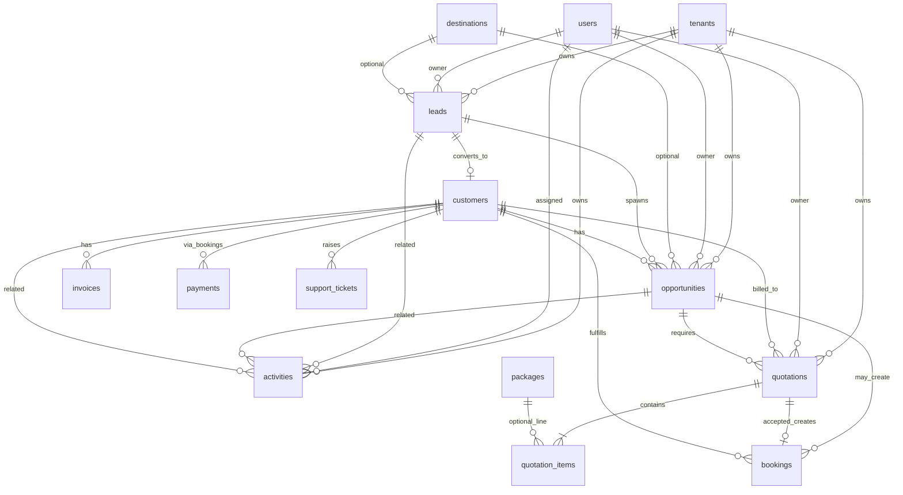
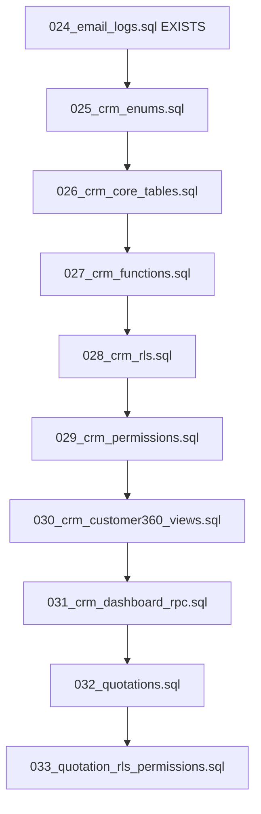

# TravelOS CRM Phase 7 — Pre-Implementation Package

**Status:** FINAL APPROVED — awaiting sign-off to generate code  
**Spec:** `CRM-Phase7-Implementation-Spec.md` (frozen)  
**Date:** 2026-06-03

---

## 1. Final ERD

### 1.1 Phase 7A–7B (Implementation Scope)

### 1.2 Invariants (Frozen)

| Rule | Enforcement |
|------|-------------|
| No `package_id` on `opportunities` | Schema + API validation |
| No CRM customer table | Use `customers` only |
| `quotation_items.package_id` optional | Line-level only |
| Activity ≥1 relation | CHECK constraint |
| Soft delete | `deleted_at IS NULL` in queries |

---

## 2. Migration Dependency Diagram

### 2.1 Migration File Responsibilities

| File | Depends on | Creates / Updates |
|------|------------|-------------------|
| **025_crm_enums.sql** | 024 | `lead_status`, `lead_source`, `preferred_contact_channel`, `opportunity_stage`, `activity_type`, `activity_status` |
| **026_crm_core_tables.sql** | 025 | `leads`, `opportunities`, `activities` + indexes + UNIQUE constraints |
| **027_crm_functions.sql** | 026 | `generate_lead_number`, `generate_opportunity_number`, `sync_activity_contact_timestamps`, `set_updated_at` triggers, `set_audit_user`, `log_audit` on CRM tables |
| **028_crm_rls.sql** | 027 | `has_crm_permission()`, `crm_can_read_row()`, `crm_can_write_row()`, ENABLE RLS + policies on leads/opportunities/activities |
| **029_crm_permissions.sql** | 028 | INSERT `permissions` (module `crm`), `role_permissions` grants (4 roles) |
| **030_crm_customer360_views.sql** | 029 | Views: `v_customer_timeline_events`, `v_customer_travel_history` (read-only, tenant-safe) |
| **031_crm_dashboard_rpc.sql** | 030 | `crm_dashboard_stats(p_from, p_to)` SECURITY DEFINER with tenant guard |
| **032_quotations.sql** | 031 | `quotation_status`, `quotation_item_type`, `quotation_approval_mode`, `quotations`, `quotation_items`, `bookings.quotation_id`, `tenant_settings` extensions, `generate_quotation_number`, totals trigger |
| **033_quotation_rls_permissions.sql** | 032 | RLS on quotations/items, quotation permission seed, `has_crm_permission` grants for quotations.* |

**Sprint 1 ships:** 025 → 031 (7A database complete).  
**Sprint 6 ships:** 032 → 033 (7B database).

---

## 3. Database Schema

### 3.1 `leads`

| Column | Type | Notes |
|--------|------|-------|
| id | UUID PK | |
| tenant_id | UUID NN FK tenants | |
| lead_number | TEXT NN | UNIQUE(tenant_id, lead_number) |
| full_name | VARCHAR(200) NN | |
| mobile, whatsapp, email | VARCHAR | |
| preferred_contact_channel | preferred_contact_channel NN DEFAULT 'whatsapp' | |
| source | lead_source NN | |
| destination_id | UUID FK destinations | |
| destination_text | VARCHAR(255) | |
| expected_budget | DECIMAL(12,2) | |
| currency | CHAR(3) NN DEFAULT 'USD' | |
| travel_date | DATE | |
| pax_count | INT NN DEFAULT 1 CHECK (>0) | |
| notes | TEXT | |
| owner_id | UUID NN FK users | |
| status | lead_status NN DEFAULT 'new' | |
| customer_id | UUID FK customers | |
| last_contacted_at | TIMESTAMPTZ | Trigger-maintained |
| last_whatsapp_at | TIMESTAMPTZ | Trigger-maintained |
| lost_reason | TEXT | |
| deleted_at | TIMESTAMPTZ | |
| created_by, updated_by | UUID FK users | |
| created_at, updated_at | TIMESTAMPTZ NN | |

### 3.2 `opportunities` (NO package_id)

| Column | Type | Notes |
|--------|------|-------|
| id | UUID PK | |
| tenant_id | UUID NN | |
| opportunity_number | TEXT NN | UNIQUE(tenant_id, opportunity_number) |
| lead_id | UUID FK leads | |
| customer_id | UUID FK customers | |
| destination_id | UUID FK destinations | |
| destination_text | VARCHAR(255) | |
| expected_budget | DECIMAL(12,2) | |
| estimated_revenue | DECIMAL(12,2) | |
| currency | CHAR(3) NN | |
| expected_travel_date | DATE | |
| pax_count | INT NN DEFAULT 1 | |
| probability | SMALLINT CHECK 0-100 | |
| expected_close_date | DATE | |
| stage | opportunity_stage NN DEFAULT 'discovery' | |
| owner_id | UUID NN FK users | |
| notes | TEXT | |
| deleted_at + audit cols | | |

### 3.3 `activities`

| Column | Type | Notes |
|--------|------|-------|
| id | UUID PK | |
| tenant_id | UUID NN | |
| activity_type | activity_type NN | |
| subject | VARCHAR(255) NN | |
| description | TEXT | |
| due_date | TIMESTAMPTZ | |
| assigned_to | UUID NN FK users | |
| related_lead_id | UUID FK leads | |
| related_opportunity_id | UUID FK opportunities | |
| related_customer_id | UUID FK customers | |
| status | activity_status NN DEFAULT 'open' | |
| completed_at | TIMESTAMPTZ | |
| channel_meta | JSONB DEFAULT '{}' | |
| deleted_at + audit cols | | |

**CHECK:** `num_nonnulls(related_lead_id, related_opportunity_id, related_customer_id) >= 1`

### 3.4 `quotations` (032)

| Column | Type | Notes |
|--------|------|-------|
| quotation_number | TEXT NN | QT-YYYY-###### |
| opportunity_id | UUID NN FK opportunities | |
| customer_id | UUID FK customers | |
| status | quotation_status NN DEFAULT 'draft' | |
| valid_until | DATE | |
| currency | CHAR(3) NN | |
| subtotal, discount_amount, tax_amount, total_amount | DECIMAL NN | |
| notes, terms_and_conditions | TEXT | |
| sent_at, accepted_at, rejected_at, approved_at | TIMESTAMPTZ | |
| approved_by | UUID FK users | |
| owner_id | UUID NN | |
| deleted_at + audit cols | | |

### 3.5 `quotation_items` (032)

| Column | Type | Notes |
|--------|------|-------|
| quotation_id | UUID NN FK CASCADE | |
| tenant_id | UUID NN | |
| sort_order | INT | |
| item_type | quotation_item_type NN | |
| description | TEXT NN | |
| package_id | UUID FK packages NULL | |
| quantity, unit_price, line_total | DECIMAL NN | |

### 3.6 Extensions

| Object | Change |
|--------|--------|
| `bookings` | + `quotation_id UUID FK quotations` |
| `tenant_settings` | + `quotation_approval_mode`, `quotation_default_valid_days`, `quotation_terms_default`, `company_logo_storage_path` |

### 3.7 Views (030)

**`v_customer_timeline_events`** — UNION ALL normalized events:

| event_type | source |
|------------|--------|
| lead_created | leads |
| opportunity_created | opportunities |
| activity_logged | activities |
| quotation_sent | quotations.sent_at |
| quotation_approved | quotations.approved_at |
| booking_created | bookings |
| invoice_created | invoices |
| ticket_created | support_tickets |

Columns: `tenant_id`, `customer_id`, `event_type`, `title`, `occurred_at`, `ref_table`, `ref_id`, `meta jsonb`

**`v_customer_travel_history`** — bookings grouped by destination/year for customer.

### 3.8 RPC (031)

**`crm_dashboard_stats(p_from timestamptz, p_to timestamptz)`** returns JSON:

- kpis (leads_this_month, leads_by_source, open_opportunities, forecast_revenue, closed_revenue, activities_due_today, activities_overdue, whatsapp_activities_7d)
- chart series (lead_trend, opportunity_funnel, revenue_forecast, lead_source_analysis)
- stale_leads, overdue_activities lists

Uses `current_tenant_id()`; callable only by authenticated role with dashboard permission (enforced in API layer + GRANT).

---

## 4. Permission Matrix

**Storage:** `permissions.module = 'crm'`, `permissions.action` = exact string below.

| action | super_admin | tenant_admin | sales_agent | finance_officer |
|--------|:-----------:|:------------:|:-----------:|:---------------:|
| leads.read | ✓ | ✓ | ✓ | — |
| leads.read_all | ✓ | ✓ | — | ✓ |
| leads.write | ✓ | ✓ | ✓ | — |
| leads.write_all | ✓ | ✓ | — | — |
| opportunities.read | ✓ | ✓ | ✓ | — |
| opportunities.read_all | ✓ | ✓ | — | ✓ |
| opportunities.write | ✓ | ✓ | ✓ | — |
| opportunities.write_all | ✓ | ✓ | — | — |
| activities.read | ✓ | ✓ | ✓ | — |
| activities.read_all | ✓ | ✓ | — | ✓ |
| activities.write | ✓ | ✓ | ✓ | — |
| activities.write_all | ✓ | ✓ | — | — |
| dashboard.read | ✓ | ✓ | ✓ | ✓ |
| quotations.read | ✓ | ✓ | ✓ | — |
| quotations.read_all | ✓ | ✓ | — | ✓ |
| quotations.write | ✓ | ✓ | ✓ | — |
| quotations.write_all | ✓ | ✓ | — | — |
| quotations.approve | ✓ | ✓ | — | — |
| quotations.send | ✓ | ✓ | ✓ | — |
| quotations.accept | ✓ | ✓ | ✓ | — |

**RLS mapping:**

| Entity | read | read_all | write | write_all |
|--------|------|----------|-------|-----------|
| leads | owner | leads.read_all | owner + leads.write | leads.write_all |
| opportunities | owner | opportunities.read_all | owner + write | write_all |
| activities | assigned_to | activities.read_all | assigned + write | write_all |
| quotations | owner | quotations.read_all | owner + write | write_all |

---

## 5. API Contracts

**Auth:** Bearer JWT | **Errors:** API.md standard | **Mutations:** API only

### 5.1 Leads

| Method | Path | Permission | Body / Notes |
|--------|------|------------|--------------|
| GET | `/api/leads` | read or read_all | Query: search, status, source, owner_id, page, limit |
| POST | `/api/leads` | write | Create payload |
| GET | `/api/leads/:id` | read | Detail |
| PATCH | `/api/leads/:id` | write on row | Partial update |
| DELETE | `/api/leads/:id` | write / write_all | Soft delete |
| POST | `/api/leads/:id/assign` | write | `{ owner_id }` |
| POST | `/api/leads/:id/convert-opportunity` | opportunities.write | → `{ opportunity_id }` |
| POST | `/api/leads/:id/convert-customer` | leads.write + customers.create | → `{ customer_id }`; sets won |

*Alias for product language:* `convert` documented as two explicit endpoints above (no combined ambiguous convert).

### 5.2 Opportunities

| Method | Path | Permission |
|--------|------|------------|
| GET | `/api/opportunities` | read / read_all |
| POST | `/api/opportunities` | write |
| GET | `/api/opportunities/:id` | read |
| PATCH | `/api/opportunities/:id` | write |
| DELETE | `/api/opportunities/:id` | write / write_all |
| PATCH | `/api/opportunities/:id/stage` | write | `{ stage }` |
| GET | `/api/opportunities/forecast` | dashboard.read |
| POST | `/api/opportunities/:id/create-booking` | write + bookings.create | **Required** |

### 5.3 Activities

| Method | Path | Permission |
|--------|------|------------|
| GET | `/api/activities` | read | `view=timeline\|upcoming\|overdue` |
| POST | `/api/activities` | write |
| PATCH | `/api/activities/:id` | write |
| DELETE | `/api/activities/:id` | write |

### 5.4 Customer 360

| Method | Path | Permission |
|--------|------|------------|
| GET | `/api/customers/:id/360` | customers.read + CRM reads | Tabs + **timeline** mandatory |

**Timeline:** Server merges `v_customer_timeline_events` + live activity rows; sort `occurred_at DESC`.

### 5.5 CRM Dashboard

| Method | Path | Permission |
|--------|------|------------|
| GET | `/api/crm/dashboard` | dashboard.read | Query: period, from, to; calls RPC |

### 5.6 Quotations (Sprint 6)

| Method | Path | Permission |
|--------|------|------------|
| GET/POST | `/api/quotations` | read/write |
| GET/PATCH | `/api/quotations/:id` | read/write (draft only patch) |
| POST | `/api/quotations/:id/items` | write |
| PATCH/DELETE | `/api/quotations/:id/items/:itemId` | write |
| POST | `/api/quotations/:id/submit-approval` | write (mode B) |
| POST | `/api/quotations/:id/approve` | quotations.approve |
| POST | `/api/quotations/:id/send` | quotations.send |
| POST | `/api/quotations/:id/accept` | quotations.accept |
| POST | `/api/quotations/:id/reject` | write |
| GET | `/api/quotations/:id/pdf` | read |
| POST | `/api/quotations/:id/create-booking` | accept + bookings.create | **Required** |

### 5.7 Approval Mode Logic (API)

| Mode | Allowed transitions |
|------|---------------------|
| **simple** | draft→sent; sent→accepted\|rejected; auto expired |
| **standard** | draft→pending_approval→approved→sent→accepted\|rejected |

Read `tenant_settings.quotation_approval_mode` on each transition endpoint.

---

## 6. Test Plan

### 6.1 Sprint 1 — Database & RLS (Blocking)

| ID | Test | Pass criteria |
|----|------|---------------|
| RLS-01 | Tenant isolation | User T1 cannot SELECT T2 leads |
| RLS-02 | Owner read | sales_agent sees own leads only |
| RLS-03 | read_all | finance_officer reads all, INSERT denied |
| RLS-04 | write_all | tenant_admin updates peer lead owner |
| RLS-05 | Activity assignee | Agent sees activity assigned_to=self |
| RLS-06 | Super admin | Cross-tenant only for super_admin |
| MIG-01 | Idempotent seed | Re-run 029 without duplicate permissions |
| FN-01 | Lead number | Two inserts → unique LD-YYYY-###### |
| FN-02 | WhatsApp timestamp | Insert whatsapp activity → last_whatsapp_at set |

**Tooling:** SQL tests in CI or `database/tests/crm_rls.test.sql` + optional Vitest integration with service role setup.

### 6.2 Sprint 2 — Leads API

| ID | Test |
|----|------|
| API-L01 | POST create sets owner_id = auth user |
| API-L02 | Search by full_name / mobile |
| API-L03 | assign changes owner_id |
| API-L04 | convert-opportunity copies fields |
| API-L05 | convert-customer creates customer + won |
| API-L06 | 403 without permission |

### 6.3 Sprint 3 — Opportunities

| ID | Test |
|----|------|
| API-O01 | No package_id in schema (migration assert) |
| API-O02 | create-booking returns draft booking_id |
| API-O03 | Forecast endpoint returns weighted sum |

### 6.4 Sprint 4 — Activities

| ID | Test |
|----|------|
| API-A01 | upcoming / overdue filters |
| API-A02 | timeline on lead show |
| API-A03 | last_contacted_at updated |

### 6.5 Sprint 5 — Customer 360 & Dashboard

| ID | Test |
|----|------|
| API-C01 | 360 returns all tab arrays |
| API-C02 | Timeline includes lead, opp, activity, booking, invoice, ticket events |
| API-C03 | Timeline chronological DESC |
| API-D01 | Dashboard KPIs match seed data |
| API-D04 | whatsapp_activities_7d count |

### 6.6 Sprint 6 — Quotations

| ID | Test |
|----|------|
| API-Q01 | Simple mode draft→sent→accepted |
| API-Q02 | Standard mode requires approve |
| API-Q03 | accept creates customer if missing |
| API-Q04 | create-booking prefills + quotation_id |
| API-Q05 | PDF returns application/pdf |
| API-Q06 | Invalid transition returns 422 |

### 6.7 E2E (Playwright)

1. Lead → WhatsApp quick log → wa.me link works  
2. Lead → opportunity → quotation → accept → booking (full funnel)  
3. Customer 360 timeline visible with ≥3 event types  
4. Finance user: read CRM, cannot create lead  

### 6.8 Regression

- Existing booking/invoice/payment flows unchanged  
- Non-CRM RBAC unchanged  

---

## Sign-Off

| Reviewer | Sprint 1 code OK? |
|----------|-------------------|
| Product | ☐ |
| Engineering | ☐ |

**On approval:** Generate `database/migrations/025_crm_enums.sql` through `031_crm_dashboard_rpc.sql` (Sprint 1), then application layers per sprint order.

**No architecture changes permitted after sign-off.**
