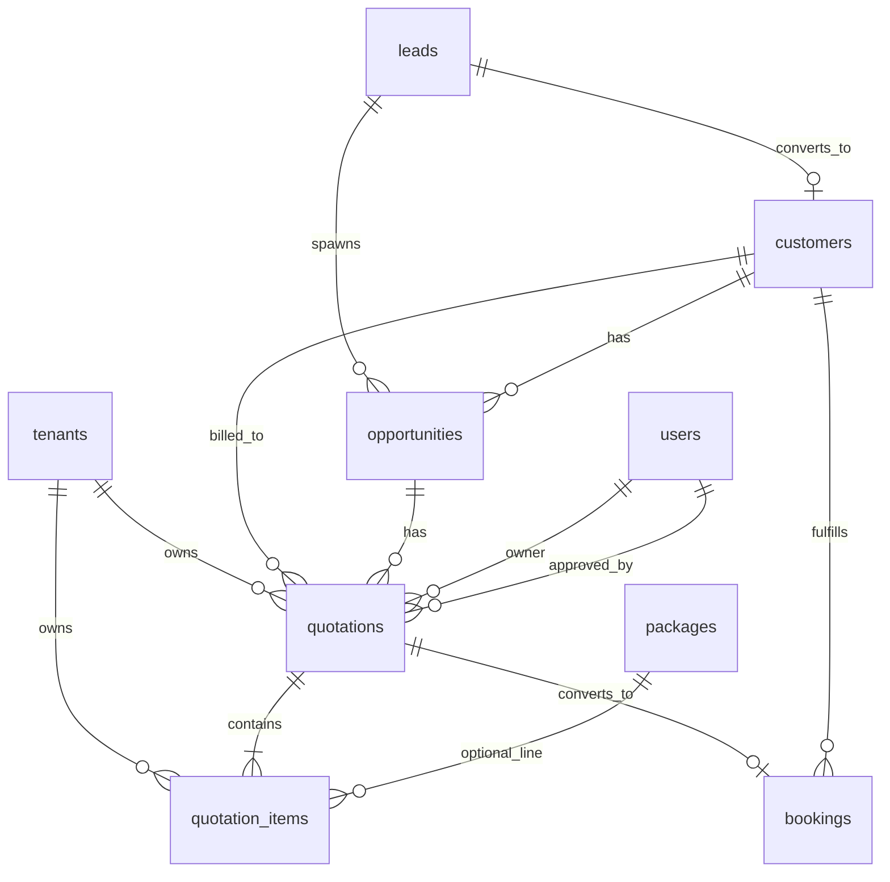

# Sprint 6 Phase 2 — Quotation Architecture Design Review

**Status:** DESIGN ONLY — **awaiting approval**  
**Version:** 1.0  
**Date:** 2026-06-03  
**Blocked until approved:** Migrations `035_quotations.sql`, `036_quotation_rls_permissions.sql`, and all application code  

**Normative references (do not redesign):**

- Sales flow: **Lead → Opportunity → Quotation → Approval → Booking**
- [CRM-Phase7-Implementation-Spec.md](./CRM-Phase7-Implementation-Spec.md) §1–2, §11 (baseline schema)
- [CRM-Migration-Numbering-Plan.md](./CRM-Migration-Numbering-Plan.md) — `035` / `036`
- [CRM-Customer360-Wireframe.md](./CRM-Customer360-Wireframe.md) — **no structural 360 redesign**
- [RBAC.md](./RBAC.md) — four MVP roles (no `sales_manager` today)
- Sprint 5 gate: Customer 360 **CLOSED**; Sprint 6 Phase 1: `034_dashboard_rpc` (separate track)

---

## Executive summary

This package defines quotations and quotation items for TravelOS CRM **7B**, scoped to migrations **035–036** and follow-on API/UI sprints. It extends the approved Phase 7 ERD without introducing Corporate Accounts, Supplier CRM, Travel Requests, or AI features.

**Key design choices for sign-off:**

| Topic | Recommendation |
|-------|----------------|
| Opportunity → Quotation | **1:N** (revisions); at most **one** `accepted` or `converted_to_booking` per opportunity at a time |
| Quotation → Booking | **1:1** (one booking per quotation; `bookings.quotation_id` nullable FK) |
| Accepted quote edits | **Forbidden** — create new revision (new quotation) |
| Rejected quote reactivation | **Forbidden** — clone to new `draft` |
| `viewed` state | **Included** — `sent` → `viewed` on first tracked view (portal/link or manual mark) |
| `converted_to_booking` | **Terminal state** after successful booking conversion |
| Approval | **Dual mode** per tenant: **simple** (skip internal approval) vs **standard** (`pending_approval` → `approved`) |
| `sales_manager` | **Not in MVP RBAC** — matrix below defines **proposed** role; until seeded, map to **tenant_admin** for approve + **write_all** for team quotes |

---

## Approval gate

| # | Deliverable | Product | Engineering |
|---|-------------|---------|-------------|
| 1 | ERD & keys | ☐ | ☐ |
| 2 | Lifecycle & transitions | ☐ | ☐ |
| 3 | Opportunity integration rules | ☐ | ☐ |
| 4 | Booking conversion rules | ☐ | ☐ |
| 5 | Permission matrix | ☐ | ☐ |
| 6 | Timeline events | ☐ | ☐ |
| 7 | API contracts (draft) | ☐ | ☐ |
| 8 | Customer 360 integration | ☐ | ☐ |
| 9 | Reporting impact | ☐ | ☐ |
| 10 | Test plan | ☐ | ☐ |

**After all boxes signed:** Implement `035` → `036` → API → UI. **Do not** start 035/036 before approval.

---

## 1. ERD review

### 1.1 Entity diagram (proposed)



### 1.2 Mandatory sales chain (unchanged)

```
Lead ──► Opportunity ──► Quotation ──► Approval ──► Booking
                              │
                              └── quotation_items (line detail)
```

- **Lead** is optional on opportunity (`lead_id` nullable) but flow assumes CRM origin.
- **Customer** on quotation: required before **send** (or copied from opportunity at create); required before **accept**.
- **Package** appears only on **quotation_items** / booking items — **not** on `opportunities` (D-CRM-7A-02).

### 1.3 Table: `quotations`

| Column | Type | Notes |
|--------|------|-------|
| `id` | UUID | PK, `gen_random_uuid()` |
| `tenant_id` | UUID | NOT NULL, FK → `tenants`, RLS root |
| `quotation_number` | TEXT | NOT NULL, `UNIQUE (tenant_id, quotation_number)` — `QT-YYYY-######` |
| `opportunity_id` | UUID | NOT NULL, FK → `opportunities` |
| `customer_id` | UUID | FK → `customers`, nullable until linked |
| `status` | `quotation_status` | See §2 |
| `valid_until` | DATE | Default from `tenant_settings.quotation_default_valid_days` |
| `currency` | CHAR(3) | NOT NULL, align with opportunity/tenant |
| `subtotal` | DECIMAL(12,2) | Maintained by `recalculate_quotation_totals()` |
| `discount_amount` | DECIMAL(12,2) | NOT NULL DEFAULT 0 |
| `tax_amount` | DECIMAL(12,2) | NOT NULL DEFAULT 0 |
| `total_amount` | DECIMAL(12,2) | NOT NULL DEFAULT 0 |
| `notes` | TEXT | |
| `terms_and_conditions` | TEXT | Default from tenant settings |
| `owner_id` | UUID | NOT NULL, FK → `users` — RLS owner scope |
| `sent_at` | TIMESTAMPTZ | Set on send |
| `viewed_at` | TIMESTAMPTZ | Set on first view (§2) |
| `accepted_at` | TIMESTAMPTZ | Set on accept |
| `rejected_at` | TIMESTAMPTZ | Set on reject |
| `approved_by` | UUID | FK → `users` (standard mode) |
| `approved_at` | TIMESTAMPTZ | Standard mode |
| `booking_id` | UUID | FK → `bookings`, nullable — set on convert (denormalized convenience) |
| `deleted_at` | TIMESTAMPTZ | Soft delete |
| `created_by`, `updated_by`, `created_at`, `updated_at` | | Standard audit |

**Indexes (recommended):**

- `(tenant_id, opportunity_id) WHERE deleted_at IS NULL`
- `(tenant_id, status) WHERE deleted_at IS NULL`
- `(tenant_id, owner_id) WHERE deleted_at IS NULL`
- `(tenant_id, customer_id) WHERE deleted_at IS NULL`
- Optional: `(booking_id) WHERE booking_id IS NOT NULL` — enforce unique booking link at API/DB

### 1.4 Table: `quotation_items`

| Column | Type | Notes |
|--------|------|-------|
| `id` | UUID | PK |
| `tenant_id` | UUID | NOT NULL — **duplicate tenant_id recommended** for simple RLS (Phase 7 §4.6) |
| `quotation_id` | UUID | NOT NULL, FK → `quotations` ON DELETE CASCADE |
| `sort_order` | INTEGER | NOT NULL DEFAULT 0 |
| `item_type` | `quotation_item_type` | package, hotel, flight, visa, transport, insurance, other |
| `description` | TEXT | NOT NULL |
| `package_id` | UUID | FK → `packages`, nullable |
| `quantity` | DECIMAL(10,2) | NOT NULL DEFAULT 1, CHECK > 0 |
| `unit_price` | DECIMAL(12,2) | NOT NULL |
| `line_total` | DECIMAL(12,2) | NOT NULL — `quantity * unit_price` at write time |
| `created_at`, `updated_at` | TIMESTAMPTZ | |

**Cascade:** Deleting quotation soft-deletes or hard-deletes items per product rule — **recommend** hard delete items on quotation soft-delete only when status = `draft`; otherwise retain items for audit.

### 1.5 Extension: `bookings`

| Column | Type | Notes |
|--------|------|-------|
| `quotation_id` | UUID | FK → `quotations(id)` ON DELETE SET NULL, nullable |

Existing: `opportunity_id`, nullable `package_id` (CRM custom bookings).

### 1.6 Extension: `tenant_settings` (7B)

| Column | Default |
|--------|---------|
| `quotation_approval_mode` | `'simple'` (`simple` \| `standard`) |
| `quotation_default_valid_days` | `14` |
| `quotation_terms_default` | NULL |
| `company_logo_storage_path` | NULL (PDF) |

### 1.7 Enum: `quotation_status` (proposed — reconciled with §2)

**Storage enum** (superset for both approval modes):

```sql
CREATE TYPE quotation_status AS ENUM (
  'draft',
  'pending_approval',  -- standard mode only
  'approved',          -- standard mode only
  'sent',
  'viewed',
  'accepted',
  'rejected',
  'expired',
  'converted_to_booking'
);
```

**Product-facing states** requested in Sprint 6 map to this enum; `pending_approval` / `approved` are internal approval steps, not customer-facing labels.

### 1.8 Keys and relationships summary

| Relationship | Cardinality | FK | On delete |
|--------------|-------------|-----|-----------|
| Tenant → Quotation | 1:N | `quotations.tenant_id` | CASCADE |
| Opportunity → Quotation | 1:N | `quotations.opportunity_id` | RESTRICT (no delete opp with active quotes) |
| Customer → Quotation | 1:N | `quotations.customer_id` | SET NULL |
| Quotation → Items | 1:N | `quotation_items.quotation_id` | CASCADE |
| Quotation → Booking | 1:1 | `bookings.quotation_id` + `quotations.booking_id` | SET NULL on booking delete |
| User → Quotation (owner) | 1:N | `quotations.owner_id` | SET NULL |

### 1.9 Multi-tenant ownership

- Every row carries `tenant_id`; JWT `tenant_id` must match on all writes.
- **Owner scope:** `sales_agent` sees/mutates own quotations via `quotations.read` / `quotations.write` + `owner_id = auth.uid()`.
- **read_all / write_all:** `finance_officer` read-only all; `tenant_admin` full tenant.
- RLS pattern: same as `leads` / `opportunities` (see Phase 7 §4.5).

### 1.10 Soft delete

- `quotations.deleted_at` — list queries filter `.is('deleted_at', null)`.
- **Forbidden:** soft-delete when status ∈ (`sent`, `viewed`, `accepted`, `converted_to_booking`) — use **reject** or **expire** instead.
- **Allowed:** soft-delete `draft` (and optionally `rejected` / `expired` by admin).
- Items: do not soft-delete independently in MVP — lifecycle tied to parent quotation.

---

## 2. Quotation lifecycle

### 2.1 State definitions

| State | Meaning | Customer-visible |
|-------|---------|------------------|
| `draft` | Editable quote; not sent | No |
| `pending_approval` | Submitted for internal approval (standard mode) | No |
| `approved` | Internal approval granted; ready to send | No |
| `sent` | Delivered to customer (email/PDF/link) | Yes |
| `viewed` | Customer opened quote (first view recorded) | Yes |
| `accepted` | Customer/agency accepted; ready for booking | Yes |
| `rejected` | Declined by customer or agency | Yes |
| `expired` | Past `valid_until` without acceptance | Yes |
| `converted_to_booking` | Booking created; quotation locked | Yes (read-only) |

### 2.2 Mode A — Simple (`quotation_approval_mode = simple`)

Internal approval states are **unused**.

```
draft ──send──► sent ──view──► viewed ──accept──► accepted ──convert──► converted_to_booking
                  │                │
                  ├──reject──► rejected
                  └──expire──► expired
```

| Transition | Actor | API (draft) |
|------------|-------|-------------|
| `draft` → `sent` | Owner with send perm | `POST .../send` |
| `sent` → `viewed` | System / customer link / optional manual | `POST .../mark-viewed` or auto on public view |
| `viewed` → `accepted` | Owner or admin | `POST .../accept` |
| `sent` → `accepted` | Same (skip viewed if no tracking) | `POST .../accept` |
| `*` → `rejected` | Owner from `sent` or `viewed` | `POST .../reject` |
| `*` → `expired` | Cron or lazy on read | `valid_until < today` |
| `accepted` → `converted_to_booking` | Owner + bookings.create | `POST .../convert` |

### 2.3 Mode B — Standard (`quotation_approval_mode = standard`)

```
draft ──submit──► pending_approval ──approve──► approved ──send──► sent ──► viewed ──► accepted ──► converted_to_booking
                         │                                              │
                         └──reject (internal)──► draft (or rejected*)     ├──reject──► rejected
                         *product choice: return to draft vs rejected    └──expire──► expired
```

| Transition | Actor | API |
|------------|-------|-----|
| `draft` → `pending_approval` | Owner | `POST .../submit-approval` |
| `pending_approval` → `approved` | `quotations.approve` (admin / sales_manager) | `POST .../approve` |
| `pending_approval` → `draft` | Approver reject | `POST .../reject-approval` (internal) |
| `approved` → `sent` | Owner | `POST .../send` |
| Same as simple from `sent` onward | | |

**Recommendation:** Internal rejection from `pending_approval` returns to **`draft`** (preserves quotation number and items); customer-facing **`rejected`** only from `sent` / `viewed`.

### 2.4 Allowed transitions (matrix)

| From \ To | draft | pending | approved | sent | viewed | accepted | rejected | expired | converted |
|-----------|:-----:|:-------:|:--------:|:----:|:------:|:--------:|:--------:|:-------:|:---------:|
| draft | — | ✓* | — | ✓** | — | — | — | — | — |
| pending_approval | ✓† | — | ✓ | — | — | — | — | — | — |
| approved | — | — | — | ✓ | — | — | — | — | — |
| sent | — | — | — | — | ✓ | ✓ | ✓ | ✓ | — |
| viewed | — | — | — | — | — | ✓ | ✓ | ✓ | — |
| accepted | — | — | — | — | — | — | — | ✓ | ✓ |
| rejected | — | — | — | — | — | — | — | — | — |
| expired | — | — | — | — | — | — | — | — | — |
| converted_to_booking | — | — | — | — | — | — | — | — | — |

\* Standard mode only (`submit-approval`).  
\** Simple mode only (`send` skips pending/approved).  
† Internal reject to draft.

### 2.5 Forbidden transitions (hard rules)

| Rule | Rationale |
|------|-----------|
| Any → `draft` from `sent` / `viewed` / `accepted` / `converted` | Immutability after customer exposure |
| `converted_to_booking` → anything | Terminal |
| `rejected` / `expired` → `sent` without new quotation | No reactivation — clone instead |
| `accepted` → `draft` | Financial snapshot frozen |
| Edit items/PATCH body when status ∉ (`draft`, optionally `pending_approval` for admin) | Data integrity |
| Delete quotation when status = `converted_to_booking` | Audit trail |
| Two `accepted` on same opportunity | Business rule (§3) |

### 2.6 Validation rules (by transition)

| Transition | Validations |
|------------|-------------|
| Create `draft` | `opportunity_id` exists, same tenant, opportunity not `closed_lost`; ≥1 item optional at create but required before send |
| `send` | `customer_id` NOT NULL; ≥1 item; `total_amount > 0`; `valid_until >= today`; opportunity stage ≥ `proposal` (recommendation); simple: status=`draft`; standard: status=`approved` |
| `mark-viewed` | status ∈ (`sent`, `viewed`); idempotent if already `viewed` |
| `accept` | status ∈ (`sent`, `viewed`); not expired; `customer_id` set; opportunity not `closed_lost` |
| `reject` | status ∈ (`sent`, `viewed`); `rejected_at` set |
| `expire` | `valid_until < today`; status ∈ (`sent`, `viewed`, `draft`*, `approved`*) — *optional auto-expire drafts past validity |
| `convert` | status = `accepted`; `booking_id` IS NULL; `bookings.create` perm; opportunity has customer |

### 2.7 Expiry behavior

- **Lazy:** On `GET /api/quotations/:id`, if `valid_until < today` and status ∈ (`sent`, `viewed`, `approved`), API transitions to `expired` (transactional).
- **Batch (POST-MVP):** `pg_cron` daily job calling `expire_quotations()`.
- Expired quotations cannot accept or convert.

---

## 3. Opportunity integration

### 3.1 Can multiple quotations belong to one opportunity?

**Yes — 1:N (revisions).**

| Rule | Detail |
|------|--------|
| Multiple drafts | Allowed (e.g. option A / option B) |
| Multiple sent | Discouraged but possible; UI should warn |
| Multiple accepted | **Forbidden** — enforce in API: count where `status IN ('accepted','converted_to_booking')` per `opportunity_id` ≤ 1 |
| After `closed_won` | New quotations **blocked** unless admin override |
| After `closed_lost` | New quotations **blocked** |

**Recommendation:** Add DB partial unique index (design for 035):

```sql
CREATE UNIQUE INDEX uq_quotations_one_active_accept
  ON quotations (opportunity_id)
  WHERE deleted_at IS NULL
    AND status IN ('accepted', 'converted_to_booking');
```

### 3.2 Can one quotation link to multiple bookings?

**No (MVP).**

- **1:1:** `bookings.quotation_id` unique when not null.
- Second `POST .../convert` returns **409 CONFLICT**.
- Amendments after booking: edit **booking** in operations module, not quotation.

### 3.3 Can accepted quotations be edited?

**No.**

- PATCH quotation/items only in `draft` (and `pending_approval` for admin recall-to-draft flow).
- Price changes require **new quotation** (clone revision) linked to same opportunity.
- `accepted_at` and line totals are audit snapshot.

### 3.4 Can rejected quotations be reactivated?

**No direct reactivation.**

| Action | Allowed |
|--------|---------|
| `rejected` → `sent` | **Forbidden** |
| Clone to new `draft` | **Yes** — `POST /api/quotations` with `source_quotation_id` (optional body) copying items |
| Soft-delete rejected | Admin only |

### 3.5 Opportunity stage sync (recommendation)

| Quotation event | Suggested opportunity stage |
|-----------------|----------------------------|
| First `sent` | `proposal` (if below) |
| `accepted` | `verbal_approval` or `closed_won` (tenant policy — default `verbal_approval`) |
| `converted_to_booking` | `closed_won` when booking confirmed (existing booking workflow) |

Do **not** auto-downgrade opportunity stage on reject.

---

## 4. Booking conversion rules

### 4.1 Opportunity → Quotation

**Prerequisites:**

| # | Condition |
|---|-----------|
| 1 | User has `crm.quotations.write` (or `write_all`) |
| 2 | Opportunity exists, same `tenant_id`, `deleted_at` IS NULL |
| 3 | Opportunity `stage` NOT IN (`closed_lost`) |
| 4 | Opportunity has `customer_id` OR lead linked customer — **required before send**, not necessarily at draft create |
| 5 | No other quotation in `accepted` / `converted_to_booking` on same opportunity |

**Create payload defaults:**

- `owner_id` = opportunity.owner_id (override allowed for admin)
- `currency`, `customer_id`, `destination` context copied from opportunity
- `valid_until` = today + `tenant_settings.quotation_default_valid_days`
- Items: empty or template (POST-MVP package template)

**Edge cases:**

| Case | Behavior |
|------|----------|
| Opportunity without customer | Allow draft; block `send` with 422 `CUSTOMER_REQUIRED` |
| Opportunity `closed_won` with existing booking | Allow new quotation only for **add-on** POST-MVP; MVP: **403** |
| Foreign tenant opportunity | 404 |
| sales_agent not owner of opportunity | May create quote if `opportunities.read` + `quotations.write` on own quote only — **cannot** attach to peer's opportunity unless `write_all` |

### 4.2 Quotation → Booking (`POST /api/quotations/:id/convert`)

**Prerequisites:**

| # | Condition |
|---|-----------|
| 1 | Quotation `status` = `accepted` |
| 2 | `booking_id` IS NULL |
| 3 | `customer_id` NOT NULL |
| 4 | User has `crm.quotations.accept` (or admin) **and** `bookings.create` |
| 5 | Quotation not expired |
| 6 | Opportunity not `closed_lost` |

**Booking defaults created:**

| Field | Source |
|-------|--------|
| `tenant_id` | quotation.tenant_id |
| `customer_id` | quotation.customer_id |
| `opportunity_id` | quotation.opportunity_id |
| `quotation_id` | quotation.id |
| `package_id` | NULL if custom lines; else first package line's `package_id` if exactly one package item |
| `status` | `draft` |
| `travel_date` | opportunity.expected_travel_date |
| `pax_count` | opportunity.pax_count |
| `notes` | quotation.notes + quotation_number reference |
| `currency` / amounts | Booking financials from operations rules — **do not** auto-confirm; totals may copy to booking_items in POST-MVP |

**Post-convert quotation updates:**

1. Set `quotations.booking_id` = new booking.id  
2. Set `quotations.status` = `converted_to_booking`  
3. Emit timeline `quotation_converted`  
4. Return `{ data: { quotation, booking } }`

**Edge cases:**

| Case | Behavior |
|------|----------|
| Accept without convert | Valid — booking created later from opportunity UI still allowed? **MVP: prefer convert from quotation**; direct `opportunity/create-booking` remains but should not duplicate if `quotation_id` already set |
| Convert twice | 409 `ALREADY_CONVERTED` |
| Booking create fails | Roll back quotation status (stay `accepted`) |
| Partial package + custom lines | `package_id` null on booking; manual booking items |
| Finance officer | **No** `bookings.create` — cannot convert (read-only quotes) |

### 4.3 Approval gating before booking

Mandatory flow: **Approval → Booking**

| Mode | Approval step before `sent` | Before `accept` | Before `convert` |
|------|----------------------------|-----------------|------------------|
| Simple | None (draft → sent) | Customer/agency accept | `accepted` required |
| Standard | `approved` required before `sent` | Same | Same |

**Booking Agent / AI:** Not used for confirm or convert (project rule).

---

## 5. Permission matrix

### 5.1 MVP roles (implemented today)

| Role | Exists in `RBAC.md` |
|------|---------------------|
| `tenant_admin` | ✓ |
| `sales_agent` | ✓ |
| `finance_officer` | ✓ |
| `super_admin` | ✓ (platform) |
| **`sales_manager`** | **✗ Not seeded** — proposed below |

### 5.2 CRM permission catalog (quotations)

| Permission | Description |
|------------|-------------|
| `quotations.read` | Read own quotations |
| `quotations.read_all` | Read all tenant quotations |
| `quotations.write` | Create/update own draft items |
| `quotations.write_all` | Manage any quotation (admin) |
| `quotations.approve` | `pending_approval` → `approved` |
| `quotations.send` | Send to customer |
| `quotations.accept` | Accept on behalf of customer |
| `quotations.convert` | `accepted` → booking (**new** — split from accept for clarity) |
| `quotations.delete` | Soft-delete draft (optional explicit perm) |

**Note:** Phase 7 merged convert under `accept` + `bookings.create`. This design adds **`quotations.convert`** for explicit matrix; implementation may alias to `accept` + `bookings.create` if fewer permissions preferred.

### 5.3 Action matrix — MVP roles

Legend: ✓ = allowed, ○ = own records only, — = denied, R = read-only

| Action | sales_agent | finance_officer | tenant_admin | super_admin |
|--------|:-----------:|:---------------:|:------------:|:-----------:|
| **Create** | ○ | — | ✓ | ✓ |
| **Read** | ○ | R (all) | ✓ | ✓ |
| **Update** (draft) | ○ | — | ✓ | ✓ |
| **Delete** (draft) | ○ | — | ✓ | ✓ |
| **Send** | ○ | — | ✓ | ✓ |
| **Approve** (standard) | — | — | ✓ | ✓ |
| **Accept** | ○ | — | ✓ | ✓ |
| **Reject** (customer) | ○ | — | ✓ | ✓ |
| **Convert** | ○* | — | ✓ | ✓ |

\* Requires `bookings.create` in addition.

### 5.4 Proposed `sales_manager` role (not in MVP — approval required to seed)

Intended as team lead: broader read, approve quotes, reassign owners, no tenant settings.

| Action | sales_manager (proposed) |
|--------|------------------------|
| Create | ✓ (any opp in tenant) |
| Read | ✓ all |
| Update | ✓ draft/pending on team quotes |
| Delete | ✓ draft |
| Send | ✓ own + team |
| Approve | ✓ |
| Accept | ✓ |
| Convert | ✓ |

**Until `sales_manager` exists:** Grant `tenant_admin` for approve; use `quotations.write_all` for cross-owner edits.

### 5.5 UI / Refine mapping

| Resource | Action | Permission check |
|----------|--------|------------------|
| `quotations` | list/show | read / read_all |
| `quotations` | create/edit | write (draft only) |
| `quotations` | delete | write / delete |
| `quotations` | send | send |
| `quotations` | approve | approve |
| `quotations` | accept | accept |
| `quotations` | convert | convert + bookings.create |

---

## 6. Timeline events

### 6.1 Stable `event_type` values (Customer 360 + CRM timeline)

Align with `src/lib/crm/timeline-events.ts` naming (snake_case / dotted — **new types use snake_case** for quotations):

| event_type | Source table | Title template | Bucket |
|------------|--------------|----------------|--------|
| `quotation_created` | `quotations` | Quotation {number} created | **sales** |
| `quotation_sent` | `quotations` | Quotation {number} sent | **sales** |
| `quotation_viewed` | `quotations` | Quotation {number} viewed | **sales** |
| `quotation_accepted` | `quotations` | Quotation {number} accepted | **sales** |
| `quotation_rejected` | `quotations` | Quotation {number} rejected | **sales** |
| `quotation_expired` | `quotations` | Quotation {number} expired | **sales** |
| `quotation_converted` | `quotations` | Quotation {number} → booking {ref} | **sales** |

**Deprecated aliases (do not use in new code):** `quotation_sent` in old wireframe as two types — consolidated above.

### 6.2 `TimelineEvent` shape (unchanged)

```typescript
{
  id: string;              // quotation.id or composite
  event_type: string;      // from table above
  title: string;
  occurred_at: string;     // sent_at, viewed_at, etc.
  ref_table: "quotations";
  ref_id: string;
  meta: {
    quotation_number: string;
    status: string;
    total_amount?: number;
    currency?: string;
    opportunity_id?: string;
    booking_id?: string;
  };
}
```

### 6.3 View integration (`033` extension — design only)

Add UNION branches to `v_customer_timeline_events` **only after 035**:

- Join `quotations` on `customer_id` (and optionally opportunity-linked customer).
- Filter `deleted_at IS NULL`.
- Do **not** break Sprint 5 gate tests — extend `test-crm-rls` when implementing.

### 6.4 Bucket mapping

| Bucket | Quotation events |
|--------|------------------|
| `sales` | All seven types |
| `operations` | — (booking_created remains separate) |
| `support` | — |

---

## 7. API contracts (draft only)

**Base:** `/api/quotations`  
**Auth:** Supabase session cookie or Bearer JWT  
**Envelope:** `{ data }` / `{ data, meta }` per [API.md](./API.md)

### 7.1 `GET /api/quotations`

**Permission:** `crm.quotations.read` (own) or `crm.quotations.read_all`

**Query:**

| Param | Type | Description |
|-------|------|-------------|
| `opportunity_id` | UUID | Filter |
| `customer_id` | UUID | Filter |
| `status` | string | Comma-separated |
| `owner_id` | UUID | Admin filter |
| `page`, `limit` | int | Pagination |

**Response 200:**

```json
{
  "data": [
    {
      "id": "uuid",
      "quotation_number": "QT-2026-000042",
      "opportunity_id": "uuid",
      "customer_id": "uuid",
      "status": "sent",
      "currency": "USD",
      "total_amount": 12500.0,
      "valid_until": "2026-07-01",
      "owner_id": "uuid",
      "sent_at": "2026-06-03T10:00:00Z",
      "viewed_at": null,
      "accepted_at": null,
      "booking_id": null
    }
  ],
  "meta": { "page": 1, "limit": 20, "total": 3, "totalPages": 1 }
}
```

### 7.2 `GET /api/quotations/:id`

**Permission:** read on row

**Response 200:**

```json
{
  "data": {
    "id": "uuid",
    "quotation_number": "QT-2026-000042",
    "opportunity_id": "uuid",
    "customer_id": "uuid",
    "status": "draft",
    "currency": "USD",
    "subtotal": 12000.0,
    "discount_amount": 0,
    "tax_amount": 500.0,
    "total_amount": 12500.0,
    "notes": "",
    "terms_and_conditions": "...",
    "valid_until": "2026-07-01",
    "owner_id": "uuid",
    "items": [
      {
        "id": "uuid",
        "sort_order": 0,
        "item_type": "package",
        "description": "Dubai 5D package",
        "package_id": "uuid",
        "quantity": 2,
        "unit_price": 6000.0,
        "line_total": 12000.0
      }
    ],
    "opportunity": { "id": "uuid", "opportunity_number": "OP-2026-000010", "stage": "proposal" },
    "customer": { "id": "uuid", "full_name": "Jane Doe" },
    "booking_id": null,
    "audit": { "created_at": "...", "updated_at": "..." }
  }
}
```

### 7.3 `POST /api/quotations`

**Permission:** `crm.quotations.write`

**Request:**

```json
{
  "opportunity_id": "uuid",
  "customer_id": "uuid",
  "currency": "USD",
  "valid_until": "2026-07-01",
  "notes": "optional",
  "items": [
    {
      "item_type": "package",
      "description": "Dubai 5D",
      "package_id": "uuid",
      "quantity": 2,
      "unit_price": 6000.0
    }
  ],
  "source_quotation_id": "uuid"
}
```

**Response 201:** Same shape as GET single (status `draft`).

**Errors:** `404` opportunity, `409` active accepted exists, `422` validation.

### 7.4 `PATCH /api/quotations/:id`

**Permission:** `crm.quotations.write` on row  
**Constraint:** status = `draft` only (admin `write_all` may edit `pending_approval`)

**Request:** Partial header fields + optional item upserts via separate endpoints (recommended).

**Response 200:** Updated quotation.

### 7.5 `POST /api/quotations/:id/send`

**Permission:** `crm.quotations.send`

**Request:**

```json
{
  "channel": "email",
  "recipient_email": "customer@example.com"
}
```

**Response 200:**

```json
{
  "data": {
    "id": "uuid",
    "status": "sent",
    "sent_at": "2026-06-03T12:00:00Z"
  }
}
```

**Side effects:** Timeline `quotation_sent`; email/PDF POST-MVP.

### 7.6 `POST /api/quotations/:id/accept`

**Permission:** `crm.quotations.accept`

**Request:**

```json
{
  "accepted_by_customer": true,
  "acceptance_notes": "optional"
}
```

**Response 200:**

```json
{
  "data": {
    "id": "uuid",
    "status": "accepted",
    "accepted_at": "2026-06-03T14:00:00Z"
  }
}
```

**Errors:** `422` if expired; `409` if another accepted on opportunity.

### 7.7 `POST /api/quotations/:id/reject`

**Permission:** `crm.quotations.write` (own) or admin

**Request:**

```json
{
  "reason": "Price too high"
}
```

**Response 200:** `{ "data": { "status": "rejected", "rejected_at": "..." } }`

### 7.8 `POST /api/quotations/:id/convert`

**Permission:** `crm.quotations.convert` + `bookings.create`

**Request:**

```json
{
  "confirm_booking_defaults": true
}
```

**Response 201:**

```json
{
  "data": {
    "quotation": {
      "id": "uuid",
      "status": "converted_to_booking",
      "booking_id": "uuid"
    },
    "booking": {
      "id": "uuid",
      "reference_number": "BK-2026-000200",
      "status": "draft",
      "quotation_id": "uuid",
      "opportunity_id": "uuid",
      "customer_id": "uuid"
    }
  }
}
```

### 7.9 Additional endpoints (Phase 7B — include in implementation, not in user minimal list)

| Method | Path | Purpose |
|--------|------|---------|
| POST | `/api/quotations/:id/items` | Add line |
| PATCH | `/api/quotations/:id/items/:itemId` | Update line |
| DELETE | `/api/quotations/:id/items/:itemId` | Remove line |
| POST | `/api/quotations/:id/submit-approval` | Standard mode |
| POST | `/api/quotations/:id/approve` | Standard mode |
| POST | `/api/quotations/:id/mark-viewed` | `sent` → `viewed` |
| GET | `/api/quotations/:id/pdf` | PDF stream |

### 7.10 Standard error codes

| HTTP | Code | When |
|------|------|------|
| 403 | FORBIDDEN | Missing permission |
| 404 | NOT_FOUND | Wrong tenant / missing |
| 409 | CONFLICT | Double accept / convert |
| 422 | UNPROCESSABLE | Invalid transition / validation |

---

## 8. Customer 360 integration

**Constraint:** Do **not** redesign Customer 360 layout or tabs. Minimal additive exposure only.

### 8.1 Recommendations by surface

| Surface | Show quotations? | Recommendation |
|---------|------------------|----------------|
| **Overview** | Optional compact strip | **POST-035:** Max 3 recent quotes in timeline preview only — **no** new overview card in first 7B slice |
| **Timeline** | Yes | Add seven event types via `v_customer_timeline_events` (§6) — primary integration |
| **Opportunities tab** | Yes | Per-opportunity row: count + link latest quotation status |
| **Revenue** | Indirect | Accepted/converted totals **do not** replace payment-based LTV; footnote "Quoted value" optional for financial role |
| **Bookings tab** | Link | Show `quotation_number` on booking row when `booking.quotation_id` set |
| **New Quotations tab** | Optional | **POST-MVP** — full list `GET quotations?customer_id=`; defer to avoid tab sprawl |

### 8.2 API impact on `GET /api/customers/:id/360`

| Change | Scope |
|--------|-------|
| `tabs.opportunities[].quotation_summary` | `{ count, latest_status, latest_number }` |
| `timeline` / `timeline_preview` | Include quotation events from view |
| `meta.permissions` | Add `quotations: boolean` from `crm.quotations.read*` |
| **No change** | Financial summary computation (still payments/invoices) |

### 8.3 Finance officer

- Sees quotation amounts in timeline and opportunity summary (read_all).
- Does **not** see convert actions; Revenue tab unchanged.

---

## 9. Reporting impact (future — no implementation)

CRM dashboard (`034` / `crm_dashboard_stats`) **excludes** quotations today. Planned **POST-036** metrics:

| Metric | Definition | Role gate |
|--------|------------|-----------|
| **Quotation count** | COUNT quotations created in period | dashboard.read |
| **Acceptance rate** | accepted / sent (same period) | dashboard.read |
| **Conversion rate** | converted_to_booking / accepted | dashboard.read |
| **Average quote value** | AVG(total_amount) for sent | dashboard.financial |
| **Pipeline coverage** | SUM(open quote totals) / weighted pipeline | dashboard.financial |

**Recommendation:** Add RPC fields in migration **037+** or extend `crm_dashboard_stats` after 7B stable — **not** in 035/036.

---

## 10. Test plan

### 10.1 Unit tests

| Area | Cases |
|------|-------|
| `recalculate_quotation_totals` | Items add/update/delete; discount/tax |
| `resolveQuotationTransition` | Allowed/forbidden matrix §2.4 |
| `generate_quotation_number` | Per-tenant sequence |
| Expiry helper | `valid_until` edge (timezone UTC) |
| Approval mode | Simple vs standard paths |

### 10.2 API tests

| Suite | Cases |
|-------|-------|
| CRUD | Create draft, PATCH draft, PATCH blocked when sent |
| Send | Requires customer + items; sets `sent_at` |
| Viewed | Idempotent mark-viewed |
| Accept / reject | From sent/viewed; reject blocks convert |
| Convert | Creates draft booking, sets `converted_to_booking`, 409 on repeat |
| Standard mode | submit → approve → send chain |
| Tenant isolation | 404 cross-tenant quotation |

### 10.3 RLS tests (`CRM_REQUIRE_LIVE=1`)

| Test | Assert |
|------|--------|
| sales_agent read own | ✓ |
| sales_agent read peer | ✗ |
| finance read all | ✓ |
| finance write | ✗ |
| tenant_admin write_all | ✓ |
| quotation_items tenant | Cannot insert item for other tenant's quotation |

### 10.4 Workflow tests (E2E / integration)

1. Lead → opportunity → quotation draft → send → viewed → accept → convert → booking draft visible on customer 360 timeline.  
2. Rejected quote → clone new draft → send (new number).  
3. Second accept on same opportunity → 409.  
4. Expired quote → accept → 422.

### 10.5 Booking conversion tests

| Case | Expected |
|------|----------|
| Happy path | `booking.quotation_id`, `quotation.booking_id`, status `converted_to_booking` |
| Opportunity create-booking after convert | Does not duplicate (guard) |
| Custom lines only | `package_id` null on booking |
| Missing bookings.create | 403 on convert |

### 10.6 Performance tests

| Target | Threshold (staging) |
|--------|---------------------|
| `GET /api/quotations?opportunity_id=` | < 500 ms, < 50 KB |
| `GET /api/quotations/:id` with 20 items | < 800 ms |
| Customer 360 with quotation events | < 2 s p95 (regression vs Sprint 5 gate) |
| `v_customer_timeline_events` + quotation UNION | Explain analyze < 100 ms on seed tenant |

### 10.7 Regression

- Sprint 5 Customer 360 gate remains PASS (timeline still works if quotation UNION empty).
- Operations dashboard unchanged.
- Opportunity `create-booking` without quotation still works.

---

## 11. Migration plan (reference — not executed)

| File | Contents |
|------|----------|
| `035_quotations.sql` | Enums, `quotations`, `quotation_items`, `bookings.quotation_id`, `tenant_settings` columns, totals trigger, number generator |
| `036_quotation_rls_permissions.sql` | RLS policies, permission seeds, partial unique index §3.1 |

**Order:** 035 → 036. **Never** modify Customer 360 view `033` in 035 — separate **037** or bundled **036** addendum after approval.

---

## 12. Open questions for product sign-off

| ID | Question | Default if silent |
|----|----------|-------------------|
| Q1 | Seed `sales_manager` role in 036? | No — use tenant_admin |
| Q2 | `viewed` tracking MVP: manual vs public link? | Manual `mark-viewed` + optional email pixel POST-MVP |
| Q3 | Internal `pending_approval` reject → `draft` or `rejected`? | Return to `draft` |
| Q4 | Accept bumps opportunity to `verbal_approval` or `closed_won`? | `verbal_approval` |
| Q5 | Separate `quotations.convert` permission? | Optional alias to accept + bookings.create |

---

## 13. Document history

| Version | Date | Change |
|---------|------|--------|
| 1.0 | 2026-06-03 | Initial Sprint 6 Phase 2 design package |

**Next step after approval:** Implement `035_quotations.sql` and `036_quotation_rls_permissions.sql` per this document; update `CRM-Phase7-Implementation-Spec.md` §2 enum if `viewed` / `converted_to_booking` approved.
