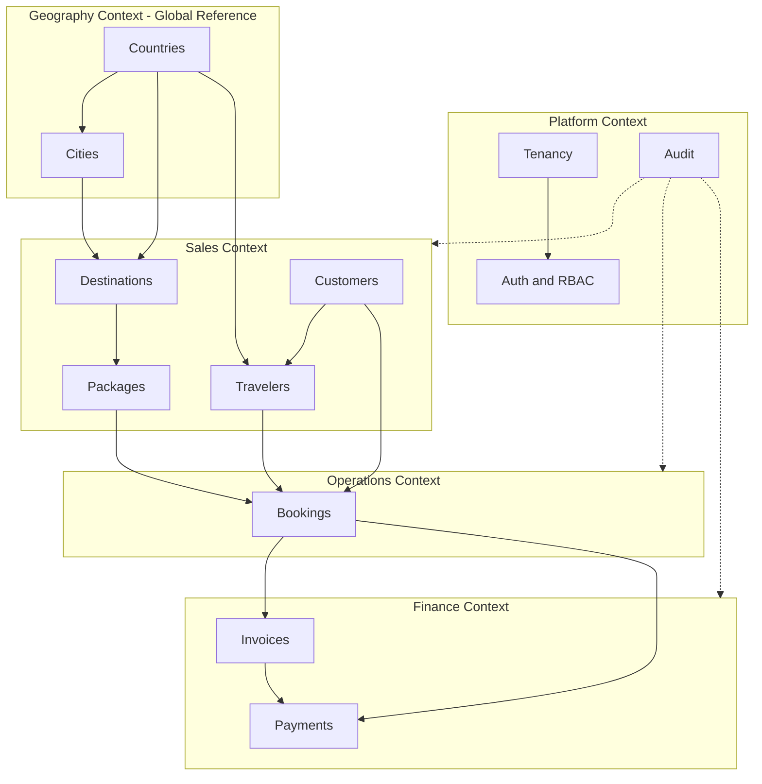
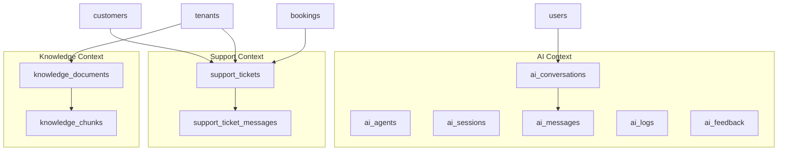

# TravelOS Domain Model

**Version:** 2.0 — Expanded MVP (Database Design Exercise)
**Author:** PostgreSQL / Supabase Architecture
**Last Updated:** 2026-06-02
**Status:** Core MVP approved; AI entities recommended (Phase 5) — no migrations yet

---

## 1. Scope

This domain model covers the approved MVP module set:

`Auth`, `Users`, `Roles`, `Permissions`, `Customers`, `Travelers`, `Countries`, `Cities`, `Destinations`, `Packages`, `Package Pricing`, `Bookings`, `Booking Travelers`, `Payments`, `Invoices`.

It supersedes the v1.0 MVP model by adding **standalone Travelers**, a **geography reference layer** (Countries, Cities, Destinations), and **Invoices** as a first-class financial document between Bookings and Payments.

---

## 2. Entity Classification

Per the design brief, every entity is classified into one of four categories.

### 2.1 Core Entities (primary business objects, tenant-owned)

| Entity | Description |
|--------|-------------|
| `tenants` | The agency organization; root of all tenant isolation |
| `users` | Staff accounts (mapped 1:1 to Supabase `auth.users`) |
| `customers` | Booking account holder (individual or corporate) |
| `travelers` | Person who travels; reusable profile linked to a customer |
| `packages` | Sellable travel product |
| `bookings` | Central transaction linking customer + package + travelers |

### 2.2 Lookup / Reference Entities (relatively static)

| Entity | Scope | Description |
|--------|-------|-------------|
| `roles` | Global | System roles (super_admin, tenant_admin, sales_agent, finance_officer) |
| `permissions` | Global | Discrete `{module}.{action}` grants |
| `countries` | Global | ISO 3166 country reference data |
| `cities` | Global | Cities linked to countries |
| `destinations` | Tenant | Agency-curated marketable destinations (built on countries/cities) |

### 2.3 Transaction Entities (operational records)

| Entity | Description |
|--------|-------------|
| `package_pricing` | Price per tier (adult/child/infant) for a package |
| `package_days` | Day-by-day plan for a package |
| `package_day_activities` | Activities scheduled within a package day |
| `bookings` | Booking header (also a Core entity; it is the transactional hub) |
| `booking_items` | Booking line items contributing to the total |
| `booking_travelers` | Junction assigning travelers to a booking |
| `booking_status_history` | Status transition ledger |
| `invoices` | Financial document issued for a booking (1 booking → N invoices) |
| `payments` | Money received against an invoice/booking |
| `payment_transactions` | Immutable ledger of each payment movement |

### 2.4 Audit Entities

| Entity | Description |
|--------|-------------|
| `audit_logs` | Append-only record of INSERT/UPDATE/DELETE on business tables |

### 2.5 Supporting / Junction Entities

| Entity | Description |
|--------|-------------|
| `tenant_settings` | Per-tenant configuration (timezone, currency) |
| `role_permissions` | Role ↔ permission junction |
| `user_roles` | User ↔ role assignment (tenant-scoped) |
| `customer_contacts` | Additional contacts per customer |
| `customer_addresses` | Addresses per customer (FK to countries/cities) |
| `package_media` | Media files per package |
| `booking_notes` | Free-text notes attached to a booking |
| `booking_documents` | Files/attachments attached to a booking |
| `notifications` | In-app notifications delivered to users |

---

## 3. Bounded Contexts



---

## 4. Aggregates and Invariants

| Aggregate Root | Members | Key Invariants |
|----------------|---------|----------------|
| `tenants` | `tenant_settings` | One settings row per tenant |
| `users` | `user_roles` | Each user belongs to exactly one tenant (except super_admin); exactly one role per tenant |
| `countries` | `cities` | A city must belong to a valid country |
| `destinations` | — | Destination references a country (city optional); tenant-scoped |
| `customers` | `customer_contacts`, `customer_addresses` | Email unique per tenant |
| `travelers` | — | Belongs to a tenant; optionally linked to a customer; nationality references a country |
| `packages` | `package_days` → `package_day_activities`, `package_pricing`, `package_media` | Only `published` packages are bookable; one price row per tier; days unique per package |
| `bookings` | `booking_items`, `booking_travelers`, `booking_status_history`, `booking_notes`, `booking_documents` | Total = Σ line items; status follows defined workflow; at least one lead traveler |
| `invoices` | — | `total_amount = subtotal + tax_amount`; unique invoice_number per tenant; one or more invoices per booking |
| `payments` | `payment_transactions` | Σ payments ≤ invoice/booking total; cannot apply to cancelled booking |

---

## 5. Key Relationships (cardinality)

| From | To | Cardinality | Notes |
|------|----|-------------|-------|
| tenants | users | 1:N | |
| countries | cities | 1:N | |
| countries | destinations | 1:N | |
| cities | destinations | 1:N | city optional |
| destinations | packages | 1:N | destination optional on package |
| customers | travelers | 1:N | traveler may be standalone (null customer) |
| countries | travelers | 1:N | nationality |
| packages | package_days | 1:N | |
| package_days | package_day_activities | 1:N | |
| customers | bookings | 1:N | |
| packages | bookings | 1:N | |
| bookings | booking_travelers | 1:N | |
| travelers | booking_travelers | 1:N | reusable across bookings |
| bookings | booking_notes | 1:N | |
| bookings | booking_documents | 1:N | |
| bookings | invoices | 1:N | multiple invoices allowed per booking |
| users | notifications | 1:N | recipient |
| invoices | payments | 1:N | |
| bookings | payments | 1:N | payment may reference invoice or booking directly |
| payments | payment_transactions | 1:N | |

---

## 6. Multi-Tenancy Strategy

Two data tiers:

1. **Global reference data** — `roles`, `permissions`, `countries`, `cities`. No `tenant_id`, no soft delete, no audit columns. Seeded by the platform and shared read-only across all tenants.
2. **Tenant-scoped data** — every other table carries `tenant_id UUID NOT NULL REFERENCES tenants(id)` and is isolated via Row Level Security:

```sql
USING (tenant_id = (auth.jwt() ->> 'tenant_id')::uuid OR auth.is_super_admin())
```

`destinations` is tenant-scoped even though it builds on global geography, because each agency curates its own marketable destination catalog.

---

## 7. Cross-Cutting Conventions

| Convention | Rule |
|------------|------|
| Primary keys | `UUID DEFAULT gen_random_uuid()` |
| Soft delete | `deleted_at TIMESTAMPTZ NULL` on all tenant business tables |
| Audit columns | `created_by`, `updated_by` (FK → users), `created_at`, `updated_at` (timestamptz) |
| Timestamps | UTC `timestamptz`, `updated_at` maintained by trigger |
| Money | `DECIMAL(12,2)` + `currency CHAR(3)` (USD default for MVP) |
| Enumerations | PostgreSQL `ENUM` types |
| Audit trail | DB trigger writes to `audit_logs` on INSERT/UPDATE/DELETE |

Soft delete applies to: `destinations`, `customers`, `travelers`, `packages`, `bookings`, `invoices`, `payments`.
Soft delete does NOT apply to: global lookups, junction tables, history/ledger tables, `booking_notes`, `booking_documents`, `notifications`, `audit_logs`.

---

## 8. Story-to-Entity Mapping (delta from v1.0)

| Requirement Area | New/Changed Entities |
|------------------|----------------------|
| Travelers as reusable profiles | `travelers` (new), `booking_travelers` (now FK → travelers) |
| Geography reference | `countries`, `cities` (new global), `destinations` (new tenant) |
| Package location | `packages.destination_id` (new FK) |
| Package planning | `package_days` (replaces `package_itineraries`) + `package_day_activities` (new) |
| Invoicing | `invoices` (new, 1:N per booking), `payments.invoice_id` (new optional FK) |
| Booking attachments | `booking_notes` (new), `booking_documents` (new) |
| Addresses | `customer_addresses` now uses `country_id`/`city_id` FKs (no free-text) |
| Notifications | `notifications` (new) |

---

## 9. Confirmed Design Decisions (approved 2026-06-01)

1. **Geography:** countries & cities are global; destinations are tenant-scoped.
2. **Travelers:** `customer_id` is nullable (standalone travelers allowed).
3. **Payments:** `invoice_id` remains optional.
4. **Invoices:** multiple invoices per booking allowed (1:N).
5. **Addresses:** `customer_addresses` uses `country_id` + `city_id` FKs; free-text country/city removed.

6. **Knowledge Agent** approved (D-006) — Phase 5.
7. **Booking Agent** approved (D-007) — Phase 5; draft-only mutations.
8. **Support Agent** approved (D-008) — Phase 5.
9. **Landing Trust & Scale Metrics** approved (D-009) — marketing only.

See [DECISIONS.md](../01-Product/DECISIONS.md).

---

## 10. AI & Support Domain (recommended — Phase 5)

**Status:** Recommendations only. Do not generate migrations until implementation approval.

### 10.1 Bounded context



### 10.2 Recommended entities

| Entity | Category | Tenant-scoped | Description |
|--------|----------|:-------------:|-------------|
| `ai_agents` | Lookup/config | Yes | Registry of enabled agents per tenant (`knowledge`, `booking`, `support`) |
| `ai_sessions` | Transaction | Yes | Browser/session binding to user |
| `ai_conversations` | Transaction | Yes | Conversation thread (agent type, user) |
| `ai_messages` | Transaction | Yes | User, assistant, system, tool messages |
| `ai_logs` | Audit | Yes | Tool calls, latency, model, token usage |
| `ai_feedback` | Transaction | Yes | Rating / correction on message |
| `knowledge_documents` | Core | Yes | Uploaded policy, FAQ, contract metadata |
| `knowledge_chunks` | Transaction | Yes | Text chunks + embedding vector |
| `support_tickets` | Core | Yes | Customer support case |
| `support_ticket_messages` | Transaction | Yes | Ticket thread |

### 10.3 Key relationships

| From | To | Cardinality | Notes |
|------|----|-------------|-------|
| tenants | knowledge_documents | 1:N | |
| knowledge_documents | knowledge_chunks | 1:N | Cascade delete on reindex |
| users | ai_conversations | 1:N | |
| ai_conversations | ai_messages | 1:N | |
| customers | support_tickets | 1:N | Optional FK |
| bookings | support_tickets | 1:N | Optional FK |
| users | support_tickets | 1:N | `assigned_user_id` |
| support_tickets | support_ticket_messages | 1:N | |

### 10.4 Integration with existing aggregates

- **Booking Agent** mutates `bookings` aggregate only in `draft` state.
- **Support Agent** reads `customers`, `bookings`; writes `support_tickets` aggregate.
- **Knowledge Agent** read-only on business tables; writes only to `knowledge_*` and `ai_*`.

Full schema recommendations: [DatabaseDesign.md](./DatabaseDesign.md) §8.
