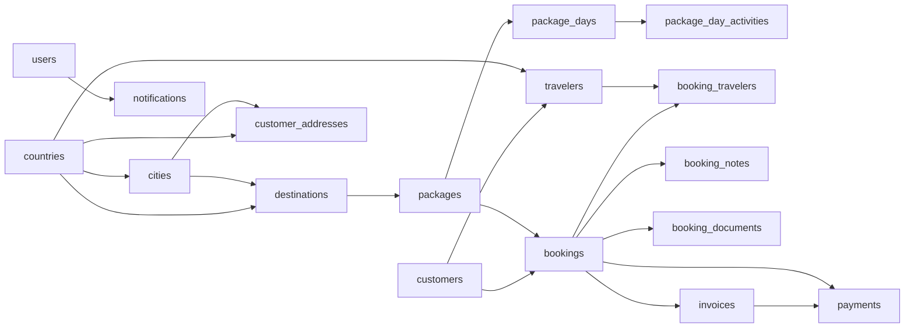
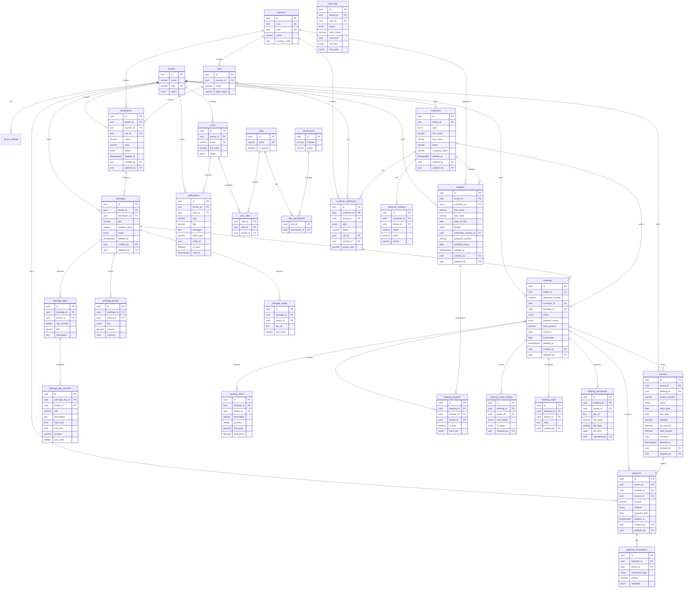
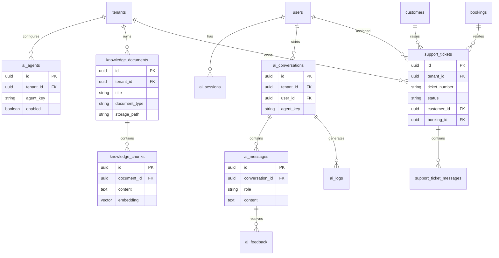

# TravelOS Entity Relationship Diagram

**Version:** 2.1 — Expanded MVP (approved)
**Last Updated:** 2026-06-02

Normalized to 3NF. Global reference tables (`roles`, `permissions`, `countries`, `cities`) have no `tenant_id`; all other tables are tenant-scoped.

---

## 1. High-Level Relationship Map

---

## 2. Full ERD

---

## 3. Table Inventory

| # | Table | Category | Tenant-Scoped | Soft Delete | Audit Cols | Migration |
|---|-------|----------|:-------------:|:-----------:|:----------:|-----------|
| 1 | tenants | Core | n/a (root) | No | No | 001 |
| 2 | tenant_settings | Support | Yes | No | No | 001 |
| 3 | users | Core | Yes | No | No | 001 |
| 4 | roles | Lookup (global) | No | No | No | 001 |
| 5 | permissions | Lookup (global) | No | No | No | 001 |
| 6 | role_permissions | Junction | No | No | No | 001 |
| 7 | user_roles | Junction | Yes | No | No | 001 |
| 8 | countries | Lookup (global) | No | No | No | 002 |
| 9 | cities | Lookup (global) | No | No | No | 002 |
| 10 | destinations | Lookup (tenant) | Yes | Yes | Yes | 002 |
| 11 | customers | Core | Yes | Yes | Yes | 003 |
| 12 | customer_contacts | Support | Yes | No | No | 003 |
| 13 | customer_addresses | Support | Yes | No | No | 003 |
| 14 | travelers | Core | Yes | Yes | Yes | 003 |
| 15 | packages | Core | Yes | Yes | Yes | 003 |
| 16 | package_days | Transaction | Yes | No | No | 003 |
| 17 | package_day_activities | Transaction | Yes | No | No | 003 |
| 18 | package_pricing | Transaction | Yes | No | No | 003 |
| 19 | package_media | Support | Yes | No | No | 003 |
| 20 | bookings | Core/Transaction | Yes | Yes | Yes | 004 |
| 21 | booking_items | Transaction | Yes | No | No | 004 |
| 22 | booking_travelers | Junction | Yes | No | No | 004 |
| 23 | booking_status_history | Transaction (ledger) | Yes | No | No | 004 |
| 24 | booking_notes | Support | Yes | No | partial | 004 |
| 25 | booking_documents | Support | Yes | No | partial | 004 |
| 26 | invoices | Transaction | Yes | Yes | Yes | 004 |
| 27 | payments | Transaction | Yes | Yes | Yes | 004 |
| 28 | payment_transactions | Transaction (ledger) | Yes | No | No | 004 |
| 29 | notifications | Support | Yes | No | No | 005 |
| 30 | audit_logs | Audit | Yes | No | No | 005 |

**Total: 30 tables** (MVP operational schema).

---

## 4. Recommended AI & Support ERD (Phase 5 — not migrated)

The following entities are **recommended** for Knowledge, Booking, and Support agents. See [DECISIONS.md](../01-Product/DECISIONS.md) D-006–D-008.

**Migration policy:** Document only until Phase 5 implementation gate passes.
