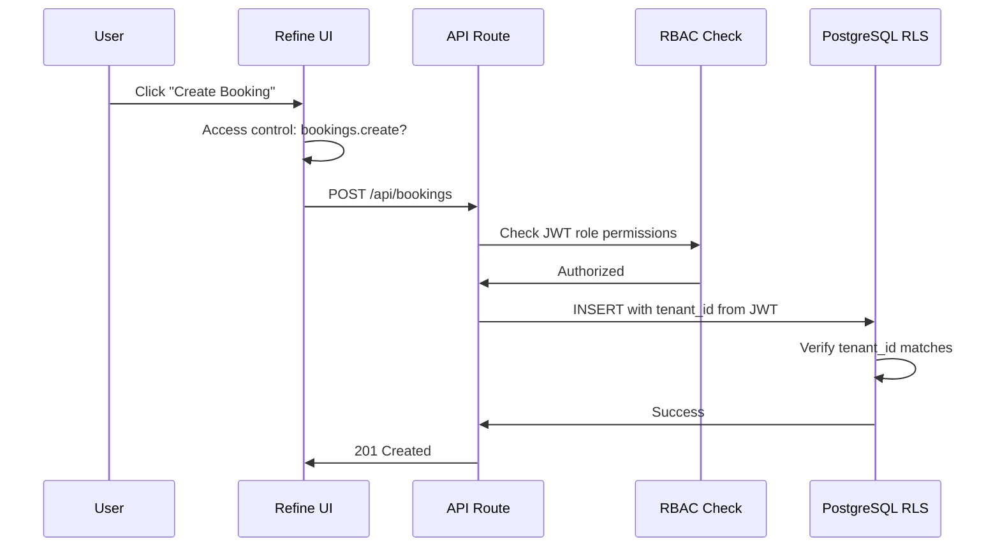

# TravelOS RBAC Security Model

**Version:** 2.0 — Pilot (CRM + Portal + Payments + AI)  
**Last Updated:** 2026-06-04

---

## Overview

TravelOS implements Role-Based Access Control (RBAC) at three layers:

1. **Database (RLS)** — Row Level Security policies enforce tenant isolation
2. **API (Middleware)** — JWT role checked against required permission
3. **UI (Refine Access Control)** — Buttons and routes hidden based on role

**CRM permissions** (leads, opportunities, quotations) are defined in migrations `029`, `036` and enforced via `crm.*` permission strings — see `src/lib/auth/crm-rbac.ts`.

**Customer portal** uses a separate auth path (`requirePortalApiAccess`) — not staff roles. Portal users have `user_type: customer` and RLS on portal tables (migrations `039`–`042`).

**AI modules** (Sales 9C, Operations 9D) are read-only at the API layer; RLS migrations `059`, `063` restrict snapshot and recommendation tables.

**Payments & WhatsApp** tenant settings are admin-configurable; gateway webhooks use server secrets, not user JWT.

---

## Roles

| Role | Scope | Description |
|------|-------|-------------|
| super_admin | Platform | Full access to all tenants and platform settings |
| tenant_admin | Tenant | Full access within their agency |
| sales_agent | Tenant | Customer, package, and booking management |
| finance_officer | Tenant | Payment management and financial read access |

---

## Permission Matrix

### Tenants

| Permission | super_admin | tenant_admin | sales_agent | finance_officer |
|------------|:-----------:|:------------:|:-----------:|:---------------:|
| tenants.create | ✓ | — | — | — |
| tenants.read | ✓ | ✓ (own) | — | — |
| tenants.update | ✓ | ✓ (own) | — | — |
| tenants.delete | ✓ | — | — | — |
| tenants.manage | ✓ | — | — | — |

### Users

| Permission | super_admin | tenant_admin | sales_agent | finance_officer |
|------------|:-----------:|:------------:|:-----------:|:---------------:|
| users.create | ✓ | ✓ | — | — |
| users.read | ✓ | ✓ | — | — |
| users.update | ✓ | ✓ | — | — |
| users.delete | ✓ | ✓ | — | — |
| users.manage | ✓ | ✓ | — | — |

### Customers

| Permission | super_admin | tenant_admin | sales_agent | finance_officer |
|------------|:-----------:|:------------:|:-----------:|:---------------:|
| customers.create | ✓ | ✓ | ✓ | — |
| customers.read | ✓ | ✓ | ✓ | ✓ |
| customers.update | ✓ | ✓ | ✓ | — |
| customers.delete | ✓ | ✓ | — | — |
| customers.export | ✓ | ✓ | — | ✓ |

### Packages

| Permission | super_admin | tenant_admin | sales_agent | finance_officer |
|------------|:-----------:|:------------:|:-----------:|:---------------:|
| packages.create | ✓ | ✓ | ✓ | — |
| packages.read | ✓ | ✓ | ✓ | ✓ |
| packages.update | ✓ | ✓ | ✓ | — |
| packages.delete | ✓ | ✓ | — | — |
| packages.publish | ✓ | ✓ | ✓ | — |
| packages.export | ✓ | ✓ | — | — |

### Bookings

| Permission | super_admin | tenant_admin | sales_agent | finance_officer |
|------------|:-----------:|:------------:|:-----------:|:---------------:|
| bookings.create | ✓ | ✓ | ✓ | — |
| bookings.read | ✓ | ✓ | ✓ | ✓ |
| bookings.update | ✓ | ✓ | ✓ | — |
| bookings.delete | ✓ | ✓ | — | — |
| bookings.confirm | ✓ | ✓ | ✓ | — |
| bookings.cancel | ✓ | ✓ | ✓ | — |
| bookings.complete | ✓ | ✓ | ✓ | — |
| bookings.export | ✓ | ✓ | ✓ | ✓ |

### Payments

| Permission | super_admin | tenant_admin | sales_agent | finance_officer |
|------------|:-----------:|:------------:|:-----------:|:---------------:|
| payments.create | ✓ | ✓ | — | ✓ |
| payments.read | ✓ | ✓ | ✓ | ✓ |
| payments.update | ✓ | ✓ | — | ✓ |
| payments.delete | ✓ | ✓ | — | — |
| payments.export | ✓ | ✓ | — | ✓ |

### Dashboard & Audit

| Permission | super_admin | tenant_admin | sales_agent | finance_officer |
|------------|:-----------:|:------------:|:-----------:|:---------------:|
| dashboard.read | ✓ | ✓ | ✓ | ✓ |
| dashboard.financial | ✓ | ✓ | — | ✓ |
| audit_logs.read | ✓ | ✓ | — | — |
| settings.read | ✓ | ✓ | — | — |
| settings.update | ✓ | ✓ | — | — |
| settings.manage | ✓ | ✓ | — | — |

### AI agents (Phase 5)

| Permission | super_admin | tenant_admin | sales_agent | finance_officer |
|------------|:-----------:|:------------:|:-----------:|:---------------:|
| ai.knowledge.use | ✓ | ✓ | ✓ | ✓ |
| ai.booking.use | ✓ | ✓ | ✓ | — |
| ai.support.use | ✓ | ✓ | ✓ | ✓ |
| ai.read | ✓ | ✓ | ✓ | ✓ |
| ai.analytics.read | ✓ | ✓ | — | — |
| ai.logs.read | ✓ | ✓ | — | — |
| knowledge.manage | ✓ | ✓ | — | — |

**Notes:**

- Booking Agent is **not** granted to `finance_officer` (see `src/lib/auth/rbac.ts`, migration `015_rls_ai.sql`).
- `ai.read` allows the conversation history UI (`/ai/history`). Tenant admins see all tenant threads; other roles see only their own conversations (UI filter).
- Agents never receive `bookings.confirm`, `payments.create`, or autonomous confirmation permissions.

---

## JWT Custom Claims

On login, the custom access token hook injects into JWT `app_metadata`:

```json
{
  "sub": "user-uuid",
  "email": "agent@agency.com",
  "app_metadata": {
    "tenant_id": "tenant-uuid",
    "role": "sales_agent"
  }
}
```

Configured in `database/migrations/009_auth_hook.sql` and enabled in Supabase Dashboard → Authentication → Hooks.

---

## RLS Policy Summary

| Policy | Rule |
|--------|------|
| Tenant isolation | `tenant_id = auth.tenant_id()` |
| Super Admin bypass | `auth.is_super_admin()` |
| Roles/permissions | Read-only for all authenticated users |

See `database/migrations/006_rls_policies.sql` for full policy definitions.

---

## Enforcement Flow



---

## Seed Data

Roles and permissions seeded in `database/migrations/008_seed_reference.sql`.

To check a user's permissions:

```sql
SELECT p.module, p.action
FROM permissions p
JOIN role_permissions rp ON rp.permission_id = p.id
JOIN user_roles ur ON ur.role_id = rp.role_id
WHERE ur.user_id = '{user_id}';
```
