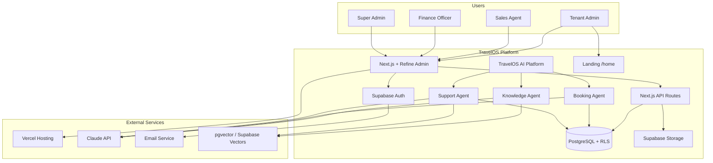
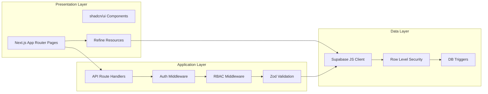
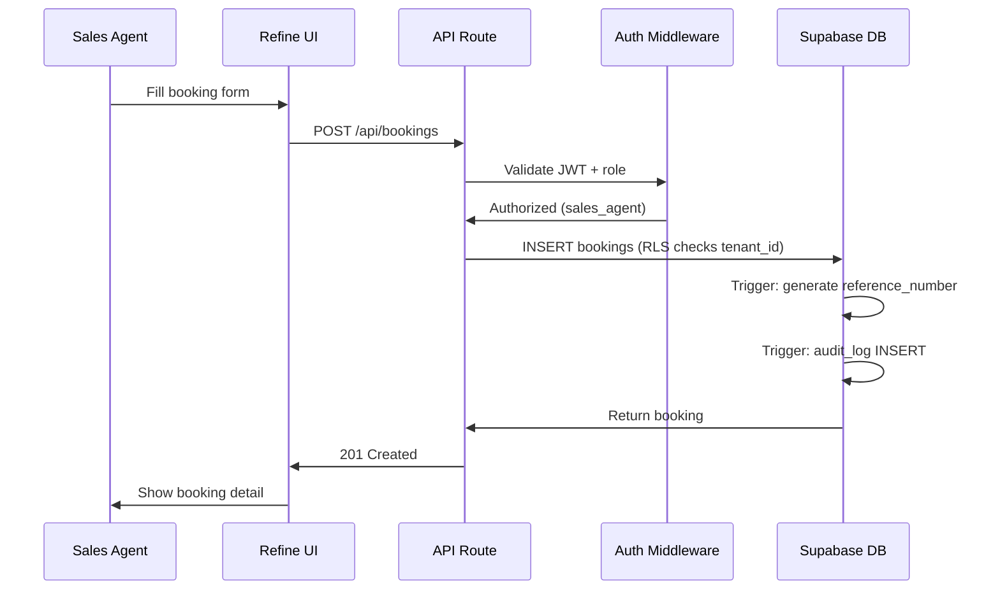
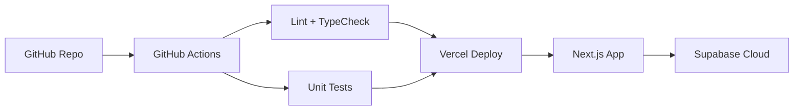

# TravelOS Solution Architecture

**Version:** 1.1 — MVP + AI Platform (documented)  
**Last Updated:** 2026-06-02

---

## System Context



---

## Component Architecture



---

## Technology Stack

| Layer | Technology | Purpose |
|-------|-----------|---------|
| Frontend Framework | Next.js 15 (App Router) | SSR, routing, API routes |
| Admin Framework | Refine 4 | CRUD scaffolding, data provider |
| UI Components | shadcn/ui + Tailwind CSS | Design system |
| Language | TypeScript (strict) | Type safety |
| Backend | Supabase | Auth, DB, Storage, RLS |
| Database | PostgreSQL 15 | Relational data |
| AI | Claude API | Booking Agent |
| Hosting | Vercel | Frontend + API deployment |
| CI/CD | GitHub Actions | Lint, test, deploy |

---

## Data Flow: Create Booking



---

## Multi-Tenancy Architecture

1. **Tenant provisioning:** Super Admin creates tenant → tenant_settings row
2. **User assignment:** Users linked to tenant via `users.tenant_id`
3. **JWT claims:** On login, custom claims set: `{ tenant_id, role }`
4. **RLS enforcement:** Every query filtered by `tenant_id` from JWT
5. **Super Admin bypass:** Dedicated RLS policy for platform-level access

---

## Security Architecture

| Layer | Mechanism |
|-------|-----------|
| Transport | HTTPS (TLS 1.2+) via Vercel |
| Authentication | Supabase Auth (JWT) |
| Authorization | RBAC middleware + RLS policies |
| Input validation | Zod schemas on all API routes |
| Audit | Database triggers → audit_logs |
| Soft delete | deleted_at filter in all queries |

---

## Deployment Architecture



| Environment | Frontend | Database |
|-------------|----------|----------|
| Development | localhost:3000 | Supabase local or dev project |
| Staging | staging.travelos.app | Supabase staging project |
| Production | app.travelos.app | Supabase production project |

---

## Folder Structure

```
travel-os/
├── app/                    # Next.js App Router
│   ├── (auth)/             # Login, forgot password
│   ├── (dashboard)/        # Authenticated routes
│   │   ├── customers/
│   │   ├── packages/
│   │   ├── bookings/
│   │   ├── payments/
│   │   ├── users/
│   │   └── settings/
│   └── api/                # API route handlers
├── components/             # Shared UI components
├── lib/                    # Utilities, Supabase client, validation
├── providers/              # Refine providers (auth, data, access)
├── types/                  # TypeScript types
├── database/
│   ├── schema/             # DDL reference files
│   └── migrations/         # Supabase migrations
├── docs/                   # Documentation
├── ai/                     # AI agents and prompts
└── .github/workflows/      # CI/CD
```

---

## Integration Points (MVP)

| Integration | Status | Phase |
|-------------|--------|-------|
| Supabase Auth | MVP | Phase 5 |
| Supabase Database | MVP | Phase 4 |
| Supabase Storage | MVP (package images) | Phase 5 |
| Claude API | MVP (Booking Agent) | Phase 6 |
| Stripe Payments | POST-MVP | Growth |
| Email Notifications | POST-MVP | Growth |
