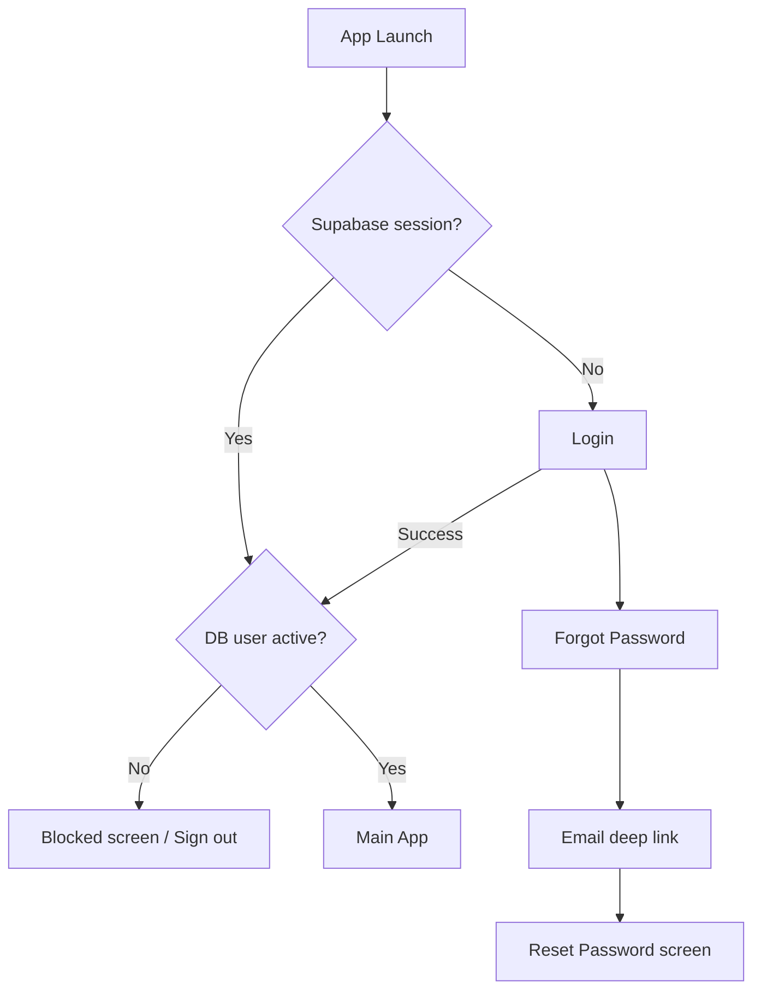
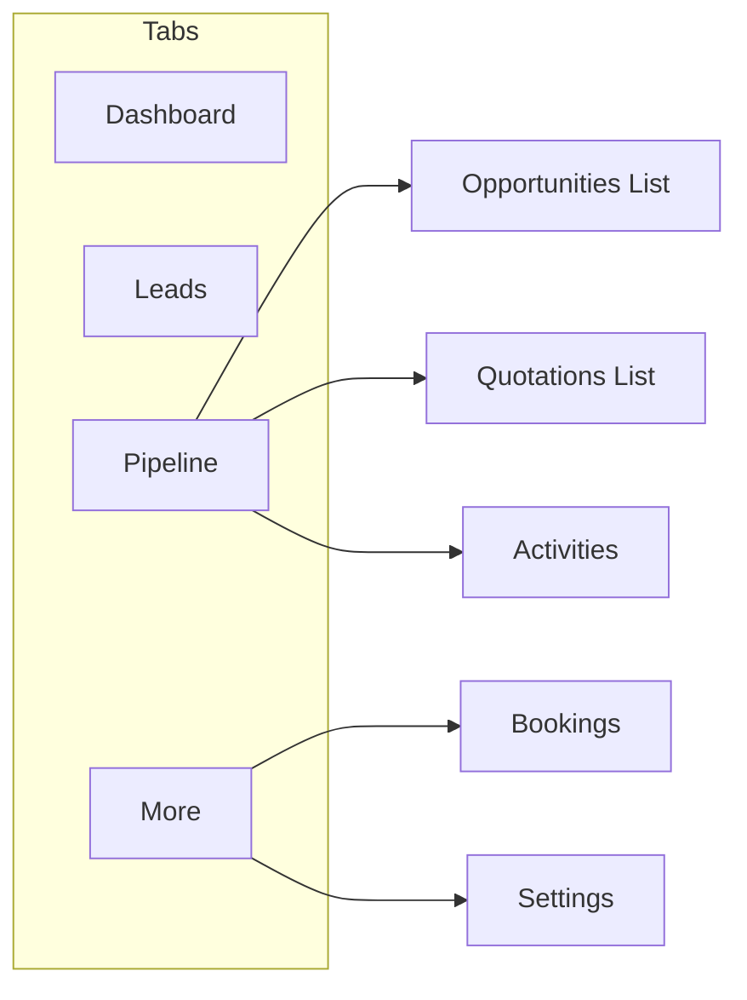
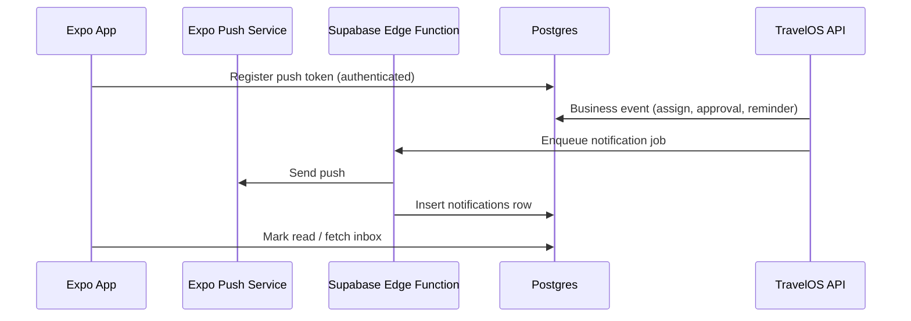

# TravelOS Mobile Architecture & Readiness Report

**Sprint:** 7A — Architecture & Readiness Gate  
**Date:** 2026-06-03  
**Status:** Architecture / planning only (no mobile implementation)  
**Prerequisite:** Sprint 6 CRM Core — **CLOSED (PASS)**

**Approved mobile stack:** Expo, React Native, TypeScript, TanStack Query, React Navigation  
**Constraints:** Reuse Supabase Auth, JWT claims, RBAC, RLS; no separate mobile backend; no duplicated business logic; do not redesign CRM or quotations workflows.

---

## 1. Executive Summary

TravelOS CRM Core is production-grade for web: leads, opportunities, activities, Customer 360, CRM dashboard, quotations (full lifecycle), booking conversion, RBAC, RLS, and audit logging are implemented and validated on staging (Sprint 6 closure).

For mobile, **CRM mutation and read APIs are largely complete** and follow consistent JSON envelopes (`data` + `meta`), Zod validation, and `requireActiveApiAccess` + CRM permission checks. **Bookings and operational modules remain web-first**: list/detail flows use Refine + Supabase Data Provider with RLS; only `PATCH /api/bookings/:id/status` exists as a REST mutation route.

The **primary blocker for a cookie-less mobile client** is that all Next.js API routes authenticate via **Supabase SSR cookie sessions** (`createClient()` from `src/lib/supabase/server.ts`), not the `Authorization: Bearer` pattern documented in `docs/03-Architecture/API.md`. Mobile can authenticate with `@supabase/supabase-js` immediately, but **must not assume existing `/api/*` routes work with Bearer tokens until a thin auth transport layer is added** (Sprint 7B prerequisite).

Secondary gaps: documented `GET /api/auth/me` is not implemented; bookings list/detail REST APIs are missing; in-app `notifications` table has no app/API surface; push/device registry does not exist; quotation PDF/email/public flows remain POST-MVP on web.

**Decision: GO WITH CONDITIONS** — Superseded by Sprint 7B completion. See `TravelOS-Mobile-Backend-Foundation.md` and **READY FOR MOBILE UI** below.

When conditions are met:

> **TravelOS Mobile MVP is ready to begin implementation using Expo and React Native.**

---

## 2. Mobile Readiness Score

| Dimension | Weight | Score (0–100) | Notes |
|-----------|--------|---------------|-------|
| CRM REST APIs (coverage, envelopes, RBAC) | 25% | **88** | Leads, opportunities, activities, quotations, CRM dashboard, Customer 360 |
| Auth & session model | 20% | **62** | Supabase Auth solid; API cookie-only; `/api/auth/me` missing |
| Bookings & operations APIs | 15% | **45** | RLS + Refine on web; REST list/detail absent |
| Multi-tenant security (RLS + JWT) | 15% | **90** | Proven; mobile must mirror DB-backed gate |
| Notifications & push | 10% | **25** | DB table exists; no API, no push pipeline |
| Offline / performance contracts | 10% | **55** | Page/limit pagination; no cursor on CRM lists; timeline cursor on C360 |
| Documentation alignment | 5% | **70** | API.md vs implementation drift (Bearer, bookings) |
| **Weighted total** | | **74** | Up from Sprint 6 closure estimate (72) after full route inventory |

---

## 3. API Readiness Matrix

**Legend:** **READY** = callable from mobile with Bearer support (or Supabase-only read where noted); **PARTIAL** = exists but needs auth transport, fields, or companion APIs; **MISSING** = not implemented.

| Screen | API | Status | Notes |
|--------|-----|--------|-------|
| **Authentication** | | | |
| Login | Supabase `signInWithPassword` | READY | Standard RN SDK + SecureStore session |
| Login (profile gate) | `public.users` + `user_roles` via Supabase (RLS) | READY | Same logic as `resolveDbUserAccess` |
| Forgot Password | Supabase `resetPasswordForEmail` | READY | Deep link / universal link config required |
| Profile / session | `GET /api/auth/me` | MISSING | Documented in API.md; use Supabase self-read until added |
| Onboarding | `POST /api/auth/onboarding` | PARTIAL | Web-oriented; mobile may skip or mirror later |
| **CRM Dashboard** | | | |
| CRM Dashboard | `GET /api/crm/dashboard?period=&from=&to=` | READY | KPIs/charts/lists; financial gated by `dashboard.financial` |
| Ops Dashboard (alt) | `GET /api/dashboard/stats` | READY | Bookings/revenue; not CRM pipeline |
| **Leads** | | | |
| Lead List | `GET /api/leads` | READY | `page`, `limit`, `search`, `status`, `source`, `owner_id` |
| Lead Create | `POST /api/leads` | READY | Duplicate meta via `?allow_duplicates=true` |
| Lead Details | `GET /api/leads/:id` | READY | |
| Lead Update | `PATCH /api/leads/:id` | READY | Owner-scoped write via service |
| Lead Delete | `DELETE /api/leads/:id` | READY | Soft delete |
| Lead Assign | `POST /api/leads/:id/assign` | READY | |
| Lead Health | `GET /api/leads/:id/health` | READY | |
| Duplicate Check | `GET /api/leads/check-duplicate` | READY | |
| Convert → Opportunity | `POST /api/leads/:id/convert-opportunity` | READY | |
| Convert → Customer | `POST /api/leads/:id/convert-customer` | READY | Needs `customers.create` |
| Log WhatsApp | `POST /api/leads/:id/log-whatsapp` | READY | |
| Assignee picker | `GET /api/users` | PARTIAL | Requires `users.read` (tenant_admin); sales agents need assignee subset API |
| **Opportunities** | | | |
| Opportunity List | `GET /api/opportunities` | READY | Pagination + filters |
| Opportunity Create | `POST /api/opportunities` | READY | |
| Opportunity Details | `GET /api/opportunities/:id` | READY | |
| Opportunity Update | `PATCH /api/opportunities/:id` | READY | Stage change via PATCH body |
| Opportunity Delete | `DELETE /api/opportunities/:id` | READY | |
| Stage History | `GET /api/opportunities/:id/stage-history` | READY | |
| Forecast | `GET /api/opportunities/forecast` | READY | P1 analytics |
| Create Booking | `POST /api/opportunities/:id/create-booking` | READY | Requires `bookings.create` + stage rules |
| **Activities** | | | |
| Activity List / Timeline | `GET /api/activities` | READY | `view=timeline|activities`, scoped by role |
| Activity Create | `POST /api/activities` | READY | |
| Activity Details | `GET /api/activities/:id` | READY | |
| Activity Update | `PATCH /api/activities/:id` | READY | |
| Activity Delete | `DELETE /api/activities/:id` | READY | |
| **Quotations** | | | |
| Quotation List | `GET /api/quotations` | READY | Filters: opportunity, customer, status, owner |
| Quotation Create | `POST /api/quotations` | READY | |
| Quotation Details | `GET /api/quotations/:id` | READY | Includes items when `getQuotationById(..., true)` |
| Quotation Update | `PATCH /api/quotations/:id` | READY | Lifecycle rules in service |
| Quotation Delete | `DELETE /api/quotations/:id` | READY | |
| Items CRUD | `POST/PATCH/DELETE /api/quotations/:id/items/...` | READY | |
| Submit Approval | `POST /api/quotations/:id/submit-approval` | READY | |
| Approve / Reject Approval | `POST .../approve`, `.../reject-approval` | READY | Tenant admin approval path |
| Send / Mark Viewed | `POST .../send`, `.../mark-viewed` | READY | No email delivery (POST-MVP) |
| Accept / Reject (customer) | `POST .../accept`, `.../reject` | READY | Staff-driven accept on MVP |
| Convert to Booking | `POST /api/quotations/:id/convert` | READY | Returns `booking_id`, `redirect_url` (web path) |
| Quotation PDF | — | MISSING | POST-MVP on web |
| **Customer 360** (linked from lead/customer) | | | |
| Customer 360 Summary | `GET /api/customers/:id/360` | READY | Requires `customers.read` |
| Customer 360 Timeline | `GET /api/customers/:id/360/timeline` | READY | Cursor pagination, buckets |
| **Bookings** | | | |
| Booking List | `GET /api/bookings` | MISSING | Web: Supabase `bookings` + RLS |
| Booking Details | `GET /api/bookings/:id` | MISSING | Web: Refine show |
| Booking Create/Update | — | MISSING | Web: direct Supabase mutations |
| Booking Status | `PATCH /api/bookings/:id/status` | READY | Only REST booking mutation |
| **Settings** | | | |
| User Profile | Supabase `users` self-row (RLS `id = auth.uid()`) | PARTIAL | No self-service profile PATCH API |
| User Profile (admin) | `GET /api/users/:id` | PARTIAL | `users.read` — not for sales_agent |
| Tenant Users List | `GET /api/users` | PARTIAL | Admin-only |
| Notifications | — | MISSING | Table `notifications` exists; no routes/UI |
| Notification Preferences | — | MISSING | |
| **Health** | `GET /api/health/supabase` | READY | Connectivity check only |

---

## 4. Mobile Screen Inventory

| Screen | Area | Priority | Primary data source | MVP scope |
|--------|------|----------|---------------------|-----------|
| Login | Auth | **P0** | Supabase Auth | Email/password |
| Forgot Password | Auth | **P0** | Supabase Auth | Reset email flow |
| Session bootstrap / splash | Auth | **P0** | Supabase session + DB user status | Active vs pending/inactive |
| CRM Dashboard | CRM | **P0** | `GET /api/crm/dashboard` | Period selector; hide financial without permission |
| Lead List | CRM | **P0** | `GET /api/leads` | Search, filters, infinite scroll |
| Lead Create / Edit | CRM | **P0** | `POST/PATCH /api/leads` | Duplicate warning UX |
| Lead Details | CRM | **P0** | `GET /api/leads/:id` + activities timeline | Quick actions: assign, convert, WhatsApp log |
| Opportunity List | CRM | **P0** | `GET /api/opportunities` | Stage filters |
| Opportunity Details | CRM | **P0** | `GET /api/opportunities/:id` | Stage PATCH, linked quotations |
| Opportunity Create / Edit | CRM | **P0** | `POST/PATCH /api/opportunities` | |
| Activity List (global / entity) | CRM | **P0** | `GET /api/activities` | Timeline view default |
| Activity Create / Complete | CRM | **P0** | `POST/PATCH /api/activities` | |
| Quotation List | CRM | **P0** | `GET /api/quotations` | Status filters |
| Quotation Details | CRM | **P0** | `GET /api/quotations/:id` | Workflow actions (send, approve, accept, convert) |
| Quotation Create / Edit | CRM | **P1** | Quotation + items APIs | Line items UX heavier on mobile |
| Customer 360 (summary) | CRM | **P1** | `GET /api/customers/:id/360` | Tabbed summary; deep link from lead |
| Customer 360 Timeline | CRM | **P1** | `GET /api/customers/:id/360/timeline` | Cursor infinite scroll |
| Booking List | Bookings | **P0** | **TBD:** REST or Supabase read | Read-only MVP for sales_agent |
| Booking Details | Bookings | **P0** | **TBD** | Status display; limited actions |
| Booking Status Update | Bookings | **P1** | `PATCH /api/bookings/:id/status` | Role-gated transitions |
| User Profile | Settings | **P0** | Supabase + `users` row | Name, email, role display (read-only) |
| Notifications Inbox | Settings | **P2** | Future API or Supabase | Placeholder until backend writes notifications |
| Notification Preferences | Settings | **P2** | — | Push opt-in (7D+) |
| Ops Dashboard | CRM | **P2** | `GET /api/dashboard/stats` | Finance-oriented |
| Opportunity Forecast | CRM | **P2** | `GET /api/opportunities/forecast` | |
| Lead Health badge | CRM | **P2** | `GET /api/leads/:id/health` | |
| User Management | Settings | **P2** | `/api/users/*` | tenant_admin only — out of sales MVP |

---

## 5. Navigation Architecture

### 5.1 Authentication flow

- **Unauthenticated stack:** Login, Forgot Password, Reset Password (universal links: `travelos://reset-password` or Expo linking).
- **Gate:** Mirror web `validateActiveAccountAccess` — JWT `app_metadata.account_status` vs DB `users.status`; reject `pending` / `inactive`.
- **No mobile-specific backend:** Session in `expo-secure-store` via Supabase Auth storage adapter.

### 5.2 Main navigation

**Recommended tab bar (MVP):**

| Tab | Root screen | Stack children |
|-----|-------------|----------------|
| Home | CRM Dashboard | — |
| Leads | Lead List | Lead Detail, Create/Edit, Activity compose |
| Pipeline | Opportunity List | Opportunity Detail, Quotation List/Detail |
| Bookings | Booking List | Booking Detail |
| More | Menu | Activities (global), Settings, Profile |

**Role-based visibility:** Hide Bookings tab if `bookings.read` denied; hide financial dashboard widgets if `dashboard.financial` missing; quotation write actions gated by `crm.quotations.*` permissions (mirror `crm-rbac.ts`).

### 5.3 Deep linking strategy

| Pattern | Purpose |
|---------|---------|
| `travelos://lead/:id` | Open Lead Details |
| `travelos://opportunity/:id` | Open Opportunity Details |
| `travelos://quotation/:id` | Open Quotation Details |
| `travelos://booking/:id` | Open Booking Details |
| `travelos://customer/:id/360` | Customer 360 |
| `travelos://activity/:id` | Activity detail (optional) |
| `https://app.travelos.com/...` | Universal links → same paths (host config per env) |

**Push → navigation:** Map `entity_type` + `entity_id` from notification payload to the routes above (once push pipeline exists).

**Auth links:** Supabase password recovery and magic links must be registered in Expo `scheme` + Apple/Android intent filters.

---

## 6. Security Review

### 6.1 Mobile security model

| Layer | Mechanism | Mobile implementation |
|-------|-----------|------------------------|
| Identity | Supabase Auth (email/password MVP) | `@supabase/supabase-js` + SecureStore |
| Authorization claims | JWT `app_metadata`: `tenant_id`, `role`, `account_status` | Read for UX only; **never sole source of truth** |
| Authoritative access | DB: `users`, `user_roles` | Same as `resolveDbUserAccess` / `validateActiveAccountAccess` |
| Tenant isolation | RLS `current_tenant_id()` / `auth_user_tenant_id()` | All Supabase reads use user JWT |
| CRM mutations | Next.js API + service layer | Bearer-authenticated calls post-7B |
| Owner scope | `crm_can_read_row` / `crm_can_write_row` + API asserts | Enforced server-side; mobile displays 403 |

### 6.2 JWT handling

- Store refresh token only via Supabase client secure storage.
- Attach **access token** to API requests: `Authorization: Bearer <access_token>` once `requireActiveApiAccess` supports header-based session (7B).
- On **401** / `ACCOUNT_STATUS_MISMATCH` / `SESSION_MISMATCH`: clear session, navigate to Login.
- Do not persist service role or anon elevation keys in the app.

### 6.3 Session refresh

- Rely on Supabase auto-refresh (`autoRefreshToken: true`).
- Foreground resume: call `supabase.auth.getUser()` (not cached session alone).
- Optional: background task to refresh before expiry for long field-use sessions.

### 6.4 Tenant isolation

- Every API route re-validates tenant via DB (`gate.access.tenantId`).
- Supabase direct reads: RLS prevents cross-tenant rows when JWT is valid.
- Mobile must not send `tenant_id` in bodies for authorization — only for display/filter hints where API accepts optional filters within tenant.

### 6.5 Role enforcement

- **Client:** Mirror `src/lib/auth/crm-rbac.ts` and `access-control-provider` for hiding actions (UX only).
- **Server:** API returns 403 `FORBIDDEN` — mobile must handle gracefully.
- **Finance officer:** Read-all CRM, no quotation writes; read-only bookings — tab visibility reflects this.

### 6.6 Risks

| Risk | Mitigation |
|------|------------|
| API cookie-only today | 7B: Bearer in `createClient` or dual-mode gate |
| Client-side-only RBAC | Treat as hints; handle 403 |
| Deep link hijacking | Auth-gated screens; validate entity exists (404) |
| Jailbroken device token extraction | Short-lived JWT; no secrets in app binary |

---

## 7. Offline Strategy

| Domain | Classification | Recommendation |
|--------|----------------|----------------|
| CRM Dashboard | **Online Only** | KPIs must be fresh; TanStack Query `staleTime` 1–2 min max |
| Lead List | **Cached** | Persist last page(s) in MMKV/SQLite; show stale badge |
| Lead Detail | **Cached** | Cache after visit; refresh on focus |
| Lead Create/Edit | **Online Only** | Duplicate detection requires server |
| Opportunity List / Detail | **Cached** | Same as leads |
| Opportunity Stage Change | **Online Only** | Business rules + stage history |
| Activities List | **Cached** | Timeline read cache per entity |
| Activity Create/Complete | **Offline Editable (P2)** | Queue drafts with idempotency keys in 7D+; MVP online only |
| Quotations List / Detail | **Online Only** | Totals/triggers server-side; avoid stale pricing |
| Quotation Workflow Actions | **Online Only** | send/approve/accept/convert |
| Bookings List / Detail | **Cached (read)** | If using Supabase read; invalidate on status PATCH |
| Booking Status Change | **Online Only** | |
| Customer 360 | **Online Only** | Aggregated; timeout-sensitive fetches |
| Profile / Settings | **Cached** | User row from last session |

**MVP stance:** **No offline mutation queue** in 7B–7C. Use TanStack Query cache + NetInfo "offline" banner. **7D** may add activity draft queue if product approves.

---

## 8. Push Notification Strategy

### 8.1 Current state

- `notifications` table exists (in-app) but **no writers, no API, no UI**.
- Email delivery logs (`email_delivery_logs`) are audit-only, not user alerts.
- No `device_tokens` / Expo push token storage.

### 8.2 Recommended architecture (implement later — Sprint 7D+)

| Component | Role |
|-----------|------|
| **Expo Notifications** | Device permission, token, foreground/background handlers |
| **Supabase Edge Function** | Fan-out to Expo Push API; keep secrets off mobile |
| **TravelOS API** | Emit events after successful mutations (assign lead, submit quotation approval, activity due) |
| **`push_device_tokens` table (new)** | `user_id`, `tenant_id`, `expo_push_token`, `platform`, `updated_at` |
| **`notifications` table** | In-app inbox + deep link payload |

### 8.3 Event mapping (MVP push scope)

| Event | Trigger point | Priority |
|-------|---------------|----------|
| Activity reminder | Scheduled job / `due_at` cron | P1 |
| Lead assignment | `POST /api/leads/:id/assign` | P0 |
| Opportunity assignment | Owner change on PATCH | P1 |
| Quotation approval requested | `submit-approval` | P0 |
| Quotation approved/rejected | approve / reject-approval | P1 |

**Alternatives considered:** FCM directly (more plumbing); OneSignal (vendor lock-in). **Expo + Edge Function** aligns with approved stack.

**Do not implement in Sprint 7A.**

---

## 9. Performance Strategy

Based on existing APIs:

| Pattern | Where applied | Mobile guidance |
|---------|---------------|-----------------|
| **Offset pagination** | `GET /api/leads`, opportunities, quotations, activities (`page`, `limit`, max 100) | Infinite scroll: increment `page`; dedupe by `id` |
| **Cursor pagination** | Customer 360 timeline (`cursor` on `occurred_at` + `id`) | Prefer for long timelines |
| **Query caching** | TanStack Query | `staleTime`: lists 30–60s, detail 10–30s, dashboard 60s |
| **Prefetch** | On list item press | `queryClient.prefetchQuery` for detail route |
| **Optimistic updates** | PATCH lead/opportunity/activity | Safe for simple fields; **avoid** for quotation workflow and booking status |
| **Parallel queries** | Lead detail | `useQueries` for lead + `activities?lead_id=` |
| **Payload size** | CRM dashboard RPC | Single request; cache per `period` |
| **Images / PDF** | N/A MVP | Defer quotation PDF to web share link (POST-MVP) |

**Not available today:** cursor-based CRM list APIs (spec mentions `cursor` for leads — implementation uses page/limit only). Request cursor pagination only if profiling shows deep-list pain.

---

## 10. Gap Analysis

| ID | Gap | Severity | Sprint target |
|----|-----|----------|---------------|
| G1 | API routes use **cookie session only**, not Bearer | **Critical** | 7B |
| G2 | `GET /api/auth/me` not implemented | **Critical** | 7B |
| G3 | `GET /api/bookings` and `GET /api/bookings/:id` missing | **Critical** | 7B (or signed hybrid read doc) |
| G4 | Bookings create/edit only via Supabase (no API) | **Medium** | 7D or keep web for complex edits |
| G5 | Assignee list for sales agents (`users.read` admin-only) | **Medium** | 7B — `GET /api/users/assignees` |
| G6 | Owner display names not denormalized in list DTOs | **Medium** | 7C — join in list services |
| G7 | Notifications inbox API + writers | **Medium** | 7D |
| G8 | Push token registry + Edge Function | **Medium** | 7D+ |
| G9 | `Authorization` header documented but not implemented | **Medium** | 7B (doc + code alignment) |
| G10 | Quotation PDF / email / public link | **Low** (POST-MVP web) | Backlog |
| G11 | Cursor pagination on CRM lists | **Low** | As needed |
| G12 | Mobile i18n (EN/AR) | **Low** | 7C+ per Roadmap |
| G13 | `redirect_url` in convert responses is web path | **Low** | Map to mobile deep links client-side |
| G14 | Activity offline queue | **Low** | 7D+ |

### Mobile-specific requirements (non-negotiable for MVP)

1. Bearer-capable API authentication shared with web business logic.  
2. Secure session storage (Expo SecureStore).  
3. Deep linking scheme per environment.  
4. Role-aware UI from `crm-rbac` + bookings permissions.  
5. Base URL config (`EXPO_PUBLIC_API_URL`) pointing to deployed Next.js origin.

---

## 11. Implementation Roadmap

### Sprint 7B — Platform foundation & API gate

**Objectives**

- Expo monorepo/app scaffold (TypeScript, TanStack Query, React Navigation).
- Supabase Auth integration (login, forgot password, session refresh).
- **Backend:** Dual-mode API auth (cookies + `Authorization: Bearer`).
- Implement `GET /api/auth/me` (profile + role + tenant + permissions summary optional).
- Bookings read contract: `GET /api/bookings`, `GET /api/bookings/:id` **or** formally document Supabase-read + API-mutation split in mobile ADR.
- Optional: `GET /api/users/assignees` for lead/opportunity assignment UI.

**Screens:** Login, Forgot Password, Session splash, User Profile (read-only), minimal Home placeholder.

**Dependencies:** Deployed staging/prod API URL; Supabase anon key; custom access token hook active.

**Risks:** Bearer auth regression on web cookies — test both transports.

---

### Sprint 7C — CRM core mobile

**Objectives**

- CRM Dashboard, Leads (list/detail/create/edit), Opportunities (list/detail/stage), Activities (timeline + create/complete).
- TanStack Query hooks mirroring `*-api-client.ts` patterns.
- Deep links for lead/opportunity.
- EN copy (AR optional stretch).

**Screens:** All P0 CRM rows except quotations heavy editor.

**Dependencies:** 7B complete; `crm.dashboard.read` test users on staging.

**Risks:** Large dashboard payload on slow networks — skeleton UI + timeout handling.

---

### Sprint 7D — Quotations, bookings & settings

**Objectives**

- Quotation list/detail + workflow actions (read-only finance officer).
- Booking list/detail; status PATCH where permitted.
- Customer 360 summary (P1) from lead/customer links.
- Notifications inbox (if G7 done) or read via Supabase.
- Push notification Phase 1 (token register + assign/approval events) if approved.

**Screens:** Quotation List/Detail, Booking List/Detail, Customer 360, Notifications (P2).

**Dependencies:** 7C; quotation approval config on tenant.

**Risks:** Quotation line-item editing UX on small screens — scope to view + approve + convert for MVP.

---

## 12. Go / No-Go Decision

### **GO WITH CONDITIONS**

| Condition | Owner | Required before 7C CRM screens |
|-----------|-------|--------------------------------|
| C1 — Bearer JWT accepted by all CRM/booking API routes | Backend / 7B | Yes |
| C2 — Profile contract (`/api/auth/me` or equivalent) | Backend / 7B | Yes |
| C3 — Bookings **read** path documented and implemented | Backend / 7B | Yes |
| C4 — Staging CRM migrations 034–037 applied to target environment | DevOps | Yes (for integrated UAT) |

When C1–C4 are satisfied:

> **TravelOS Mobile MVP is ready to begin implementation using Expo and React Native.**

**Not a No-Go because:** CRM API surface is broad, tested on staging, aligned with API-first mutations, and RLS provides a safe fallback read path for bookings once Bearer auth exists.

**Would be No-Go if:** Sprint 6 CRM were incomplete (it is PASS), or tenant JWT/RLS were unproven (they are proven).

---

## Appendix A — Implemented API route inventory (CRM + related)

| Method | Route |
|--------|-------|
| GET/POST | `/api/leads` |
| GET/PATCH/DELETE | `/api/leads/:id` |
| POST | `/api/leads/:id/assign`, `convert-opportunity`, `convert-customer`, `log-whatsapp` |
| GET | `/api/leads/:id/health`, `/api/leads/check-duplicate` |
| GET/POST | `/api/opportunities` |
| GET/PATCH/DELETE | `/api/opportunities/:id` |
| GET | `/api/opportunities/forecast`, `/api/opportunities/:id/stage-history` |
| POST | `/api/opportunities/:id/create-booking` |
| GET/POST | `/api/activities` |
| GET/PATCH/DELETE | `/api/activities/:id` |
| GET/POST | `/api/quotations` |
| GET/PATCH/DELETE | `/api/quotations/:id` |
| POST | `/api/quotations/:id/send`, `mark-viewed`, `submit-approval`, `approve`, `reject-approval`, `accept`, `reject`, `convert` |
| POST/PATCH/DELETE | `/api/quotations/:id/items`, `/api/quotations/:id/items/:itemId` |
| GET | `/api/crm/dashboard` |
| GET | `/api/customers/:id/360`, `/api/customers/:id/360/timeline` |
| PATCH | `/api/bookings/:id/status` |
| GET | `/api/dashboard/stats` |
| GET/POST/PUT/DELETE | `/api/users`, `/api/users/:id`, `/api/users/invite` |
| POST | `/api/auth/onboarding` |

## Appendix B — References

- `docs/03-Architecture/API.md`
- `docs/03-Architecture/RBAC.md`
- `docs/03-Architecture/CRM-Sprint6-Final-Closure-Report.md`
- `docs/03-Architecture/CRM-Phase7-Implementation-Spec.md` §6
- `src/lib/auth/require-active-api-access.ts`
- `src/lib/auth/crm-rbac.ts`
- Sprint 6 closure UAT: `scripts/run-sprint6-closure-uat.mjs`

---

*Document version: 1.0 — Sprint 7A architecture gate.*
