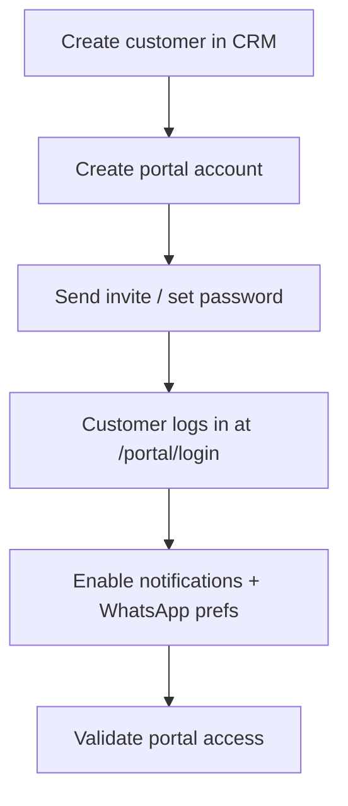

# Customer Onboarding Runbook

**Sprint:** 9E  
**Scope:** Documentation only — no portal architecture changes  
**Audience:** Agency sales / operations

---

## Overview

Customer portal access is **provisioned per customer** after a CRM customer record exists. Provisioning is script-assisted today; daily operations use CRM UI + Supabase Auth invite patterns.



---

## Customer go-live checklist

| # | Step | Done |
|---|------|:----:|
| 1 | Customer record exists with correct email/mobile | ☐ |
| 2 | Portal account linked to `customer_id` | ☐ |
| 3 | Auth user `user_metadata.user_type = customer` | ☐ |
| 4 | Invite email or password delivered securely | ☐ |
| 5 | Customer signed in at `/portal/login` | ☐ |
| 6 | Sees quotations/bookings for **their** customer only | ☐ |
| 7 | `customer_communication_preferences` — WhatsApp opt-in if used | ☐ |
| 8 | Test notification visible in `/portal/notifications` | ☐ |

---

## 1. Create customer

**CRM UI:** Customers → Create — capture legal name, email, mobile, preferred language.

**Requirements for portal:**

- Valid **email** (used as portal login)
- **Mobile** if WhatsApp transactional messages expected

---

## 2. Create portal account

**Engineering script (pilot / gate):**

```bash
PORTAL_TEST_EMAIL=customer@agency-domain.com \
PORTAL_CUSTOMER_ID=<uuid-from-customers-table> \
GATE_TEST_PASSWORD='TemporarySecurePassword1!' \
node scripts/provision-portal-test-account.mjs
```

**Production process:**

1. Create Supabase Auth user (Dashboard or Admin API) with email = customer email.
2. Call RPC `link_customer_portal_account` with `tenant_id`, `customer_id`, `auth_user_id`, email.
3. Store **no** staff `tenant_users` row for portal users.

Script reference: `scripts/provision-portal-test-account.mjs`.

---

## 3. Send invite

| Method | When |
|--------|------|
| Supabase invite email | New auth user; requires Auth SMTP |
| Manual password (phone) | Walk-in customer; use strong temp password + force reset |
| Agency sends link | `https://YOUR_APP/portal/login` after account exists |

**Security:** Never send `SUPABASE_SERVICE_ROLE_KEY` or staff credentials.

---

## 4. Reset password

1. Customer uses **Forgot password** on `/portal/login`, **or**
2. Agency triggers Supabase Auth reset email (Dashboard → Users → Send reset).

Supabase **Site URL** must match production (`NEXT_PUBLIC_SITE_URL`).

---

## 5. Enable notifications

| Item | Action |
|------|--------|
| In-app | Automatic when domain events fire (quotation sent, payment, booking) |
| Email | Customer email on record + Resend configured on Vercel |
| Portal UI | `/portal/notifications` — unread count API |

Ensure **cron worker** runs so `dispatch.notification` jobs complete within minutes.

---

## 6. Enable WhatsApp preferences

| Step | Action |
|------|--------|
| 1 | Tenant WhatsApp enabled (`tenant_whatsapp_settings`) |
| 2 | Customer `mobile` E.164 or local format accepted by adapter |
| 3 | Upsert `customer_communication_preferences`: `whatsapp_opt_in_at` set, `whatsapp_opt_out_at` null |
| 4 | Approved template for event e.g. `quotation.sent` |

Without opt-in, WhatsApp jobs complete as skipped/failed per policy.

---

## 7. Validate portal access

**Automated (engineering):**

```bash
PORTAL_TEST_EMAIL=customer@example.com \
GATE_BASE_URL=https://your-pilot.vercel.app \
node scripts/run-portal-gate-http.mjs
```

**Manual (operations):**

| Check | Expected |
|-------|----------|
| Login | Success at `/portal/login` |
| Dashboard | Shows customer name, no other tenants’ data |
| Quotations | Only own quotations; foreign UUID → 404 |
| Accept quotation | Status → `accepted` |
| Checkout | If payments enabled, deposit flow loads |

---

## Troubleshooting

| Symptom | Likely cause | Fix |
|---------|--------------|-----|
| 401 on portal API | Wrong password or no portal link | Re-run link RPC |
| Empty quotations | None sent to this customer | Send quotation from CRM |
| Notifications empty | Worker not running | Fix cron + `CRON_SECRET` |
| WhatsApp not received | Mock mode / no opt-in / template | See WhatsApp runbook in 9B report |

---

## Related

- [Tenant-Onboarding-Runbook.md](./Tenant-Onboarding-Runbook.md)
- [Customer-Portal-Foundation-Report.md](../03-Architecture/Customer-Portal-Foundation-Report.md)
- `scripts/provision-portal-test-account.mjs`
