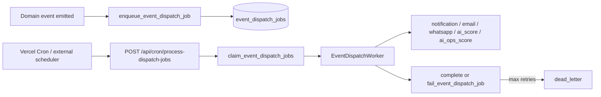

# Production Worker Runbook

**Sprint:** 8D / 9E  
**Component:** `event_dispatch_jobs` queue + `EventDispatchWorker` + `POST /api/cron/process-dispatch-jobs`  
**Audience:** Pilot operations, DevOps

---

## Architecture summary



| Job type | Handler |
|----------|---------|
| `dispatch.notification` | In-app + portal notifications |
| `dispatch.email` | Resend/SMTP via `EmailDispatcher` |
| `dispatch.whatsapp` | Meta Cloud (or mock) |
| `dispatch.ai_score` | Sales AI snapshots |
| `dispatch.ai_ops_score` | Operations AI snapshots |

---

## Expected SLA (pilot)

| Metric | Target | Warning | Critical |
|--------|--------|---------|----------|
| Pending queue depth | &lt; 20 | 50+ | 200+ |
| Oldest pending job age | &lt; 5 min | 5–30 min | &gt; 30 min |
| Dead-letter count | 0 | any | growing daily |
| Cron success rate | 100% / 5 min | missed &gt; 2 intervals | missed &gt; 6 intervals |
| P95 job duration | &lt; 30s | 30–60s | &gt; 60s |

---

## Health checks

### Automated

```bash
node scripts/verify-worker-health.mjs
npm run gate:sprint8d:worker
```

### Manual (Supabase SQL)

```sql
SELECT status, COUNT(*) FROM event_dispatch_jobs GROUP BY status;
SELECT id, job_type, retry_count, last_error, created_at
FROM event_dispatch_jobs
WHERE status IN ('failed', 'dead_letter')
ORDER BY updated_at DESC
LIMIT 20;
```

### UI

**CRM → Operations** (`/crm/operations`) — pending/failed/dead-letter counts, email/WhatsApp 24h metrics.

---

## Cron configuration (Vercel)

1. Set `CRON_SECRET` on Vercel Production.
2. The cron schedule is codified in `vercel.json` at the repo root:

   ```json
   { "crons": [{ "path": "/api/cron/process-dispatch-jobs", "schedule": "*/2 * * * *" }] }
   ```

   Vercel Cron invokes the path with **GET** and automatically sends
   `Authorization: Bearer <CRON_SECRET>` when the `CRON_SECRET` env var is set.
   The route accepts both GET (Vercel Cron, default batch 20) and POST
   (manual/external schedulers, custom `batchSize`).
   Note: `*/2 * * * *` requires a Vercel plan with sub-daily crons (Pro);
   on Hobby, crons are limited to once per day — use an external scheduler
   (POST + `Authorization: Bearer <CRON_SECRET>`) instead.

3. After deploy, confirm **200** responses in Vercel function logs.

**Unauthorized test** must return **401** (no secret).

---

## Retry procedures

1. Jobs in `failed` with `retry_count < max_retries` are picked up on next cron run when `next_run_at` elapses.
2. To force immediate retry, set `next_run_at = now()` and `status = 'pending'` for the job id (service role, single tenant).
3. Re-run worker: `curl -X POST https://YOUR_APP/api/cron/process-dispatch-jobs -H "Authorization: Bearer $CRON_SECRET" -H "Content-Type: application/json" -d '{"batchSize":25}'`

---

## Dead-letter procedures

When `status = dead_letter`:

1. Read `last_error` on the job row and linked `domain_events` payload.
2. Fix root cause (template missing, invalid phone, Resend domain, Paymob, etc.).
3. **Replay:** insert a new job with a new idempotency key or re-emit the domain event (preferred for idempotent handlers).
4. Do **not** delete domain events; audit trail is required.

| Failure pattern | Typical fix |
|-----------------|-------------|
| WhatsApp template not approved | Approve template in Meta; sync `whatsapp_templates` |
| Email skipped | Set `RESEND_API_KEY` / verified sender |
| Unknown job_type | Deploy mismatch — ensure app and DB migrations aligned |

---

## Failure recovery playbook

| Scenario | Steps |
|----------|-------|
| Queue backlog | Increase cron frequency; run manual batch with `batchSize: 50`; check Anthropic/Resend rate limits |
| Cron 401 | Rotate `CRON_SECRET` on Vercel + cron config |
| Cron 500 | Check Vercel logs; verify `SUPABASE_SERVICE_ROLE_KEY` on server |
| Stuck `processing` | Jobs with old `locked_at` — engineering resets lock via `fail_event_dispatch_job` or DB maintenance |
| Notifications delayed | Expected async; SLA is minutes, not seconds |

---

## Queue monitoring

| Source | What to watch |
|--------|----------------|
| `/crm/operations` | `jobs_pending`, `jobs_failed`, `jobs_dead_letter` |
| `scripts/worker-health-results.json` | Latest automated run |
| Supabase logs | RPC errors on `claim_event_dispatch_jobs` |
| Vercel | Cron invocation count and 5xx rate |

---

## Verification script reference

`scripts/verify-worker-health.mjs` reports:

- Pending / processing / failed / dead-letter counts
- Oldest pending age
- P95 duration sample (last 20 completed)
- Cron endpoint smoke test
- Unauthenticated rejection

---

## Related

- [Operations-Monitoring-Runbook.md](./Operations-Monitoring-Runbook.md)
- [Sprint-8D-Async-Communications-Report.md](../03-Architecture/Sprint-8D-Async-Communications-Report.md)
