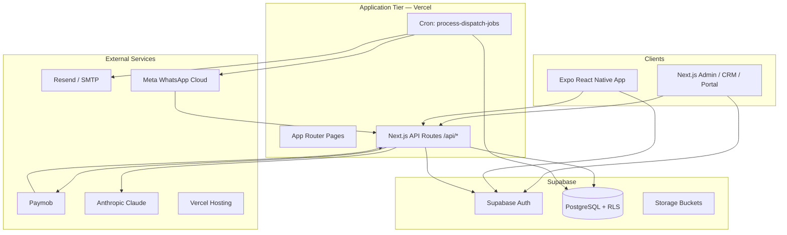

# TravelOS System Overview

**Audience:** Pilot operators, solution architects, onboarding engineers  
**Version:** Pilot package (Sprint 9E baseline)  
**Last updated:** 2026-06-04

---

## Purpose

TravelOS is a multi-tenant travel agency operating system. A single platform instance hosts many agencies (tenants). Each tenant runs sales CRM, revenue operations (bookings, packages, payments), a customer self-service portal, asynchronous communications, gateway payments, WhatsApp notifications, and AI-assisted sales and operations workflows.

---

## System Architecture

### Architectural layers

| Layer | Technology | Responsibility |
|-------|------------|----------------|
| Presentation | Next.js 15 App Router, Refine 4, shadcn/ui, Tailwind | Staff CRM, settings, AI consoles, portal UI |
| Mobile | Expo, React Navigation, TanStack Query | Field sales CRM subset |
| Application | API route handlers, Zod validation, service modules | Business logic, RBAC gates, orchestration |
| Data | Supabase PostgreSQL, RLS, triggers, RPC | Persistence, tenant isolation, audit |
| Async | `domain_events`, `event_dispatch_jobs`, `EventDispatchWorker` | Email, in-app notifications, WhatsApp, AI scoring |
| Integrations | Paymob, Meta Cloud API, Resend | Payments, messaging, transactional email |

### Multi-tenancy

1. Every business row carries `tenant_id`.
2. Staff JWT receives `app_metadata.tenant_id` and `role` via `custom_access_token_hook` (migration `009`, enabled in Supabase Dashboard).
3. RLS policies enforce `tenant_id = current_tenant_id()` with super-admin bypass.
4. Portal users are scoped by `customer_id` and `user_type: customer`, not staff roles.

---

## Frontend (Web)

| Area | Route prefix | Framework |
|------|--------------|-----------|
| Marketing / landing | `/home` | Next.js static/marketing |
| Staff authentication | `/login`, `/onboarding`, `/reset-password` | Supabase SSR cookies |
| Refine admin shell | `/dashboard`, customers, packages, bookings, payments | Refine resources + data provider |
| CRM | `/crm/*` | Leads, opportunities, activities, quotations, Customer 360, operations |
| Customer portal | `/portal/*` | Separate layout; no Refine shell |
| AI consoles | `/ai/*` | Knowledge, booking, support, sales agents |
| Settings | `/settings/*` | Tenant, users, knowledge, payment/WhatsApp config |

**Key behaviors:**

- UI access control hides actions the user’s role cannot perform (Refine `accessControlProvider`).
- API calls use same-origin `fetch` with session cookies.
- Portal routes bypass staff Refine auth; middleware enforces staff vs portal session separation.

---

## Backend

There is no separate microservice backend. **Next.js API routes** under `src/app/api/` implement the server tier.

| Concern | Implementation |
|---------|----------------|
| Auth resolution | `requireActiveApiAccess()` (staff), `requirePortalApiAccess()` (customers) |
| Dual transport | Cookie (web) or `Authorization: Bearer` (mobile) via `createApiClient()` |
| Elevated operations | `createAdminClient()` with service role for webhooks, portal writes, worker |
| Validation | Zod schemas per route |
| Events | `emitAndDispatch()` → `event_dispatch_jobs` queue |

**Scheduled worker:** `POST /api/cron/process-dispatch-jobs` (protected by `CRON_SECRET`) processes queued jobs every 1–5 minutes on Vercel Cron.

---

## Mobile

| Item | Detail |
|------|--------|
| Location | `apps/mobile/` (Expo) |
| Auth | Supabase `signInWithPassword`; tokens in Expo SecureStore |
| API | Same `/api/*` endpoints with Bearer JWT |
| Scope | CRM core: dashboard, leads, pipeline (opportunities), activities, quotations, bookings, Customer 360, profile |
| Out of scope | Portal app, WhatsApp send from mobile, payment checkout, tenant admin |

See [08-mobile-module.md](./08-mobile-module.md).

---

## Integrations

| Integration | Purpose | Configuration |
|-------------|---------|---------------|
| **Supabase** | Auth, DB, RLS, storage | `NEXT_PUBLIC_SUPABASE_*`, `SUPABASE_SERVICE_ROLE_KEY` |
| **Resend / SMTP** | Transactional email (quotations, portal, worker) | `RESEND_*` or `SMTP_*` |
| **Supabase Auth SMTP** | Invite and password-reset emails | Supabase Dashboard (not Vercel env) |
| **Paymob** | Card checkout, webhooks | `PAYMOB_*`; mock flags for dev |
| **Meta WhatsApp Cloud** | Template outbound messages, delivery status webhooks | `WHATSAPP_META_*` |
| **Anthropic** | AI agents (knowledge, booking, support, sales, operations) | `ANTHROPIC_API_KEY` (server-only) |
| **OpenAI** | Optional embeddings for RAG | `OPENAI_API_KEY` (optional) |
| **Vercel** | Hosting, serverless API, cron | Project env + cron config |

---

## Authentication

### Staff (CRM / admin)

1. User signs in via Supabase Auth (email/password).
2. Custom access token hook injects `tenant_id`, `role`, `account_status` into JWT `app_metadata`.
3. `public.users` + `user_roles` are authoritative; JWT claims are used for UX only.
4. Inactive or pending accounts receive `403` from API middleware.

### Customer portal

1. Separate Supabase auth user linked via `customer_portal_accounts` (1:1 with `customers`).
2. JWT includes `user_type: customer`, `customer_id`, `tenant_id`.
3. Staff accounts are rejected at portal login and portal API.
4. Portal users are not in `public.users` and have no CRM role.

### Service / system

| Caller | Auth mechanism |
|--------|----------------|
| Cron worker | `Authorization: Bearer CRON_SECRET` |
| Paymob webhook | HMAC signature (`PAYMOB_HMAC_SECRET`) |
| WhatsApp webhook | Meta verify token (GET), HMAC (POST) |

---

## RBAC (summary)

Four staff roles: `super_admin`, `tenant_admin`, `sales_agent`, `finance_officer`. Portal customers are outside RBAC.

Enforcement stack:

1. **PostgreSQL RLS** — tenant and row-level CRM rules (`crm_can_read_row`, etc.).
2. **API middleware** — permission string checks per route.
3. **UI** — Refine access control and conditional rendering.

CRM uses `crm.*` permissions; legacy MVP uses `customers.*`, `bookings.*`, etc. AI modules use `ai.*` and `ai.sales.*` / `ai.operations.*`.

Full matrices: [02-user-roles.md](./02-user-roles.md), [12-rbac-matrix.md](./12-rbac-matrix.md).

---

## Data and migrations

Schema is delivered via numbered SQL migrations (`database/migrations/001` through `064`). Pilot databases must apply the full chain before go-live.

Core domains: tenants/users/RBAC, geography, customers/packages/bookings, CRM (025–038), portal (039–042), domain events and worker (041, 045), payments (047–050), WhatsApp (051–055), AI sales (056–059), AI operations (060–064).

---

## Related documentation

| Document | Topic |
|----------|-------|
| [03-crm-module.md](./03-crm-module.md) | CRM entities and workflows |
| [04-portal-module.md](./04-portal-module.md) | Customer portal |
| [05-payments-module.md](./05-payments-module.md) | Paymob checkout |
| [13-business-workflows.md](./13-business-workflows.md) | End-to-end commercial path |
| [14-environment-config.md](./14-environment-config.md) | Environment variables |
| [16-production-runbooks.md](./16-production-runbooks.md) | Operations procedures |

Internal references: `docs/03-Architecture/SolutionArchitecture.md`, `docs/03-Architecture/RBAC.md`, `docs/05-Development/Pilot-Execution-Runbook.md`.
