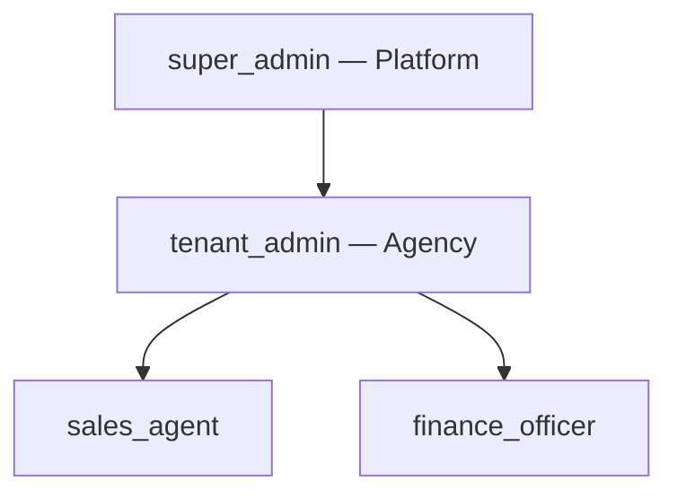

# TravelOS User Roles

**Audience:** Pilot administrators, security reviewers  
**Last updated:** 2026-06-04

---

## Role hierarchy



| Role | Scope | Typical user |
|------|-------|--------------|
| **super_admin** | All tenants | TravelOS platform operator |
| **tenant_admin** | One tenant | Agency owner / office manager |
| **sales_agent** | One tenant | Travel consultant, booking agent |
| **finance_officer** | One tenant | Accountant, finance manager |

**Customer portal users** are not staff roles. They authenticate as `user_type: customer` with no entry in `user_roles`.

---

## Assignment rules

| Rule | Description |
|------|-------------|
| BR-009 | Each staff user belongs to exactly one tenant (except super_admin) |
| BR-010 | Each staff user has exactly one role per tenant |
| RA-001 | Only tenant_admin (or super_admin) assigns roles |
| RA-002 | Tenant must retain at least one tenant_admin |
| RA-003 | super_admin assigned at platform level only |
| RA-004 | Deactivated users keep role rows but cannot authenticate |

---

## super_admin

### Permissions (effective)

- All permissions across all modules (`*` or full cross-join in seed data).
- Bypass RLS via `is_super_admin()` where policies allow.

### Allowed actions

- Create, read, update, delete tenants.
- Cross-tenant audit and platform configuration.
- Full CRM, revenue, payments, WhatsApp templates, AI configuration.
- User management on any tenant.

### Restricted actions

- None at platform level (operational policy may limit production use).
- Does not use customer portal as a customer (separate identity model).

---

## tenant_admin

### Permissions (effective)

- Full tenant-scoped MVP permissions (`customers.*`, `bookings.*`, `payments.*`, `settings.*`, etc.).
- Full CRM (`crm.*` including `*_all` variants, quotations approve/send, WhatsApp template management).
- AI: all `ai.*`, `ai.sales.*`, `ai.operations.*`, `knowledge.manage`.
- Operations dashboard and insights.

### Allowed actions

- Invite and manage users; assign roles.
- Tenant settings (timezone, currency, branding).
- Approve quotations (standard approval mode).
- Enable/configure tenant payment and WhatsApp settings.
- View audit logs and financial dashboard KPIs.
- Dismiss/complete AI recommendations; configure AI rule weights.

### Restricted actions

- Cannot access other tenants’ data (except via super_admin).
- Cannot impersonate portal customers without separate portal account.
- AI agents cannot autonomously confirm bookings or create payments.

---

## sales_agent

### Permissions (effective)

**MVP / revenue:** Create/read/update customers, packages, bookings; confirm/cancel/complete bookings; read payments and dashboard (non-financial).

**CRM (own records):** `crm.leads.read/write`, `crm.opportunities.read/write`, `crm.activities.read/write`, `crm.dashboard.read`, `crm.quotations.read/write/send/accept/convert`, `crm.whatsapp.messages.send/read`.

**AI:** `ai.knowledge.use`, `ai.booking.use`, `ai.support.use`, `ai.read`, `ai.sales.use`, `ai.sales.read`, `ai.operations.use`, `ai.operations.read`.

### Allowed actions

- Manage own leads, opportunities, activities, quotations end-to-end (except approval in standard mode).
- Send quotations to customers; accept on behalf of customer when permitted; convert to booking.
- Log WhatsApp activity on leads; send approved template messages from CRM.
- Create draft bookings via Booking Agent; staff must confirm in UI.
- Use Sales and Operations AI chat (explanation only).
- Create booking from opportunity when stage is `verbal_approval` or `closed_won` (or always if admin).

### Restricted actions

- No `users.*`, `settings.*`, `audit_logs.read`.
- No `customers.delete`, `packages.delete`, `bookings.delete`.
- No `payments.create` or `payments.update`.
- No `crm.*.read_all` / `write_all` (cannot manage other agents’ CRM rows via permission; RLS may still hide).
- No `crm.quotations.approve` (tenant_admin only in standard mode).
- No `crm.whatsapp.templates.manage`.
- No `ai.analytics.read`, `ai.logs.read`, `knowledge.manage`, `ai.sales.insights.read`, `ai.operations.insights.read`.
- No portal administration.

---

## finance_officer

### Permissions (effective)

**MVP:** Full payments CRUD and export; read bookings, customers, packages; `dashboard.read` and `dashboard.financial`.

**CRM:** Read-all only — `crm.leads.read_all`, `crm.opportunities.read_all`, `crm.activities.read_all`, `crm.quotations.read_all`, `crm.dashboard.read`. No CRM writes.

**AI:** No booking agent; no sales/operations AI permissions in seed (read-only CRM observer).

### Allowed actions

- Record and reconcile payments (manual ledger).
- View all tenant bookings and quotation statuses for finance review.
- Export payment and booking data.
- View CRM dashboard with financial KPIs when `dashboard.financial` applies.

### Restricted actions

- No CRM create/update (leads, opportunities, activities, quotations).
- No quotation send/accept/convert.
- No booking lifecycle changes (confirm/cancel/complete).
- No customer or package mutations.
- No user management or settings.
- No WhatsApp send or template management.
- No AI agent usage (booking/sales/operations agents).

---

## Customer portal user (non-RBAC)

| Attribute | Value |
|-----------|-------|
| Identity | `customer_portal_accounts` + Supabase Auth |
| Scope | Own `customer_id` within tenant |
| Access | `/portal/*`, `/api/portal/*` only |

### Allowed actions

- View dashboard, quotations (post-send statuses), bookings, documents.
- Accept/reject quotations; download PDF.
- Checkout and pay (when tenant payments enabled).
- Manage communication preferences (WhatsApp opt-in, language, quiet hours).
- Read/mark notifications.

### Restricted actions

- No CRM or staff routes.
- No access to draft/internal quotation states.
- No staff RBAC permissions.
- Cannot modify booking operational data directly.

---

## Permission naming convention

```
{module}.{action}
```

Examples: `crm.leads.write`, `bookings.confirm`, `ai.sales.read`, `crm.whatsapp.messages.send`.

---

## Enforcement points

| Layer | Mechanism |
|-------|-----------|
| Database | RLS + helper functions (`has_crm_permission`, `crm_can_read_row`) |
| API | `requireActiveApiAccess({ permission })`, CRM helpers in `crm-rbac.ts` |
| UI | Refine `accessControlProvider`, route guards |

---

## Related documents

- [12-rbac-matrix.md](./12-rbac-matrix.md) — complete permission matrix
- [docs/03-Architecture/RBAC.md](../03-Architecture/RBAC.md) — security model
- [docs/02-Business/Roles.md](../02-Business/Roles.md) — business role definitions
