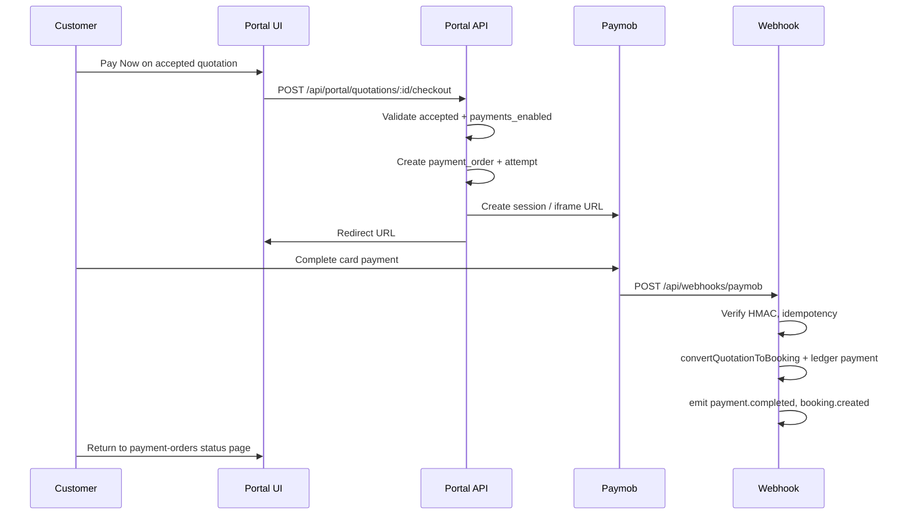

# TravelOS Payments Module

**Scope:** Paymob gateway, portal checkout, webhooks, booking automation  
**Migrations:** `047`–`050`  
**Last updated:** 2026-06-04

---

## Purpose

Enable customers to pay quotation deposits (and configured order types) through Paymob while preserving the existing manual `payments` ledger as the financial source of truth. Successful capture can automatically convert an accepted quotation to a draft booking and record a gateway-linked payment row.

---

## Paymob integration

### Components

| Component | Location |
|-----------|----------|
| Adapter | `src/lib/payments/paymob-adapter.ts` |
| Provider registry | `src/lib/payments/provider-registry.ts` |
| Webhook handler | `POST /api/webhooks/paymob` |
| Tenant settings | `tenant_payment_settings` table |

### Configuration

| Variable | Purpose |
|----------|---------|
| `PAYMOB_API_KEY` | API authentication |
| `PAYMOB_INTEGRATION_ID` | Card integration |
| `PAYMOB_IFRAME_ID` | Hosted iframe (optional) |
| `PAYMOB_HMAC_SECRET` | Webhook HMAC-SHA512 verification |

### Mock / development

When `PAYMOB_MOCK_MODE=true`, API key unset, or `PAYMOB_MOCK_WEBHOOKS=true`:

- Checkout simulates without live Paymob.
- Portal may show mock pay button (`NEXT_PUBLIC_PAYMOB_MOCK_MODE`).
- **Forbidden on production** (see [14-environment-config.md](./14-environment-config.md)).

### Stripe

`StripeAdapter` exists as stub only; `createCheckoutSession()` throws. Not production-ready.

---

## Checkout flow

### Preconditions

| Check | Failure |
|-------|---------|
| Quotation `accepted` | 422 business error |
| `tenant_payment_settings.payments_enabled = true` | 403 / disabled message |
| Customer owns quotation | 404 |
| Deposit amount | Server-calculated; client cannot override |

### APIs

| Method | Path | Role |
|--------|------|------|
| POST | `/api/portal/quotations/:id/checkout` | Create order + Paymob session |
| GET | `/api/portal/payment-orders/:id` | Status, attempts, ledger slice |
| GET | `/api/quotations/:id/gateway-payments` | Staff CRM view |
| GET | `/api/bookings/:id/gateway-payments` | Staff booking payments |
| GET | `/api/customers/:id/gateway-payments` | Customer 360 |

---

## Payment states

### `payment_orders.status`

| Status | Meaning |
|--------|---------|
| `pending` | Created; awaiting customer action |
| `processing` | Redirected / in flight |
| `completed` | Successfully captured |
| `failed` | Terminal failure |
| `cancelled` | Cancelled before capture |
| `expired` | Checkout window elapsed |

### `payment_attempts.status`

| Status | Meaning |
|--------|---------|
| `created` | Attempt row created |
| `redirected` | Customer sent to Paymob |
| `authorized` | Auth hold (if applicable) |
| `captured` | Funds captured |
| `failed` | Attempt failed |
| `cancelled` | Attempt cancelled |

### Ledger (`payments` table)

| Field | Value on gateway success |
|-------|--------------------------|
| `source` | `gateway` |
| `method` | `card` |
| `payment_order_id` | FK to order |
| `provider` | `paymob` |

Booking `payment_status` updated via existing `update_payment_status()` trigger (unpaid / partial / paid).

### Order types (`payment_order_type`)

- `quotation_deposit` (primary portal flow)
- `quotation_full`
- `booking_balance`
- `invoice_pay`

Pilot default automation: `booking_automation_mode = auto_on_deposit`, `confirm_on_deposit = false` → booking created as **draft** on deposit capture.

---

## Webhooks

### Endpoint

`POST /api/webhooks/paymob` (no JWT; HMAC only)

### Security controls

| Control | Behavior |
|---------|----------|
| HMAC | Paymob signature verified with `PAYMOB_HMAC_SECRET` |
| Replay | Unique `(provider, provider_event_id)` on `payment_provider_events` |
| Amount tampering | Compare webhook amount to `payment_orders.amount` |
| Completed short-circuit | Duplicate success webhooks ignored safely |
| Audit | Immutable `payment_provider_events` rows |

### Processing steps (success)

1. Validate signature and parse event.
2. Update `payment_attempt` and `payment_order` to completed.
3. Call `convertQuotationToBooking()` (system actor).
4. Insert `payments` ledger row (`source=gateway`).
5. Emit `payment.completed`, `booking.created` → async notifications/email/WhatsApp/AI jobs.

### Failure handling

- Failed webhooks set order/attempt to `failed`.
- `payment.failed` domain event may enqueue ops/sales AI scoring.
- Manual reconciliation via Paymob dashboard + `payment_orders` / `payment_provider_events` in Supabase.

---

## Booking creation

| Mode | Behavior |
|------|----------|
| `auto_on_deposit` | Booking created on successful deposit webhook (pilot default) |
| `auto_on_full` | Requires full amount match |
| `manual_after_payment` | Ledger only; staff converts manually |

Converted booking:

- Links `quotation_id`, `customer_id`.
- Status `draft` when `confirm_on_deposit=false`.
- Quotation status → `converted_to_booking`.

Staff may confirm booking through standard `bookings.confirm` workflow.

---

## Tenant enablement

Payments are **disabled by default** per tenant.

1. Apply migrations `047`–`050`.
2. Set `tenant_payment_settings.payments_enabled = true` for pilot tenant.
3. Configure live Paymob credentials; disable mock flags.
4. Set deposit policy in tenant payment settings JSON (`policy_snapshot` on orders).

---

## CRM visibility

Staff view gateway activity on:

- Quotation detail (gateway payments panel)
- Booking detail
- Customer 360 payments tab

Requires `payments.read` and quotation/booking read permissions.

---

## Testing

| Command | Purpose |
|---------|---------|
| `npm run test:payments` | Unit tests |
| `npm run gate:sprint9a:payments` | HTTP gate (checkout + webhook + ledger) |

---

## Related documents

- [13-business-workflows.md](./13-business-workflows.md)
- [09-operations-module.md](./09-operations-module.md)
- [docs/03-Architecture/Sprint-9A-Payments-Implementation-Report.md](../03-Architecture/Sprint-9A-Payments-Implementation-Report.md)
