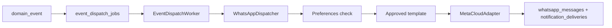

# TravelOS WhatsApp Module

**Scope:** Meta Cloud API template messaging (Sprint 9B)  
**Migrations:** `051`–`055`  
**Last updated:** 2026-06-04

---

## Purpose

Send **template-only** outbound WhatsApp messages triggered by domain events or manual CRM actions. Log delivery outcomes, respect customer opt-in and quiet hours, and surface history in CRM and operations dashboards. **No inbound chat** or free-form customer messaging in pilot scope.

---

## Templates

### Data model

Table: `whatsapp_templates`

| Field | Purpose |
|-------|---------|
| `internal_name` | Stable key per tenant |
| `language` | `en` or `ar` |
| `meta_status` | Meta approval state — **only `approved` sends** |
| `event_type` | Maps to domain event (e.g. `quotation.sent`) |
| `body_template` | Variable placeholders for Meta template |

Tenant settings: `tenant_whatsapp_settings` (`whatsapp_enabled` flag).

### User workflow (admin)

1. Tenant admin opens `/crm/whatsapp/templates`.
2. Creates template record; registers matching template in Meta Business Manager.
3. Marks `meta_status = approved` when Meta approves.
4. Maps `event_type` for automated dispatcher matching.

### Business rules

| Rule | Description |
|------|-------------|
| Approved only | Dispatcher and CRM send reject non-approved templates |
| Per-tenant registry | Templates isolated by `tenant_id` |
| Bilingual | Separate rows per language |
| Automation map | `event_type` must match emitted domain event string |

### Permissions

| Permission | Roles |
|------------|-------|
| `crm.whatsapp.templates.manage` | super_admin, tenant_admin |
| `crm.whatsapp.messages.send` | super_admin, tenant_admin, sales_agent |
| `crm.whatsapp.messages.read` | super_admin, tenant_admin, sales_agent |

---

## Sending process

### Automated path

**Triggering events (examples):**

- `quotation.sent` (from `POST /api/quotations/:id/send`)
- `quotation.accepted`
- `payment.completed`
- `booking.created`

Job type: `dispatch.whatsapp` on `event_dispatch_jobs`.

### Manual CRM path

1. Sales opens quotation/customer context → **WhatsApp Send** panel.
2. Selects approved template and variables.
3. `POST /api/crm/whatsapp/send`.
4. Same adapter + logging as dispatcher.

### Preconditions

| Check | Result if failed |
|-------|------------------|
| `whatsapp_enabled` for tenant | Skip / error |
| Customer `whatsapp_opt_in_at` set, no opt-out | Skip (logged) |
| Quiet hours | Skip until outside window |
| Valid E.164 phone on customer | Fail with validation error |
| Template approved | 422 / skip |

---

## Logging

### Tables

| Table | Content |
|-------|---------|
| `whatsapp_messages` | Outbound message audit: template, status, provider_message_id, links to quotation/booking/customer |
| `notification_deliveries` | Channel `whatsapp`, status, `last_error` |
| `payment_provider_events` | N/A (payments separate) |

### Status lifecycle (provider)

Meta webhook normalizes: `sent` → `delivered` → `read` or `failed`.

Updates match rows by `provider_message_id` (tenant-scoped). Status downgrades ignored for idempotency.

### CRM visibility

- `GET /api/crm/whatsapp/messages?customer_id=`
- Optional `quotation_id`, `booking_id` filters
- Operations dashboard: WhatsApp 24h sent/delivered/read/failed metrics

---

## Failure handling

| Failure type | Handling |
|--------------|----------|
| Template not approved | Job fails; may reach `dead_letter` after retries |
| Opt-out / quiet hours | Benign skip (not an error) |
| Meta API error | `notification_deliveries.last_error` populated; message row `failed` |
| Invalid phone | Validation at send time |
| Worker retry | `failed` jobs retry until `max_retries`; then `dead_letter` |
| Webhook signature invalid | `401` on `POST /api/webhooks/whatsapp` |

### Recovery (operations)

1. Fix template approval or customer opt-in.
2. Inspect `event_dispatch_jobs.last_error` and `notification_deliveries`.
3. Replay by re-emitting domain event or manual CRM send (new idempotency).
4. See [09-operations-module.md](./09-operations-module.md) and Production Worker Runbook.

---

## Webhooks

| Method | Path | Purpose |
|--------|------|---------|
| GET | `/api/webhooks/whatsapp` | Meta verification (`hub.verify_token`) |
| POST | `/api/webhooks/whatsapp` | Delivery status updates only |

**Security:**

- GET: `WHATSAPP_WEBHOOK_VERIFY_TOKEN` must match (skipped in mock mode).
- POST: HMAC SHA-256 `X-Hub-Signature-256` with `WHATSAPP_META_APP_SECRET`.

**Out of scope:** Inbound customer message processing, conversational AI over WhatsApp.

---

## API summary

| Method | Path | Purpose |
|--------|------|---------|
| GET/POST | `/api/crm/whatsapp/templates` | List/create templates |
| PATCH/DELETE | `/api/crm/whatsapp/templates/:id` | Update/delete |
| POST | `/api/crm/whatsapp/send` | Manual template send |
| GET | `/api/crm/whatsapp/messages` | Message history |
| GET/POST | `/api/webhooks/whatsapp` | Meta webhook |

---

## Environment

See [14-environment-config.md](./14-environment-config.md) — `WHATSAPP_META_*`, `WHATSAPP_MOCK_MODE` (dev only).

---

## Related documents

- [04-portal-module.md](./04-portal-module.md) — preferences / opt-in
- [09-operations-module.md](./09-operations-module.md) — worker queue
- [docs/03-Architecture/Sprint-9B-WhatsApp-Implementation-Report.md](../03-Architecture/Sprint-9B-WhatsApp-Implementation-Report.md)
