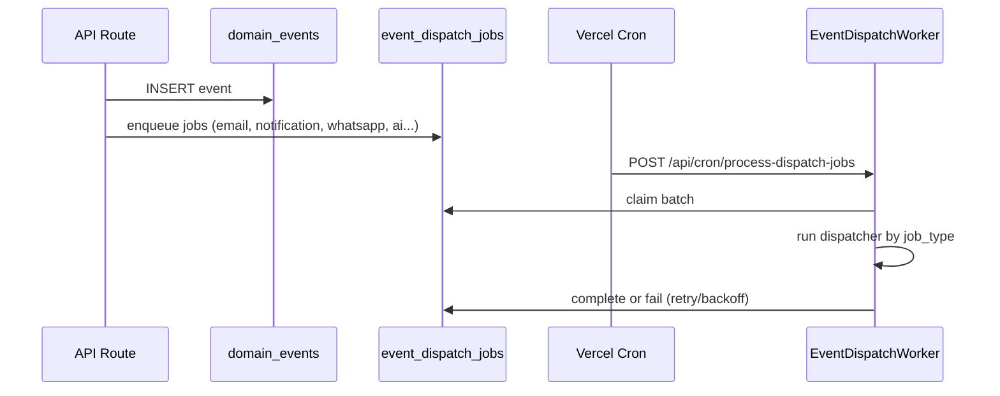

# TravelOS Operations Module

**Scope:** Async communications, event processing, operations monitoring (Sprint 8D, 9E)  
**Last updated:** 2026-06-04

---

## Purpose

Decouple side effects (email, notifications, WhatsApp, AI scoring) from synchronous API requests using a durable job queue. Provide operations staff visibility into queue health and channel delivery metrics at `/crm/operations`.

---

## Workers

### Event dispatch worker

| Item | Value |
|------|-------|
| Entry | `POST /api/cron/process-dispatch-jobs` |
| Implementation | `EventDispatchWorker` (`src/lib/events/event-dispatch-worker.ts`) |
| Auth | `Authorization: Bearer {CRON_SECRET}` or `x-cron-secret` |
| Scheduler | Vercel Cron (recommended every 2–5 minutes) |
| Batch size | Configurable JSON body `{ "batchSize": 25 }` |

### Job handlers

| `job_type` | Handler | Output |
|------------|---------|--------|
| `dispatch.notification` | `NotificationDispatcher` | In-app + portal notifications |
| `dispatch.email` | `EmailDispatcher` | Resend/SMTP via `email_delivery_logs` |
| `dispatch.whatsapp` | `WhatsAppDispatcher` | Meta template send |
| `dispatch.ai_score` | `SalesScoreDispatcher` | Sales snapshots + recommendations |
| `dispatch.ai_ops_score` | `OperationsScoreDispatcher` | Ops snapshots + recommendations |

### Claiming model

RPC `claim_event_dispatch_jobs` selects pending jobs with row locking, sets `processing` and `locked_at`. Completion via `complete_event_dispatch_job` or `fail_event_dispatch_job` with retry scheduling.

---

## Queues

### Tables

| Table | Role |
|-------|------|
| `domain_events` | Immutable business facts (audit trail) |
| `event_dispatch_jobs` | Async work queue |
| `notification_deliveries` | Per-channel delivery outcome |

### Job states

| Status | Meaning |
|--------|---------|
| `pending` | Awaiting worker |
| `processing` | Claimed by worker |
| `completed` | Success |
| `failed` | Error; may retry |
| `dead_letter` | Max retries exceeded |

### Enqueue path

API services call `emitAndDispatch()` → insert `domain_events` → `JobQueueService.enqueueForEvent()` creates jobs with idempotency keys.

**Authority:** Only server-side code emits events (not browser clients).

---

## Event processing

### Common domain events

| Event | Typical jobs |
|-------|--------------|
| `quotation.sent` | email, notification, whatsapp, ai_score |
| `quotation.accepted` | email, notification, whatsapp |
| `payment.completed` | email, notification, whatsapp, ai_score, ai_ops_score |
| `payment.failed` | ai_score, ai_ops_score |
| `booking.created` | notification, whatsapp, ai_ops_score |

### Idempotency

- Unique constraints on job idempotency keys prevent duplicate side effects.
- Webhook and provider event tables use provider event IDs for replay protection.

---

## Monitoring

### Operations dashboard UI

**Route:** `/crm/operations`  
**API:** `GET /api/crm/operations/metrics`

| Metric | Source |
|--------|--------|
| `jobs_pending`, `jobs_failed`, `jobs_dead_letter` | `event_dispatch_jobs` |
| Email sent/failed 24h | `email_delivery_logs` |
| Notifications sent/failed 24h | `notification_deliveries` |
| WhatsApp sent/delivered/read/failed 24h | `whatsapp_messages` |
| Domain events / hour | `domain_events` |

### Health scripts

| Script | Purpose |
|--------|---------|
| `node scripts/verify-worker-health.mjs` | Queue depth, cron smoke, P95 duration |
| `npm run gate:sprint8d:worker` | Automated gate |

### SLA targets (pilot)

| Metric | Target | Warning | Critical |
|--------|--------|---------|----------|
| Pending queue depth | < 20 | 50+ | 200+ |
| Oldest pending age | < 5 min | 5–30 min | > 30 min |
| Dead-letter count | 0 | any | growing |
| Cron success | every interval | 2 missed | 6 missed |

---

## Scheduled automations

Migration `046_scheduled_automations_framework.sql` provides framework for future cron-defined automations. Pilot critical path uses **event-driven** dispatch only.

---

## Recovery procedures (summary)

| Scenario | Action |
|----------|--------|
| Queue backlog | Increase cron frequency; manual POST with `batchSize: 50` |
| Cron 401 | Align `CRON_SECRET` on Vercel + cron job |
| Dead letter | Read `last_error`; fix template/SMTP/phone; replay event |
| Stuck `processing` | Engineering resets stale lock via fail RPC |
| Email skipped | Verify `RESEND_API_KEY` and verified sender |

Full detail: [16-production-runbooks.md](./16-production-runbooks.md), `docs/05-Development/Production-Worker-Runbook.md`.

---

## Related documents

- [06-whatsapp-module.md](./06-whatsapp-module.md)
- [07-ai-module.md](./07-ai-module.md)
- [docs/03-Architecture/Sprint-8D-Async-Communications-Report.md](../03-Architecture/Sprint-8D-Async-Communications-Report.md)
