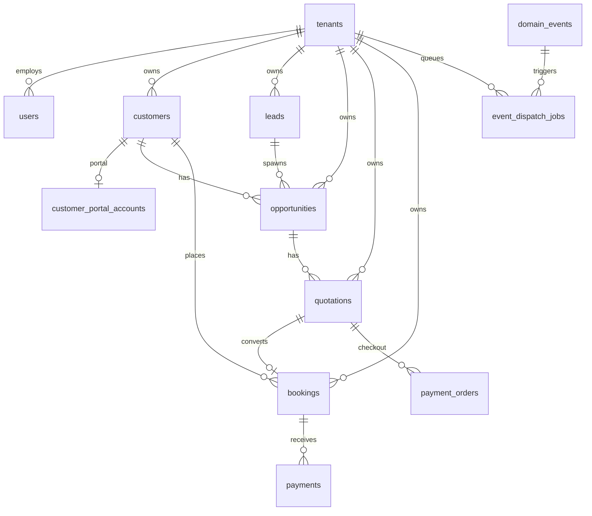

# TravelOS Database Schema

**Engine:** PostgreSQL 15 (Supabase)  
**Migrations:** `database/migrations/001`–`064`  
**Last updated:** 2026-06-04

---

## Design principles

| Principle | Implementation |
|-----------|----------------|
| Multi-tenancy | `tenant_id` on all business tables |
| Security | Row Level Security on tenant data |
| Audit | `audit_logs` triggers on key mutations |
| Soft delete | `deleted_at` on customers, packages, CRM entities |
| Reference data | Global tables without `tenant_id` (countries, roles) |

Helper functions: `current_tenant_id()`, `is_super_admin()`, `is_portal_user()`, `portal_customer_id()`, `has_crm_permission()`, `crm_can_read_row()`.

---

## Entity relationship (high level)

---

## Platform & RBAC

| Table | Business entity | Key relationships |
|-------|-----------------|-------------------|
| `tenants` | Travel agency org | Parent for all tenant data |
| `tenant_settings` | Branding, locale, JSON settings | 1:1 tenant |
| `users` | Staff profile | `tenant_id`, links to Supabase Auth uid |
| `roles` | Role catalog | System seed |
| `permissions` | Atomic grants | `module` + `action` |
| `role_permissions` | Role ↔ permission | M:N |
| `user_roles` | User ↔ role per tenant | M:N |
| `audit_logs` | Change history | Polymorphic `table_name`, `record_id` |

---

## Geography & catalog

| Table | Purpose |
|-------|---------|
| `countries`, `cities` | Reference geography |
| `destinations` | Tenant destinations |
| `packages` | Sellable packages |
| `package_days`, `package_day_activities` | Itinerary |
| `package_pricing`, `package_media` | Pricing tiers, images |

---

## Customers & revenue

| Table | Purpose |
|-------|---------|
| `customers` | Individual/corporate customers |
| `customer_contacts`, `customer_addresses` | Sub-entities |
| `travelers` | Passport holders |
| `bookings` | Reservations (`quotation_id` optional FK) |
| `booking_items`, `booking_travelers` | Line items, pax |
| `booking_status_history`, `booking_notes`, `booking_documents` | Ops data |
| `invoices` | Billing documents |
| `payments` | Ledger (`source`: manual \| gateway) |
| `payment_transactions` | Payment audit trail |

---

## CRM (Phase 7)

| Table | Purpose |
|-------|---------|
| `leads` | Top-of-funnel inquiries |
| `opportunities` | Pipeline deals |
| `opportunity_stage_history` | Stage transitions |
| `activities` | Tasks/interactions (lead/opp/customer FKs) |
| `quotations` | Proposals |
| `quotation_items` | Line-level pricing |
| `v_customer_timeline_events` | View — unified Customer 360 timeline |

**Enums:** `lead_status`, `lead_source`, `opportunity_stage`, `activity_type`, `quotation_status`, `quotation_item_type`, etc. (migration `025`).

---

## Customer portal

| Table | Purpose |
|-------|---------|
| `customer_portal_accounts` | 1:1 auth link to `customers` |
| Portal audit columns on `audit_logs` | `actor_type`, `customer_id`, `portal_account_id` |

RLS: portal SELECT on quotations (post-send), bookings, documents, customers (own row).

---

## Communications & async

| Table | Purpose |
|-------|---------|
| `domain_events` | Canonical event log |
| `event_dispatch_jobs` | Worker queue |
| `notification_deliveries` | Per-channel delivery |
| `notifications` | In-app notifications |
| `email_delivery_logs` | Email audit (migration `024`) |

**Job types enum:** includes `dispatch.notification`, `dispatch.email`, `dispatch.whatsapp`, `dispatch.ai_score`, `dispatch.ai_ops_score`.

---

## Payments gateway

| Table | Purpose |
|-------|---------|
| `payment_orders` | Checkout intent |
| `payment_attempts` | Provider session lifecycle |
| `payment_provider_events` | Webhook audit |
| `tenant_payment_settings` | Enable flag + policy JSON |

**Enums:** `payment_order_status`, `payment_attempt_status`, `payment_provider`, `booking_automation_mode`.

---

## WhatsApp

| Table | Purpose |
|-------|---------|
| `whatsapp_templates` | Template registry |
| `whatsapp_messages` | Outbound log |
| `tenant_whatsapp_settings` | Feature toggle |
| `customer_communication_preferences` | Opt-in, language, quiet hours |

---

## AI

| Table | Module |
|-------|--------|
| `ai_agents` | Per-tenant agent config |
| `ai_conversations`, `ai_messages` | Chat history (Phase 5) |
| `ai_sales_snapshots`, `ai_sales_score_history` | Sales scoring |
| `ai_sales_recommendations`, `ai_sales_recommendation_feedback` | Sales actions |
| `ai_sales_insight_cache` | Manager insights RPC cache |
| `ai_ops_snapshots`, `ai_ops_score_history` | Operations scoring |
| `ai_ops_recommendations` | Ops actions |
| `ai_ops_insight_cache` | Ops insights |

Writes to snapshot/recommendation tables: **service role / worker only** (REVOKE from `authenticated`).

---

## Support & knowledge

| Table | Purpose |
|-------|---------|
| `support_tickets` | Support cases |
| `knowledge_documents`, `knowledge_chunks` | RAG knowledge base |

---

## Key relationships

| From | To | Cardinality | Notes |
|------|-----|-------------|-------|
| Lead | Customer | N:1 | Set on convert |
| Lead | Opportunity | 1:N | Multiple deals per lead |
| Opportunity | Quotation | 1:N | One active accepted typical |
| Quotation | Booking | 1:1 typical | Via convert or payment webhook |
| Customer | Portal account | 1:1 | UNIQUE(customer_id) |
| Payment order | Quotation | N:1 | Deposit checkout |
| Payment | Payment order | N:1 | Gateway ledger link |
| Domain event | Dispatch jobs | 1:N | Idempotent enqueue |

---

## Business entity map

| Business concept | Primary table(s) |
|------------------|------------------|
| Agency (tenant) | `tenants`, `tenant_settings` |
| Staff user | `users`, `user_roles` |
| Customer | `customers` |
| Portal login | `customer_portal_accounts` |
| Sales lead | `leads` |
| Deal | `opportunities` |
| Task / interaction | `activities` |
| Proposal | `quotations`, `quotation_items` |
| Reservation | `bookings` |
| Payment (finance) | `payments` |
| Online checkout | `payment_orders`, `payment_attempts` |
| WhatsApp message | `whatsapp_messages` |
| Async work unit | `event_dispatch_jobs` |
| AI recommendation | `ai_sales_recommendations`, `ai_ops_recommendations` |

---

## Migration index (pilot)

| Range | Domain |
|-------|--------|
| 001–008 | Core schema, RLS base, RBAC seed |
| 009 | Auth JWT hook |
| 010–021 | MVP bookings, AI base, support |
| 022–024 | Invoices, AI analytics, email logs |
| 025–038 | CRM + quotations + dashboard RPC |
| 039–042 | Portal + transactions + notifications |
| 041, 045 | Domain events + dispatch jobs |
| 047–050 | Payments |
| 051–055 | WhatsApp |
| 056–059 | AI Sales |
| 060–064 | AI Operations + document types |

---

## Related documents

- [docs/03-Architecture/ERD.md](../03-Architecture/ERD.md)
- [docs/03-Architecture/DatabaseDesign.md](../03-Architecture/DatabaseDesign.md)
- [12-rbac-matrix.md](./12-rbac-matrix.md)
