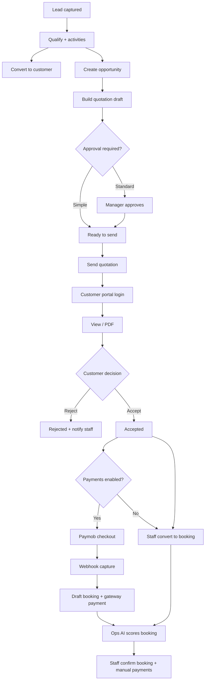

# TravelOS Business Workflows

**Primary path:** Lead → Opportunity → Quotation → Portal → Payment → Booking  
**Last updated:** 2026-06-04

---

## End-to-end commercial journey

Validated by: `scripts/run-commercial-journey-gate.mjs`

---

## 1. Lead capture

| Step | Actor | System action |
|------|-------|---------------|
| 1 | Sales agent | Creates lead with source, contact, destination interest |
| 2 | System | Assigns `owner_id`, generates `lead_number` |
| 3 | Sales | Logs calls/WhatsApp via activities |
| 4 | Sales | Updates status toward `qualified` |

**Exit criteria:** Lead qualified; ready for opportunity or customer convert.

**Permissions:** `crm.leads.write`

---

## 2. Opportunity creation

| Step | Actor | System action |
|------|-------|---------------|
| 1 | Sales | `POST /api/leads/:id/convert-opportunity` or manual create |
| 2 | System | Links `lead_id`, sets stage `discovery` |
| 3 | Sales | Updates probability, expected close, revenue |
| 4 | System | Records `opportunity_stage_history` on stage change |

**Exit criteria:** Opportunity in `proposal` or `negotiation` with active quoting.

**Permissions:** `crm.opportunities.write`

---

## 3. Quotation authoring

| Step | Actor | System action |
|------|-------|---------------|
| 1 | Sales | Creates quotation + line items |
| 2 | Sales | Submits approval (standard mode) → `pending_approval` |
| 3 | Tenant admin | Approves → `approved` |
| 4 | Sales | Sends to customer → `sent` |

**On send:**

- Portal visibility begins (post-send statuses).
- Domain event `quotation.sent` → email, notification, WhatsApp (if configured), AI sales score job.

**Permissions:** write, `crm.quotations.approve`, `crm.quotations.send`

---

## 4. Portal customer experience

| Step | Actor | System action |
|------|-------|---------------|
| 1 | Customer | Logs in at `/portal/login` |
| 2 | Customer | Views quotation list/detail |
| 3 | Customer | Optional: download PDF |
| 4 | Customer | Accept or reject |

**On accept (portal):**

- Status → `accepted` (via admin client wrapper + portal audit RPC).
- Email `quotation_accepted` queued.
- Events → notifications / WhatsApp / AI scoring.

**On reject:**

- Status → `rejected`; optional reason stored.

**Permissions:** Portal session only.

---

## 5. Payment (optional branch)

| Step | Actor | System action |
|------|-------|---------------|
| 1 | Customer | Pay Now on accepted quotation |
| 2 | System | `POST /api/portal/quotations/:id/checkout` creates `payment_order` |
| 3 | Customer | Completes Paymob hosted flow |
| 4 | Paymob | `POST /api/webhooks/paymob` |
| 5 | System | Validates HMAC; marks order completed |
| 6 | System | `convertQuotationToBooking()` → draft booking |
| 7 | System | Inserts `payments` row (`source=gateway`) |
| 8 | System | Emits `payment.completed`, `booking.created` |

**Tenant prerequisite:** `tenant_payment_settings.payments_enabled = true` and live Paymob credentials.

**Permissions:** Portal checkout; webhook uses service role.

---

## 6. Booking fulfillment

| Step | Actor | System action |
|------|-------|---------------|
| 1 | System / Sales | Booking exists (draft after auto-deposit or manual convert) |
| 2 | System | Operations AI scores readiness (async) |
| 3 | Sales | Adds travelers, documents, notes |
| 4 | Sales | Confirms booking → `confirmed` (`bookings.confirm`) |
| 5 | Finance | Records manual payments if balance remains |
| 6 | Sales | Completes after travel → `completed` |

**Payment status logic:** unpaid → partial → paid based on ledger totals.

**Permissions:** `bookings.confirm`, `payments.create` (finance)

---

## Alternate paths

| Path | Description |
|------|-------------|
| Staff accept | Sales uses `POST /api/quotations/:id/accept` instead of portal |
| Manual convert | `POST /api/quotations/:id/convert` without gateway |
| Lost lead | Lead/opportunity `lost` / `closed_lost` — no booking |
| Expired quotation | Accept blocked; reissue new quotation revision |
| Booking from opportunity | `POST /api/opportunities/:id/create-booking` at verbal approval / closed won |

---

## Async side effects (cross-cutting)

| Trigger | Async outcomes |
|---------|----------------|
| quotation.sent | Email, in-app notification, WhatsApp template, sales AI score |
| quotation.accepted | Email, notifications, WhatsApp |
| payment.completed | Notifications, WhatsApp, sales + ops AI scores |
| booking.created | Notifications, WhatsApp, ops AI score |

Worker: `POST /api/cron/process-dispatch-jobs` every 2–5 minutes.

---

## Role participation summary

| Stage | sales_agent | tenant_admin | finance_officer | customer |
|-------|:-----------:|:------------:|:---------------:|:--------:|
| Lead/opp/quote | Lead | Approve/send override | Read-only | — |
| Portal accept | — | — | — | Lead |
| Pay | — | — | — | Lead |
| Confirm booking | Lead | Lead | — | — |
| Record balance | — | — | Lead | — |

---

## Related documents

- [03-crm-module.md](./03-crm-module.md)
- [04-portal-module.md](./04-portal-module.md)
- [05-payments-module.md](./05-payments-module.md)
- [docs/02-Business/BusinessFlows.md](../02-Business/BusinessFlows.md)
